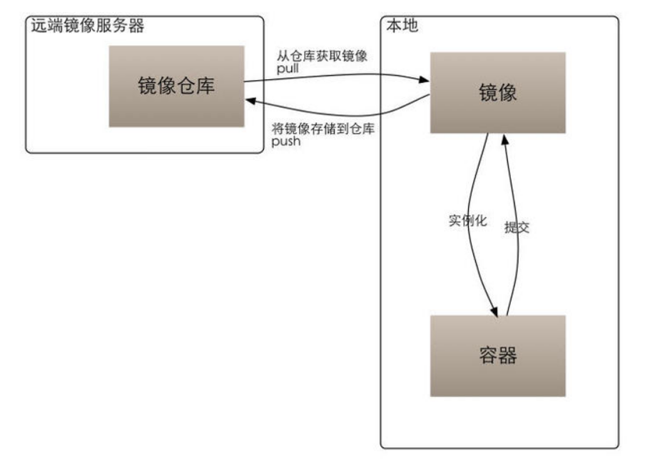

Docker笔记
====================
# 1 虚拟机与容器
## 1.1 虚拟机
虚拟机（Virtual Machine）指通过软件模拟的具有完整硬件系统功能的、运行在一个完全隔离环境中的完整计算机系统。在实体计算机中能够完成的工作在虚拟机中都能够实现。

在计算机中创建虚拟机时，需要将实体机的部分硬盘和内存容量作为虚拟机的硬盘和内存容量。每个虚拟机都有独立的 CMOS、硬盘和操作系统，可以像使用实体机一样对虚拟机进行操作。虚拟机的代表，是 VMWare 和 OpenStack。

## 1.2 容器
将操作系统层虚拟化，是一个标准的软件单元。容器是完全使用沙箱机制，相互之间不会有任何接口,更重要的是容器性能开销极低。

- 随处运行：容器可以将代码与配置文件和相关依赖库进行打包，从而确保在任何环境下的运行都是一致的。
- 高资源利用率：容器提供进程级的隔离，因此可以更加精细地设置 CPU 和内存的使用率，进而更好地利用服务器的计算资源。
- 快速扩展：每个容器都可作为单独的进程予以运行，并且可以共享底层操作系统的系统资源，这样一来可以加快容器的启动和停止效率。

## 1.3 区别与联系
- 虚拟机虽然可以隔离出很多「子电脑」，但占用空间更大，启动更慢。虚拟机软件可能还要花钱，例如VMWare；
- 容器技术不需要虚拟出整个操作系统，只需要虚拟一个小规模的环境，类似「沙箱」；
- 运行空间，虚拟机一般要几 GB 到 几十 GB 的空间，而容器只需要 MB 级甚至 KB 级；

|特性|虚拟机|容器|
|----|-----|-----|
| 隔离级别 | 操作系统级	| 进程 |
| 隔离策略 | Hypervisor（虚拟机监控器）	| Cgroups（控制组群） |
| 系统资源 | 5 ～ 15%	| 0 ～ 5% |
| 启动时间 | 分钟级	| 秒级 |
| 镜像存储 | GB - TB | KB - MB |
| 集群规模 | 上百	| 上万 |
| 高可用策略 | 备份、容灾、迁移	| 弹性、负载、动态 |

# 2 Docker 简介

## 2.1 什么是 Docker
Linux 容器是一种虚拟化技术，与虚拟机不同的是，他不是模拟一个完整的操作系统，而是对进程进行隔离。或者说，在正常进程的外面套了一个保护层。对于容器里面的进程来说，它接触到的各种资源都是虚拟的，从而实现与底层系统的隔离。

Docker 在容器的基础上，进行了进一步的封装，从文件系统、网络互联到进程隔离等，他提供简单易用的容器使用接口。Docker 将应用程序与该程序的依赖，打包在一个镜像文件里。运行这个文件，就会生成一个虚拟容器。程序在这个虚拟容器里运行，就好像在真实的物理机上运行一样。

## 2.2 为什么要用 Docker
由于容器是进程级别的，相比虚拟机有很多优势：
- 启动快
- 资源占用少
- 体积小

Docker 主要用途：
- 提供一次性的环境。如：本地测试他人的软件、持续集成的时候提供单元测试和构建的环境。
- 提供弹性的云服务。因为 Docker 容器可以随开随关，很适合动态扩容和缩容。
- 组建微服务架构。通过多个容器，一台机器可以跑多个服务，因此在本机就可以模拟出微服务架构。

# 3 Docker 架构和核心概念

## 3.1 Docker 架构图
<div align="center">  </div><br>

简介如下：
- Client：Docker 客户端，使用 Docker Api与 Docker 的守护进程通信；
- Machine：一个简化 Docker 安装的命令行工具，如：VirtualBox、Microsoft Azure；
- Host：Docker 主机，一个物理或者虚拟的机器，用于执行 Docker 守护进程和容器；
- Daemon：Docker 守护进程；
- Container：Docker 容器，独立运行的一个或一组应用，详见后文；
- Images：Docker 镜像，用于创建 Docker 容器的模板，详见后文；
- Registry：Docker 仓库，用来保存镜像，详见后文。

## 3.2 镜像（Image）
操作系统分为内核和用户空间,对于 Linux 而言，内核启动后，会挂 root 文件系统为其提供用户空间支持。**Docker 镜像（Image），就相当于一个 root 文件系统**。

Docker 镜像保存运行时所需程序、库、资源、配置、参数等的**静态文件**，它不包含任何动态数据，其内容在构建之后也不会被改变。

### 分层存储
镜像包含操作系统完整的 root	文件系统，Docker 在设计时充分利用	**UnionFS 的技术**，将其设计为**分层存储**的架构。Docker 镜像并不是像 ISO 那样的打包文件，镜像是一个虚拟的概念，**它由多层文件系统组成**。

镜像构建时，会一层层构建，前一层是后一层的基础。每一层构建完就不会再发生改变，后一层上的任何改变只发生在自己这一层。在构建镜像的时候，每一层尽量只包含该层需要添加的东西，任何额外的东西应该在该层构建结束前清理掉，以免镜像后期变的庞杂，难以维护。

## 3.3 容器（Container）
镜像和容器的关系，就像是面向对象程序设计中的类和实例一样，**镜像是静态的定义，容器是镜像运行时的实体**。容器可以被创建、启动、停止、删除、暂停等。

容器的实质是进程，但与直接在宿主执行的进程不同，容器进程运行于属于自己的独立的命名空间。因此容器可以拥有自己的 root 文件系统、网络配置、进程空间，甚至用户 ID 空间。容器内的进程是运行在一个隔离的环境里，使用起来就好像是在一个独立于宿主的系统下操作一样。

每一个容器运行时，会以镜像为基础层，在其上创建一个为容器运行时读写而准备的容器存储层。容器存储层的生存周期和容器一样，容器消亡时，容器存储层也随之消亡，并且缓存在容器存储层的数据也会随之清空。

按照 docker 最佳实践的要求，容器不应该向其存储层内写入任何数据，容器存储层要保持无状态化。所有的文件写入操作，都应该使用数据卷（Volume）、或者绑定宿主目录，在这些位置的读写会跳过容器存储层，直接对宿主（或网络存储）发生读写，其性能和稳定性更高（不会丢失数据）。

## 3.4 仓库（Repository）
``Docker Registry`` 用于集中存储、分发镜像的服务。

一个 ``Docker Registry`` 中可以包含多个仓库（``Repository``），每个仓库可以包含多个标签（``Tag``），每个标签对应一个镜像。

通常，一个仓库会包含同一个软件不同版本的镜像，而标签就常用于对应该软件的各个版本。我们可以通过	 <仓库名>:<标签> 的格式来指定具体是这个软件哪个版本的镜像。如果不给出标签，将以 ``latest`` 作为默认标签，如：``ubuntu:16.04、ubuntu:latest``。

### 公开服务 Docker Registry
Docker Registry	公开服务是开放给用户使用、允许用户管理镜像的	Registry 服务。一般公开服务允许用户免费上传、下载公开的镜像。常见的公开服务如：官方的 [Docker	Hub](https://hub.docker.com/) 、[网易云镜像服务](https://c.163.com/hub#/m/library/) 、[阿里云镜像库](https://cr.console.aliyun.com/) 。

### 私有 Docker Registry
用户还可以在本地搭建私有 Docker	Registry。Docker 官方提供了 Docker Registry 镜像，可以直接使用做为私有 Registry 服务。

## 3.5 镜像、容器、仓库的关系
镜像、容器、仓库的关系如下图：
<div align="center">  </div><br>

# 4 安装 Docker

```Text
## centos7 默认安装
yum install –y docker;
## 查看版本
docker version;
## 启动
service docker start;
chkconfig docker on;
```

# 5 Docker 常用命令
使用 `docker --help` 查看docker 命令，可分为如下几类操作：

- docker 操作：
  - 版本/信息：docker [info | version]
- 容器操作 ：
  - 容器生命周期管理：docker [ run | start | stop | restart | kill | rm | pause | unpause ]
  - 容器操作运维：docker [ ps | inspect | exec | logs | export | import | port ]
  - 容器 rootfs 命令：docker [ commit | cp | diff ]
- 镜像操作：
  - 镜像管理：docker [ images | rmi | tag | build | history | save | import ]
- 仓库操作
  - 镜像仓库：docker [ login | pull | push | search ] 

# 6 镜像使用

## 6.1、从仓库获取镜像
### 获取
从 Docker	镜像仓库获取镜像的命令是 ``docker pull``。其命令格式为：
```text
docker pull [选项] [Docker Registry 地址[:端口号]/]仓库名[:标签]
```
例如：
```text
PS C:\Users\dj673\Desktop> docker pull ubuntu:16.04
16.04: Pulling from library/ubuntu
e80174c8b43b: Pull complete                                       d1072db285cc: Pull complete                                       858453671e67: Pull complete                                       3d07b1124f98: Pull complete                                       Digest:sha256:e1fcd1f4dc443415d791bc1e97e93d3d595156005bce2b529f6b64584c9f2f4d
Status: Downloaded newer image for ubuntu:16.04
docker.io/library/ubuntu:16.04
```

使用 ``docker	pull --help``	命令查看具体选项。

### 运行
``docker run	-it	--rm	ubuntu:16.04 bash``

### 退出
``exit``

## 3.2、管理本机镜像

## 3.3、镜像实现的基本原理

# 7 容器使用


# 8 仓库使用


# 参考资料
- [Docker 官方文档](https://docs.docker.com/)
- [Docker — 从入门到实践](https://yeasy.gitbooks.io/docker_practice/content/)
- [鲸鱼云 Docker中文文档](https://www.kancloud.cn/jingyucloud/docker/216412)
- [Docker 工作原理及容器化简易指南](http://dockone.io/article/8788)

