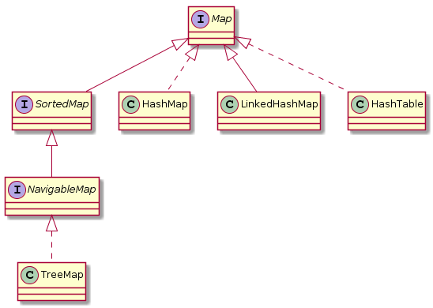
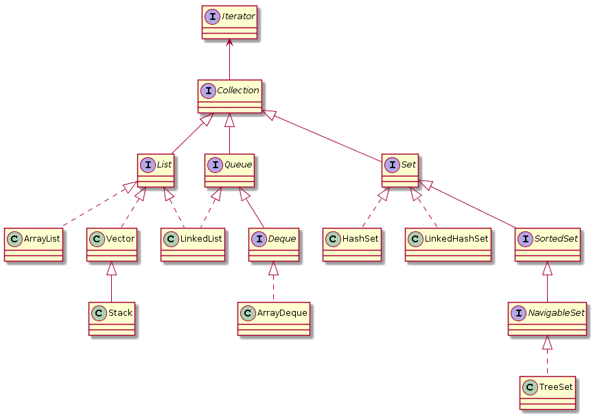

Java 容器-概述
====================
Java 内部的容器类包含了常用的数据结构：数组、集合、链表、队列、栈等。

我们可以把容器类分为三大类： Map 、Collection 和 工具类（Iterator迭代器、Enumeration枚举类、Arrays和Collections）。

# Map
**Map** 是一个映射接口（即 key-value 键值对），常用实现类有 ``HashMap, Hashtable, LinkedHashMap, TreeMap, WeakHashMap,ConcurrentHashMap``。

<div align="center">  </div><br>

# Collection
**Collection** 是一个集合的父接口，定义了集合的基本属性和方法，常用子接口有：List<E> ,  Queue<E> , Set<E>。

<div align="center">  </div><br>

它是一个接口，是高度抽象出来的集合，它包含了集合的基本操作：添加、删除、清空、遍历(读取)、是否为空、获取大小、是否保护某元素等等。

Collection的API：
```java
boolean         add(E object)
boolean         addAll(Collection<? extends E> collection)
void            clear()
boolean         contains(Object object)
boolean         containsAll(Collection<?> collection)
boolean         equals(Object object)
int             hashCode()
boolean         isEmpty()
Iterator<E>     iterator()
boolean         remove(Object object)
boolean         removeAll(Collection<?> collection)
boolean         retainAll(Collection<?> collection)
int             size()
<T> T[]         toArray(T[] array)
Object[]        toArray()
```

- List ：有序可重复的队列，每一个元素都有它的索引。第一个元素的索引值是0。常用实现类有LinkedList , ArrayList , Vector , Stack。

- Set : 无序不可重复元素的集合。 常用实现类有 HastSet 和 TreeSet。而 HashSet 是通过 HashMap 实现的；TreeSet 是通过 TreeMap 实现的。

3、工具类 
- Iterator ：遍历集合的工具 。
- Enumeration ：作用和Iterator一样，也是遍历集合；但是Enumeration的功能要比Iterator少。只能在Hashtable, Vector, Stack中使用。
- Arrays 和 Collections 是操作数组、集合的工具类


# 参考：
- [JDK 8 API](https://docs.oracle.com/javase/8/docs/api/)
- [关于Java集合的小抄](http://calvin1978.blogcn.com/articles/collection.html)


