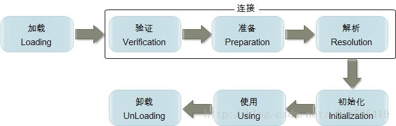

Java 虚拟机--类加载机制
====================
Java 虚拟机的类加载机制是**虚拟机把类的数据从 Class 文件加载到内存，并对数据进行校验、转换解析和初始化，最终形成可以被虚拟机直接使用的 Java 类型。**

# 一、类加载的时机
类从被加载到虚拟机内存中开始，到卸载出内存为止，它的整个生命周期包括以下7个阶段：加载（Loading）、验证（Verification）、准备（Preparation）、解析（Resolution）、初始化（Initialization）
使用（Using）、卸载（Unloading），其中验证、准备、解析。

<div align="center">  </div><br>

如上图，加载、验证、准备、初始化和卸载这5个阶段的顺序是确定的，类的加载过程必须按照这种顺序按部就班地开始，而解析阶段则不一定：它在某些情况下可以在初始化阶段之后再开始，这是为了支持 Java 的**运行时绑定**（也称为动态绑定或晚期绑定）。

对于类加载过程中的**加载**，JVM 规范中并没有进行强制约束其开始时机，可交由 VM 的具体实现来自由把握。但是对于初始化阶段，**JVM 规范严格规定了有且只有下列5种情况必须对类进行“初始化”**（因此加载、验证、准备工作需要在此之前开始）：

- **遇到 new、getstatic、putstatic、invokestatic** 这四条字节码指令时，如果类没有进行过初始化，则必须先触发其初始化。生成这4条指令的最常见场景是：使用 new 关键字实例化对象的时候；读取或设置一个类的静态字段（被final修饰、已在编译期把结果放入常量池的静态字段除外）的时候；以及调用一个类的静态方法的时候。

- **使用 java.lang.reflect 包的方法对类进行反射调用**的时候，如果类没有进行初始化，则需要先触发其初始化。

- 当初始化一个类的时候，如果发现其父类还没有进行过初始化，则需要**先触发其父类的初始化**。

- 当虚拟机启动时，用户需要制定一个要执行的主类（包含main方法的那个类），虚拟机会先初始化这个主类。

- 当使用 jdk1.7 的动态语言支持时，如果一个 java.lang.invoke.MethodHandle 实例最后的解析结果 REF_getStatic, REF_putStatic, REF_invokeStatic 的方法句柄，并且这个方法句柄所对应的类没有进行过初始化，则需要先触发其初始化；

以上5种场景中的行为称为对一个类进行**主动引用**。除此之外，所有引用类的方式都不会触发初始化，称为**被动引用**，举例如下：
- 通过子类引用父类的静态字段，不会导致子类初始化。
- 通过数组定义来引用类，不会触发此类的初始化。
- 常量在编译阶段会存入调用类的常量池中，本质上并没有直接引用到定义常量的类，因此不会触发定义常量的类的初始化。

# 二、类加载的过程
类加载的过程包含了**加载、验证、准备、解析和初始化**这 5 个阶段。

## 2.1 加载
加载是类加载过程的一个阶段，注意区分。在加载阶段，JVM 需要完成以下 3 件事情：

- 通过**类的全限定名**获取定义该类的**二进制字节流**。
- 将该字节流所代表的的**静态存储结构**转换为方法区的**运行时存储结构**。
- 在内存中生成一个代表该类的 **Class 对象**，作为方法区中该类各种数据的**访问入口**。

## 2.2 验证
验证阶段的目的是确保 Class 文件的字节流中包含的信息符合当前虚拟机的要求，并且不会危害虚拟机自身的安全。

从整体上看，验证阶段大致上会完成以下4个阶段的检验动作：

- **文件格式验证**，验证字节流是否符合 Class 文件格式的规范，并且能被当前版本的虚拟机处理。   
该阶段的主要目的是保证输入的字节流能正确地解析并存储于方法区内，格式上符合描述一个 Java 类型信息的要求。  
这阶段的验证是基于二进制字节流进行的，只有通过了这个阶段的验证后，字节流才会进入方法区中进行存储，所以后面的3个验证阶段全部是基于方法区的存储结构进行的，不会再直接操作字节流。

- **元数据验证**，对字节码描述的信息（即类的元数据信息）进行语义分析，以保证其描述的信息符合 Java 语言规范的要求。  
该阶段的主要目的是对类的元数据信息进行语义检验，保证不存在不符合 Java 语言规范的元数据信息。

- **字节码验证**，进行数据流和控制流分析，确定程序语义是合法的、符合逻辑的。
在元数据验证对元数据信息中的数据类型做完校验之后，这个阶段将对类的方法体进行校验分析，以保证被校验类的方法在运行时不会做出危害虚拟机安全的行为

- **符号引用验证**，发生在虚拟机将符号引用转化为直接引用的时候，可以看做是对类自身以外（常量池中的各种符号引用）的信息进行匹配性校验。符号引用验证的目的是确保解析动作能正常执行。

## 2.3 准备
准备阶段是**正式为类变量（被 static 修饰的变量）分配内存并设置类变量初始值**的阶段，这些变量所使用的内存都将在方法区进行分配。

在准备阶段进行内存分配的仅包括类变量（被static修饰的变量），而不包括实例变量，实例变量将会在对象实例化时随着对象一起分配在 Java 堆中。

-  初始值一般为 0 值（参考基本数据类型0值表）。如下，变量 value 在准备阶段过后的初始值为0而不是123，因为这时候尚未开始执行任何 Java 方法，而把 value 赋值为123的 putstatic 指令是程序被编译后，存放于类构造器 <clinit>() 方法之中，所以把 value 赋值为123的动作在初始化阶段才会执行。 
```java
public static int value = 123;
```

- 如果类字段的字段属性中存在 ConstantValue 属性（同时被 static final 修饰的字段），那在准备阶段变量 value 就会被初始化为 ConstantValue 属性所指定的值：
```java
public static final int value = 123;
```
编译时 Javac 将会为 value 生成 ConstantValue 属性，在准备阶段虚拟机就会根据 ConstantValue 的设置将 value 赋值为 123。

## 2.4 解析
解析阶段是虚拟机将常量池内的**符号引用**替换为**直接引用**的过程。

符号引用和直接引用的关联关系如下：
- 符号引用（Symbol References）： 符号引用**以一组符号来描述所引用的目标**，符号可以是任何形式的字面量，只要使用时能无歧义地定位到目标即可。符号引用与虚拟机实现的内存布局无关，引用的目标并不一定已经加载到内存中。各种虚拟机实现的内存布局可以各不相同，但是它们能接受的符号引用必须一致，因为符号引用的字面量形式明确定义在 Java 虚拟机规范的 Class 文件格式中。
 
- 直接引用（Direct References）： 直接引用**可以是直接目标的指针、相对偏移量或是一个能间接定位到目标的句柄**。直接引用是和虚拟机实现的内存布局有关的，同一个符号引用在不同虚拟机实例上翻译出来的直接引用一般不会相同。如果有了直接引用，那么引用的目标必定已经在内存中存在。

## 2.5 初始化
初始化阶段才真正开始执行类中定义的 Java 程序代码。初始化阶段是虚拟机执行类构造器 \<clinit>() 方法的过程。

在准备阶段，类变量已经赋过一次系统要求的初始值（零值），而在初始化阶段，根据程序员通过程序制定的主观计划去初始化类变量和其它资源。

- \<clinit>() 是由编译器自动收集类中所有**类变量的赋值动作和静态语句块中的语句**合并产生的，编译器收集的顺序由语句在源文件中出现的顺序决定。特别注意的是，静态语句块只能访问到定义在它之前的类变量，定义在它之后的类变量只能赋值，不能访问。例如以下代码：
```java
public class Test {
    static {
        i = 0;                // 给变量赋值可以正常编译通过
        System.out.print(i);  // 这句编译器会提示“非法向前引用”
    }
    static int i = 1;
}
```

- \<clinit>() 方法与类的构造函数不同，不需要显式的调用父类构造器。虚拟机会自动保证在子类的 \<clinit>() 方法运行之前，父类的 \<clinit>() 方法已经执行结束。因此虚拟机中第一个执行 \<clinit>() 方法的类肯定为 java.lang.Object。

- 由于父类的 \<clinit>()方法先执行，也就意味着父类中定义的静态语句块要优于子类的变量赋值操作。

- \<clinit>() 方法对于类或接口不是必须的，如果一个类中不包含静态语句块，也没有对类变量的赋值操作，编译器可以不为该类生成 \<clinit>() 方法。

- 接口中不可以使用静态语句块，但仍然有类变量初始化的赋值操作，因此接口与类一样都会生成 \<clinit>() 方法。但接口与类不同的是，执行接口的 \<clinit>() 方法不需要先执行父接口的 \<clinit>() 方法。只有当父接口中定义的变量使用时，父接口才会初始化。另外，接口的实现类在初始化时也一样不会执行接口的 \<clinit>() 方法。

- 虚拟机会保证一个类的 \<clinit>() 方法在多线程环境下被正确的加锁和同步，如果多个线程同时初始化一个类，只会有一个线程执行这个类的\<clinit>() 方法，其它线程都会阻塞等待，直到活动线程执行 \<clinit>()方法完毕。如果在一个类的 \<clinit>() 方法中有耗时的操作，就可能造成多个进程阻塞，在实际过程中此种阻塞很隐蔽。

# 三、类加载器
虚拟机设计团队把类加载阶段中的“通过一个类的全限定名来获取描述此类的二进制字节流(即字节码)”这个动作放到 JVM 外部实现，以便让应用程序自己决定如何去获取所需要的类。实现这个动作的代码模块称为“**类加载器**”。

## 3.1 类与类加载器
对于任意一个类，都需要由加载它的类加载器和这个类本身一同确立其在 Java 虚拟机中的唯一性，每一个类加载器，都拥有一个独立的类名称空间。

通俗而言：比较两个类是否“相等”（这里所指的“相等”，包括类的 Class 对象的 equals()方法、isAssignableFrom() 方法、isInstance() 方法的返回结果，也包括使用 instanceof() 关键字对做对象所属关系判定等情况），只有在这两个类是由同一个类加载器加载的前提下才有意义，否则，即使这两个类来源于同一个Class文件，被同一个虚拟机加载，只要加载它们的类加载器不同，那这两个类就必定不相等。

## 3.2 双亲委派模型
**从 JVM 的角度来讲**，只存在以下两种不同的类加载器：

- 启动类加载器（Bootstrap ClassLoader），这个类加载器用 C++ 实现，是虚拟机自身的一部分；
- 所有其他类的加载器，这些类由 Java 实现，独立于虚拟机外部，并且全都继承自抽象类 java.lang.ClassLoader。

**从 Java 开发人员的角度看**，类加载器可以分为：

- 启动类加载器（Bootstrap ClassLoader），负责将存放在 <JAVA_HOME>\lib 目录中的，或者被 -Xbootclasspath 参数所指定的路径中的，并且是虚拟机识别的（仅按照文件名识别，如 rt.jar，名字不符合的类库即使放在 lib 目录中也不会被加载）类库加载到虚拟机内存中。 启动类加载器无法被 Java 程序直接引用，用户在编写自定义类加载器时，如果需要把加载请求委派给引导类加载器，直接使用 null 代替即可。

- 扩展类加载器（Extension ClassLoader），由 ExtClassLoader（sun.misc.Launcher$ExtClassLoader）实现的。它负责将<Java_Home>/lib/ext或者被 java.ext.dir 系统变量所指定路径中的所有类库加载到内存中，开发者可以直接使用扩展类加载器。

- 应用程序类加载器（Application ClassLoader），由 AppClassLoader（sun.misc.Launcher$AppClassLoader）实现的。由于这个类加载器是 ClassLoader 中的 getSystemClassLoader() 方法的返回值，因此一般称为系统类加载器。它负责加载用户类路径（ClassPath）上所指定的类库，开发者可以直接使用这个类加载器，如果应用程序中没有自定义过自己的类加载器，一般情况下这个就是程序中默认的类加载器。


### **双亲委派模型**
双亲委派模型（Parents Delegation Model）要求除了顶层的启动类加载器外，其余的类加载器都应有自己的父类加载器，这里类加载器之间的父子关系一般通过**组合（Composition）关系**来实现，而不是通过继承（Inheritance）的关系实现。   
形如下图类加载器之间的层次关系，称为类加载器的双亲委派模型。
<div align="center">  </div><br>

### **双亲委派模型的工作过程**
如果一个类加载器收到了类加载的请求，它首先不会自己去尝试加载，而是把这个请求委派给父类加载器，每一个层次的加载器都是如此，依次递归，因此所有的加载请求最终都应该传送到顶层的启动类加载器中，只有当父加载器反馈自己无法完成此加载请求（它搜索范围中没有找到所需类）时，子加载器才会尝试自己加载。

### **优点**
使用双亲委派模型来组织类加载器之间的关系，使得 Java 类随着它的类加载器一起具备了一种带有优先级的层次关系。例如类 java.lang.Object，它存放再 rt.jar 中，无论哪个类加载器要加载这个类，最终都是委派给处于模型最顶端的启动类加载器进行加载，因此 Object 类在程序的各种类加载器环境中都是同一个类。

### **实现**
抽象类 java.lang.ClassLoader 中的 loadClass() 执行过程如下：先检查类是否已经加载过，如果没有则让父类加载器去加载。当父类加载器加载失败时抛出 ClassNotFoundException，此时尝试自己去加载。
```java
protected Class<?> loadClass(String name, boolean resolve)
        throws ClassNotFoundException
    {
        synchronized (getClassLoadingLock(name)) {
            // First, check if the class has already been loaded
            Class<?> c = findLoadedClass(name);
            if (c == null) {
                long t0 = System.nanoTime();
                try {
                    if (parent != null) {
                        c = parent.loadClass(name, false);
                    } else {
                        c = findBootstrapClassOrNull(name);
                    }
                } catch (ClassNotFoundException e) {
                    // ClassNotFoundException thrown if class not found
                    // from the non-null parent class loader
                }
                if (c == null) {
                    // If still not found, then invoke findClass in order
                    // to find the class.
                    c = findClass(name);
                }
            }
            if (resolve) {
                resolveClass(c);
            }
            return c;
        }
    }
```

## 3.3 破坏双亲委派模型
双亲委派模型并不能解决 Java 应用开发中会遇到的类加载器的全部问题。Java 提供了很多服务提供者接口（Service Provider Interface，SPI），允许第三方为这些接口提供实现。

SPI 的接口是 Java 核心库的一部分，是由引导类加载器加载的，而 SPI 实现的 Java 类一般是由系统类加载器加载的。引导类加载器是无法找到 SPI 的实现类的，因为它只加载 Java 的核心库。它也不能委派给系统类加载器，因为它是系统类加载器的祖先类加载器。也就是说，类加载器的双亲委派模型无法解决这个问题。

### **线程上下文类加载器**
线程上下文类加载器（Thread Context ClassLoader）。线程上下文类加载器是从 JDK 1.2 开始引入的。类 java.lang.Thread 中的方法 getContextClassLoader() 和 setContextClassLoader(ClassLoader cl) 用来获取和设置线程的上下文类加载器。如果没有通过 setContextClassLoader(ClassLoader cl) 方法进行设置的话，线程将继承其父线程的上下文类加载器。Java 应用运行的初始线程的上下文类加载器是应用程序类加载器。在线程中运行的代码可以通过此类加载器来加载类和资源。

有了线程上下文类加载器，就可以做一些“舞弊”的事情了，JNDI 服务使用这个线程上下文类加载器去加载所需要的 SPI 代码，也就是父类加载器请求子类加载器去完成类加载器的动作，这种行为实际上就是打通了双亲委派模型的层次结构来逆向使用类加载器，已经违背了双亲委派模型的一般性原则。

## 3.4 自定义类加载器

自定义类加载器 java.lang.ClassLoader 的三个重要方法：

- defineClass(String name, byte[] b, int off, int len) ： 把字节数组 b中的内容转换成 Java 类，该字节数组可以看成是二进制流字节组成的文件，返回的结果是 java.lang.Class 类的实例。这个方法被声明为 final的。
 
- loadClass(String name) : 实现了双亲委派模型，调用 findClass() 执行类加载动作,返回的是 java.lang.Class 类的实例。

- findClass(String name) : 通过传入的类全限定名 name 来获取对应的类，返回的是 java.lang.Class 类的实例，该类没有提供具体的实现，开发者在自定义类加载器时需重用此方法，在实现此方法时需调用 defineClass(String name, byte[] b, int off, int len) 方法。

我们可以通过继承 ClassLoader 并重写 findClass() 方法来实现自定义类加载器，如下为用来加载存储在文件系统上的 Java 字节代码 的类加载器:

```java
public class FileSystemClassLoader extends ClassLoader { 
 
   private String rootDir; 
 
   public FileSystemClassLoader(String rootDir) { 
       this.rootDir = rootDir; 
   } 
 
   @Override
   protected Class<?> findClass(String name) throws ClassNotFoundException { 
       byte[] classData = getClassData(name); 
       if (classData == null) { 
           throw new ClassNotFoundException(); 
       } 
       else { 
           return defineClass(name, classData, 0, classData.length); 
       } 
   } 
 
   private byte[] getClassData(String className) { 
       String path = classNameToPath(className); 
       try { 
           InputStream ins = new FileInputStream(path); 
           ByteArrayOutputStream baos = new ByteArrayOutputStream(); 
           int bufferSize = 4096; 
           byte[] buffer = new byte[bufferSize]; 
           int bytesNumRead = 0; 
           while ((bytesNumRead = ins.read(buffer)) != -1) { 
               baos.write(buffer, 0, bytesNumRead); 
           } 
           return baos.toByteArray(); 
       } catch (IOException e) { 
           e.printStackTrace(); 
       } 
       return null; 
   } 
 
   private String classNameToPath(String className) { 
       return rootDir + File.separatorChar 
               + className.replace('.', File.separatorChar) + ".class"; 
   } 
}
```
_FileSystemClassLoader 的 findClass() 方法首先根据类的全名在硬盘上查找类的字节代码文件（.class 文件），然后读取该文件内容，最后通过 defineClass() 方法来把这些字节代码转换成 java.lang.Class 类的实例。_


# 参考
- [深入探讨 Java 类加载器](https://www.ibm.com/developerworks/cn/java/j-lo-classloader/index.html#code6)
