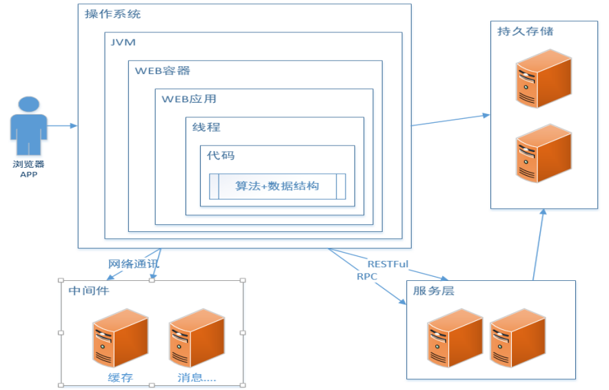

Java 虚拟机--深入了解性能优化
====================
从一张图看影响一个系统性能的方方面面： 

  
 

# 一、常用的性能评价/测试指标 

## 1.1 响应时间

提交请求和返回该请求的响应之间使用的时间，一般比较关注平均响应时间。如：数据库查询花费的时间，将字符回显到终端上花费的时间，访问 Web 页面花费的时间。

# 参考
- [深入探讨 Java 类加载器](https://www.ibm.com/developerworks/cn/java/j-lo-classloader/index.html#code6)
- [Apache Tomcat - Class Loader](https://tomcat.apache.org/tomcat-8.5-doc/class-loader-howto.html)
- [深入理解Tomcat（五）类加载机制](https://www.jianshu.com/p/51b2c50c58eb)
- [图解Tomcat类加载机制(阿里面试题)](https://www.cnblogs.com/aspirant/p/8991830.html)

