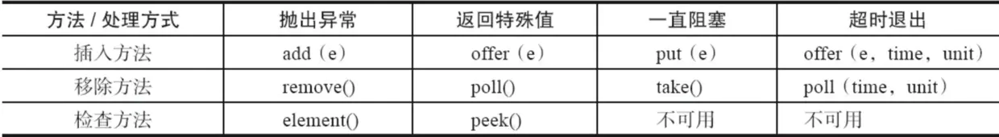
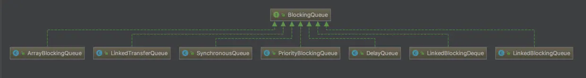

Java 并发编程--并发容器
====================
# 1、ConcurrentHashMap
- [HashMap? ConcurrentHashMap? 相信看完这篇没人能难住你](https://crossoverjie.top/2018/07/23/java-senior/ConcurrentHashMap/)
- [并发容器之ConcurrentHashMap(JDK 1.8版本)](https://juejin.im/post/6844903602423595015)

# 2、其他并发容器

# 3、阻塞队列
阻塞队列（java.util.concurrent.BlockingQueue），是一个支持两个附加操作的队列。以两个附加操作来实现队列的阻塞：
- 移除方法：当队列是空的时，从队列中**获取**元素的操作将会被阻塞，直到有数据放入队列；
- 插入方法：当队列是满时，往队列里**添加**元素的操作会被阻塞，直到队列中有空的位置，线程被自动唤醒。

## 3.1 BlockingQueue 的主要 API
BlockingQueue 的主要 API 可归类如下表：

  
 

- 抛出异常：当队列满时，如果再往队列里插入元素，会抛出 IllegalArgumentException 异常。当队列空时，从队列里获取元素会抛出 NoSuchElementException 异常。
- 返回特殊值：当往队列插入元素时，会返回元素是否插入成功，成功返回true。如果是移除方法，则是从队列里取出一个元素，如果没有则返回null。
- 一直阻塞：当阻塞队列满时，如果生产者线程往队列里put元素，队列会一直阻塞生产者线程，直到队列可用或者响应中断退出。当队列空时，如果消费者从队列里take元素，队列会阻塞住消费者线程，直到队列不为空。
- 超市退出：只在时间范围内阻塞。

## 3.2 Java 中的阻塞队列

  
 

- ArrayBlockingQueue：是一个用数组实现的有界阻塞队列。此队列按照先进先出的原则对元素进行排序。默认情况下，是不公平的访问队列（吞吐量较高）。
 
- LinkedBlockingQueue：是一个用链表实现的有界阻塞队列。此队列的默认最大长度为Integer.MAX_VALUE。此队列按照先进先出的原则对元素进行排序。与 ArrayBlockingQueue 相比，对于生产者端和消费者端分别采用了独立的锁来控制数据同步，以此来提高整个队列的并发性能。

- PriorityBlockingQueue：是一个支持优先级的无界阻塞队列。默认情况下元素采取自然顺序升序排列。也可以自定义类实现 compareTo() 方法来指定元素排序规则，或者初始化 PriorityBlockingQueue 时，指定构造参数Comparator 来进行排序。需要注意的是不能保证同优先级元素的顺序。

- DelayQueue：是一个支持延时获取元素的无界阻塞队列。队列使用 PriorityBlockingQueue 来实现。队列中的元素必须实现 Delayed 接口，在创建元素时可以指定多久才能从队列中获取当前元素。只有在延迟期满时才能从队列中提取元素。DelayQueue运用在以下应用场景：
  - 缓存系统的设计：可以用DelayQueue保存缓存元素的有效期，使用一个线程循环查询DelayQueue，一旦能从DelayQueue中获取元素时，表示缓存有效期到了。
  - 任务超时处理：使用DelayQueue 保存当天将会执行的任务和执行时间， 一旦从DelayQueue 中获取到任务就开始执行，如： TimerQueue 就是使用DelayQueue 实现的。

- SynchronousQueue：是一个不存储元素的阻塞队列。每一个put操作必须等待一个take操作，否则不能继续添加元素。SynchronousQueue 可以看成是一个传球手，负责把生产者线程处理的数据直接传递给消费者线程。

- LinkedTransferQueue：是一个由链表结构组成的无界阻塞TransferQueue 队列。相对于其他阻塞队列，
LinkedTransferQueue 多了tryTransfer() 和transfer()。
    - tryTransfer()：如果当前有消费者正在等待接收元素（take()或poll()方法），transfer方法可以把生产者传入的元素立刻transfer（传输）给消费者。如果没有消费者在等待接收元素，transfer方法会将元素存放在队列的tail节点，并等到该元素被消费者了才返回。
    - tryTransfer()：用来试探生产者传入的元素是否能直接传给消费者。如果没有消费者等待接收元素，则返回fasle。和transfer方法的区别是tryTransfer方法无论消费者是否接收，方法立即返回，而transfer方法是必须等到消费者消费了才返回。
  
- LinkedBlockingDeque：是一个由链表结构组成的双向阻塞队列。所谓双向队列指的是可以从队列的两端插入和移出元素。双向队列因为多了一个操作队列的入口，在多线程同时入队时，也就减少了一半的竞争。相比其他的阻塞队列，LinkedBlockingDeque多了addFirst、addLast、offerFirst、offerLast、peekFirst和peekLast等方法，以First单词结尾的方法，表示插入、获取（peek）或移除双端队列的第一个元素。以Last单词结尾的方法，表示插入、获取或移除双向队列的最后一个元素。

## 3.3 阻塞队列原理
如果队列是空的，消费者会一直等待，当生产者添加元素时，消费者是如何知道当前队列有元素的呢？JDK使用通知模式实现的。所谓通知模式，就是当生产者往满的队列里添加元素时会阻塞主生产者，当消息者消费了一个队列中的元素后，会通知生产者当前队列可用。

# 参考：
- [HashMap? ConcurrentHashMap? 相信看完这篇没人能难住你](https://crossoverjie.top/2018/07/23/java-senior/ConcurrentHashMap/)
- [并发容器之ConcurrentHashMap(JDK 1.8版本)](https://juejin.im/post/6844903602423595015)
- [阻塞队列（BlockingQueue）](https://juejin.im/post/6844903640709201934)
