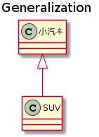
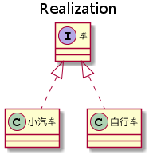
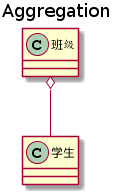
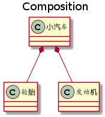
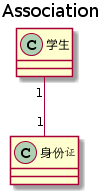
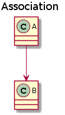
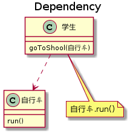

UML类图和时序图
====================

## 1、UML概述

1997年，OMG 组织（`Object Management Group`对象管理组织）发布了统一建模语言（`Unified Modeling Language，UML`）。它为开发团队提供了标准通用的设计语言来开发和构建计算机应用。


 - 为什么是统一建模语言   
 UML集成了Booch，OMT和面向对象软件工程的概念及建模符号，将这些方法融合为通用的，并且可广泛使用的建模语言。
 
 - 在UML系统开发中的三个主要模型：  
    a. 功能模型：从用户的角度展示系统的功能，包括用例图。  
    b. 对象模型：采用对象，属性，操作，关联等概念展示系统的结构和基础，包括类别图、对象图。  
    c. 动态模型：展现系统的内部行为。包括序列图，活动图，状态图。

接着学习UML类图和时序图，为后续学习设计模式做个铺垫。以下模型图使用 [PlantUML](https://www.planttext.com/) 绘制，更多语法及使用请参考：[PlantUML in a nutshell](http://plantuml.com/zh/)

## 2、类图
类图 `(Class diagram)` 由静态模型元素（如类、以及它们之间的关系等）组成。类图中包含从用户的客观世界模型中抽象出来的类、类的内部结构和类与类之间的关系。  
类图主要用在面向对象软件开发的系统分析和设计阶段，也是系统编码和测试的重要模型依据。  
静态模型元素：类（类名、属性、方法）、包、接口、关系等。

<div align="center">  </div><br>

### 2.1、泛化关系 (generalization)
用来描述继承关系( `is-a` 关系)，在 Java 中使用 `extends` 关键字。  
泛化关系用一条带空心箭头的直接表示；例如：小汽车与SUV之间为泛化关系。
<div align="center">  </div><br>

```text
@startuml

title Generalization

class 小汽车
class SUV

Car <|-- SUV

@enduml
```
_*注：Java 代码中，泛化关系表现为类与类之间的继承，接口与接口之间的继承。_


### 2.2、实现关系 (Realization)
用来描述实现关系( `is-a` 关系)，在 Java 中使用 implements 关键字。  
实现关系用一条带空心箭头的虚线表示；例如：小汽车与车之间为实现关系。

<div align="center">  </div><br>

```text
@startuml

title Realization

interface 车 
class 小汽车  
class 自行车 

车 <|.. 小汽车
车 <|.. 自行车

@enduml
```
_*注：Java 代码中，实现关系表现为类对接口的实现。_

### 2.3、聚合关系 (Aggregation)
表示整体由部分组成，但是整体和部分不是强依赖的，整体不存在了部分还是会存在。   
聚合关系用一条带空心菱形箭头的直线表示，例如：班级与学生之间为聚合关系。

<div align="center">  </div><br>

```text
@startuml

title Aggregation

class 班级 
class 学生 

班级 o-- 学生

@enduml
```
_*注：Java 代码中，聚合关系表现为类与成员变量间的关系。_


### 2.4、组合关系 (Composition)
表示整体由部分组成，并且组合中整体和部分是强依赖的，整体不存在了部分也不存在了。  
组合关系用一条带实心菱形箭头直线表示，例如：小汽车与轮胎为组合关系。

<div align="center">  </div><br>

```text
@startuml

title Composition

class 小汽车
class 轮胎 
class 发动机 

小汽车 *-- 轮胎
小汽车 *-- 发动机

@enduml
```
_*注：Java 代码中，组合关系表现为类与成员变量间的关系。_       

### 2.5、关联关系 (Association)
它描述不同类的对象之间的结构关系；它是一种静态关系， 通常与运行状态无关，一般由常识等因素决定的；它一般用来定义对象之间静态的、天然的结构。
关联关系用一条直线表示，关联关系有 1 对 1、多对 1、多对多的关系；例如：学生和身份证是 1 对 1 的关联关系。


<div align="center">  </div><br>

```text
@startuml

title Association

class 学生 
class 身份证 

学生 "1" -- "1" 身份证

@enduml
```

关联关系默认不强调方向，表示对象间相互知道；如果特别强调方向，如下图，表示A知道B，但 B不知道A；

<div align="center">  </div><br>

```text
@startuml

title Association

class A 
class B 

A  -->  B

@enduml
```
_*注：Java 代码中，关联关系表现为类与成员变量间的关系。_  

### 2.6、依赖关系 (Dependency)
与关联关系不同的是，它是一种临时性的关系，通常在运行期间产生，并且随着运行时的变化,依赖关系也可能发生变化。  
依赖关系用带箭头的虚线表示，例如：学生依赖于自行车。

<div align="center">  </div><br>

```text
@startuml

title Dependency

class 学生  {
    goToShool(自行车)
}

class 自行车  {
    run()
}

note "自行车.run()" as N

学生 ..> 自行车

学生 .. N

@enduml
```
_*注：Java 代码中，依赖关系体现为类构造方法及类方法的传入参数，箭头的指向为调用关系；依赖关系除了临时知道对方外，还是“使用”对方的方法和属性。_  

## 3、时序图
时序图（Sequence Diagram），亦称为序列力或循序图或顺序图，是一种UML交互图。它通过描述对象之间发送消息的时间顺序，显示多个对象之间的动态协作，展示对象之间的交互细节。

时序图包括的建模元素主要有：角色、对象、生命线、控制焦点、消息等。

- 角色（Actor）  
系统角色，可以是人或者其他系统，子系统。
- 对象(Object)  
对象代表时序图中的对象在交互中所扮演的角色，位于时序图顶部和对象代表
类角色。    
对象的命名方式一般有三种：  
    1).对象名和类名。例如：华为手机:手机。  
    2).只显示类名，不显示对象，即为一个匿名类。例如：:手机。  
    3).只显示对象名，不显示类名。例如：华为手机。
- 生命线(Lifeline)  
生命线代表时序图中的对象在一段时期内的存在。时序图中每个对象和底部中心都有一条垂直的虚线，这就是对象的生命线，对象间的消息存在于两条虚线间。  
- 控制焦点(Activation)  
控制焦点代表时序图中的对象执行一项操作的时期，在时序图中每条生命线上的窄的矩形代表活动期。
- 消息(Message)  
消息是定义交互和协作中交换信息的类，用于对实体间的通信内容建模，信息用于在实体间传递信息。允许实体请求其他的服务，类角色通过发送和接受信息进行通信。


# 参考资料
- [`Unified Modeling Language`](https://en.wikipedia.org/wiki/Unified_Modeling_Language)
- [统一建模语言](https://baike.baidu.com/item/%E7%BB%9F%E4%B8%80%E5%BB%BA%E6%A8%A1%E8%AF%AD%E8%A8%80/3160571?fromtitle=UML&fromid=446747&fr=aladdin)
- `Head First` 设计模式
- [图说设计模式](https://design-patterns.readthedocs.io/zh_CN/latest/index.html)

