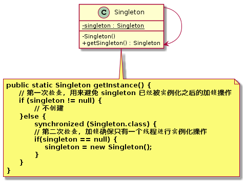

原型模式（`Prototype Pattern`）
====================
### **意图**
> 用一个已经创建的实例作为原型，通过复制该原型对象来创建一个和原型相同或相似的新对象。

### **动机**
系统中，存在大量相同或相似对象的创建问题，如果用传统的构造函数来创建对象，会比较复杂且耗时耗资源，用原型模式生成对象就更高效。

### **适用性**
原型模式通常适用于以下场景：
- 对象之间相同或相似，即只是个别的几个属性不同的时候。
- 对象的创建过程比较麻烦，但复制比较简单的时候。

### **结构**

  
 

### **实现**

    描述实现模式时使用的技巧，及需要面对的问题。
### **已知应用**

    描述已有源码中的模式例子。
### **相关模式**
    描述此模式和其他模式之间的关系。

# 参考资料
- 《`Head First` 设计模式》
- [图说设计模式](https://design-patterns.readthedocs.io/zh_CN/latest/index.html)
- [Java设计模式：23种设计模式全面解析（超级详细）](http://c.biancheng.net/design_pattern/)
