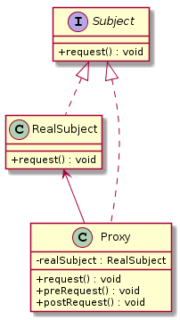

代理模式（`Proxy Pattern`）
====================
### **意图**
> 为另一个对象提供一个替身或占位符以控制对这个对象的访问。

### **动机**
 在某些情况下，一个客户不能或者不想直接访问另一个对象，这时可以找一个中介帮忙完成某项任务，这个中介就是代理对象。
 
### **适用性**
根据代理模式的使用目的，常见的代理模式有：
- 远程代理（Remote Proxy）：控制对远程对象（不同地址空间）的访问，它负责将请求及其参数进行编码，并向不同地址空间中的对象发送已经编码的请求。
- 虚拟代理（Virtual Proxy）：根据需要创建开销很大的对象，它可以缓存实体的附加信息，以便延迟对它的访问，例如在网站加载一个很大图片时，不能马上完成，可以用虚拟代理缓存图片的大小信息，然后生成一张临时图片代替原始图片。
- 保护代理（Protection Proxy）：按权限控制对象的访问，它负责检查调用者是否具有实现一个请求所必须的访问权限。

### **结构**
<div align="center">  </div><br>

### **实现**

```java
public interface Subject {
	void request();
}

public class RealSubject implements Subject {
	@Override
	public void request() {
		System.out.println("我是真正干活的...");
	}
}

public class Proxy implements Subject {
	private Subject realSubject;
	@Override
	public void request() {
		if(realSubject==null) {
			realSubject = new RealSubject();
		}
		preRequest();
		realSubject.request();
		postRequest();
	}
	public void preRequest() {
		System.out.println("访问真实主题之前处理...");
	}
	public void postRequest() {
		System.out.println("访问真实主题之后处理...");
	}
}

public class TestClient {
	public static void main(String[] args) {
		Subject proxy = new Proxy();
		proxy.request();
	}
}

```

### **已知应用**

    JDK动态代理
### **相关模式**
    描述此模式和其他模式之间的关系。


# 参考资料
- 《`Head First` 设计模式》
- [图说设计模式](https://design-patterns.readthedocs.io/zh_CN/latest/index.html)
- [Java设计模式：23种设计模式全面解析（超级详细）](http://c.biancheng.net/design_pattern/)
