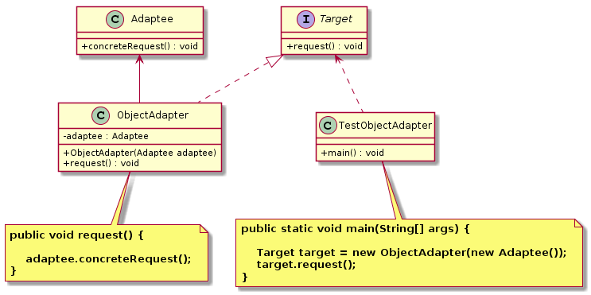

适配器模式（`Adapter Pattern`）
====================
### **意图**
> 将一个类的接口，转换成客户期望的另一个接口。

### **动机**
生活中，经常出现两个对象因接口不兼容而不能在一起工作的实例，这时需要转换接口进行适配。

### **适用性**
适配器模式通常适用于以下场景：
 - 以前开发的系统存在满足新系统功能需求的类，但其接口同新系统的接口不一致。
- 使用第三方提供的组件，但组件接口定义和自己要求的接口定义不同。

### **结构**
适配器模式的主要角色：
- 目标接口（``Target``）：适配器实现的目标接口（业务所期待的接口）；
- 适配者类（``Adaptee``）:被访问和适配的现有组件接口；
- 适配器类（``Adapter``）:是一个转换器，通过继承或组合的方式，把适配者接口转换成目标接口，让客户按目标接口的格式访问适配者。  

**“类”适配器**：使用继承的方式
<div align="center">  </div><br>

**“对象”适配器**：使用对象组合的方式
<div align="center">  </div><br>

### **实现**
```java
//目标接口
public interface Target {
	void request();
}

//适配者类
public class Adaptee {
	
	public void concreteRequest() {
		System.out.println("适配者中的业务代码被调用！");
	}
}

// 类适配器
public class ClassAdapter extends Adaptee implements Target{

	@Override
	public void request() {
		concreteRequest();
	}
}

// 测试客户端
public class TestClassAdapter {

	public static void main(String[] args) {
		System.out.println("类适配器测试。。。");
        Target target = new ClassAdapter();
        target.request();
	}

}

//类适配器，通过组合方式，把适配者接口转换成目标接口
public class ObjectAdapter implements Target {

	private Adaptee adaptee;

	public ObjectAdapter(Adaptee adaptee) {
		this.adaptee = adaptee;
	}

	@Override
	public void request() {
		adaptee.concreteRequest();
	}

}

// 测试客户端
public class TestObjectAdapter {

    public static void main(String[] args) {

        System.out.println("对象适配器测试。。。");
        Target target = new ObjectAdapter(new Adaptee());
		// 客户端绑定的是接口而不是实现，可以根据需要新增不同的实现（适配器）
        target.request();
    }

}
```
### **已知应用**
- java.util.Arrays#asList()
- java.util.Collections#list()
- java.util.Collections#enumeration()
- javax.xml.bind.annotation.adapters.XMLAdapter 

### **相关模式**
外观模式、装饰者模式


# 参考资料
- 《`Head First` 设计模式》
- [图说设计模式](https://design-patterns.readthedocs.io/zh_CN/latest/index.html)
- [Java设计模式：23种设计模式全面解析（超级详细）](http://c.biancheng.net/design_pattern/)
