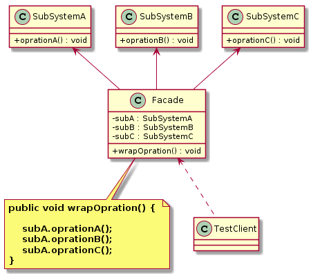

外观模式（`Facade Pattern`）
====================
### **意图**
> 提供了一个统一的接口，用来访问子系统中的一群接口。外观定义了一个高层接口，让子系统更容易使用。

### **动机**
当一个系统的功能越来越强，子系统会越来越多，客户对系统的访问也变得越来越复杂。这时如果系统内部发生改变，客户端也要跟着改变，这违背了“迪米特法则”。可以创建统一的接口，用来包装子系统,从而降低客户端和子系统之间的耦合度。

### **适用性**
    描述模式可以用在什么场合。

### **结构**
适配器模式的主要角色：
- 外观角色（``Facade``）：为多个子系统对外提供一个共同的接口;
- 子系统角色（``SubSystem``）：实现系统的部分功能，客户可以通过外观角色访问它。

<div align="center">  </div><br>

### **实现**
```java

// 子系统A
public class SubSystemA {

	public void oprationA() {		
		System.out.println("SubSystemA 的 oprationA() 被调用。。。");
	}
}
// 子系统B
public class SubSystemB {

	public void oprationB() {		
		System.out.println("SubSystemB 的 oprationB() 被调用。。。");
	}
}
// 子系统C
public class SubSystemC {

	public void oprationC() {		
		System.out.println("SubSystemC 的 oprationC() 被调用。。。");
	}
}

// 外观角色
public class Facade {

	private SubSystemA subA = new SubSystemA();
	private SubSystemB subB = new SubSystemB();
	private SubSystemC subC = new SubSystemC();

	public void wrapOpration() {
		subA.oprationA();
		subB.oprationB();
		subC.oprationC();
	}
}
// 测试客户端
public class TestClient {

	public static void main(String[] args) {
		Facade facade = new Facade();
		facade.wrapOpration();
	}
}

```
### **已知应用**

 
### **相关模式**


# 参考资料
- 《`Head First` 设计模式》
- [图说设计模式](https://design-patterns.readthedocs.io/zh_CN/latest/index.html)
- [Java设计模式：23种设计模式全面解析（超级详细）](http://c.biancheng.net/design_pattern/)
