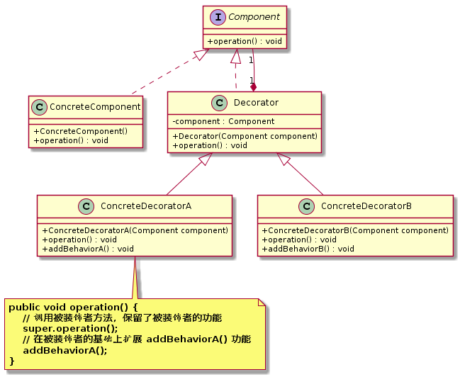

装饰者模式（`Decorator Pattern`）
====================
### **意图**
> 动态地将责任附加到对象上。

在不改变现有对象结构的情况下，使用**组合关系**创建装饰对象来包裹现有对象，动态地给该对象增加一些职责。

### **动机**
在软件开发过程中，有时想用一些现存的组件。这些组件可能只是完成了一些核心功能。但在不改变其结构的情况下，可以动态地扩展其功能。所有这些都可以釆用装饰模式来实现。

### **适用性**
装饰模式通常在以下几种情况使用。
- 当需要给一个现有类添加附加职责，而又不能采用生成子类的方法进行扩充时。例如，该类被隐藏或者该类是终极类或者采用继承方式会产生大量的子类。
- 当需要通过对现有的一组基本功能进行排列组合而产生非常多的功能时，采用继承关系很难实现，而采用装饰模式却很好实现。
- 当对象的功能要求可以动态地添加，也可以再动态地撤销时。

### **结构**
<div align="center">  </div><br>

### **实现**
```java
// 抽象组件
public interface Component {
	void operation();
}

//具体组件
public class ConcreteComponent implements Component {

	public ConcreteComponent() {
		System.out.println("创建具体组件。。。");
	}

	@Override
	public void operation() {
		System.out.println("执行具体组件的 operation()");
	}
}

// 抽象装饰类(被装饰者)
public class Decorator implements Component {

	private Component component;

	public Decorator(Component component) {
		this.component = component;
	}

	@Override
	public void operation() {
		component.operation();
	}
}

// 具体装饰类A，具体装饰类应当是装饰层次的最低层
public class ConcreteDecoratorA extends Decorator {

	public ConcreteDecoratorA(Component component) {
		super(component);
	}

	public void operation() {
		// 调用被装饰者方法，保留了被装饰者的功能
		super.operation();
		// 在被装饰者的基础上扩展 addBehaviorA() 功能
		addBehaviorA();
	}

	public void addBehaviorA() {
		System.out.println("在被装饰者的基础上扩展 addBehaviorA() 功能");
	}
}

// 具体装饰类B
public class ConcreteDecoratorB extends Decorator {

	public ConcreteDecoratorB(Component component) {
		super(component);
	}

	public void operation() {
		super.operation();
		addBehaviorB();
	}

	public void addBehaviorB() {
		System.out.println("在被装饰者的基础上扩展 addBehaviorB() 功能");
	}
}

// 测试客户端
public class TestClient {

	public static void main(String[] args) {
		Component component = new ConcreteComponent();
		
		Component decoratorA = new ConcreteDecoratorA(component);
		decoratorA.operation();
		
		Component decoratorB = new ConcreteDecoratorB(component);
		decoratorB.operation();
	}
}
```
### **已知应用**
- java.io.BufferedInputStream(InputStream)

### **相关模式**
    描述此模式和其他模式之间的关系。


# 参考资料
- 《`Head First` 设计模式》
- [图说设计模式](https://design-patterns.readthedocs.io/zh_CN/latest/index.html)
- [Java设计模式：23种设计模式全面解析（超级详细）](http://c.biancheng.net/design_pattern/)
