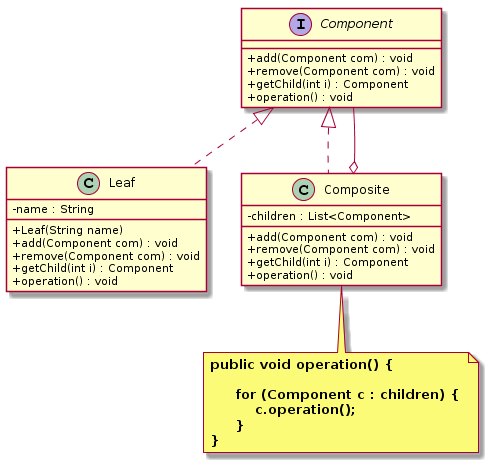
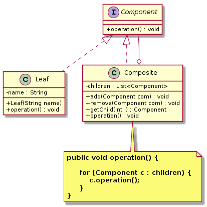

组合模式（`Composite Pattern`）
====================
### **意图**
> 允许你将对象组合成树形结构来表现“整体/部分”。组合能让客户以一致的方式处理个别对象以及对象组合。

### **动机**
形如：有一个树形结构的菜单，子菜单和可能还带有菜单项的子菜单，那么任何菜单都是一种“组合”。因为它既可以包含其他菜单，也可以包含菜单项。我们可以使用组合模式设计、编码，从而对整个菜单结构应用相同的操作。


### **适用性**
组合模式主要的应用场景：
- 在需要表示一个对象整体与部分的层次结构的场合。
- 要求对用户隐藏组合对象与单个对象的不同，用户可以用统一的接口使用组合结构中的所有对象的场合。

### **结构**
组合模式包含以下主要角色：
- 抽象组件（``Component``）：为分支节点和叶子节点声明公共接口，并实现其默认方法。在透明式的组合模式中抽象组件还声明访问和管理子类的接口；在安全式的组合模式中不声明访问和管理子类的接口，管理工作由分支节点完成。
- 分支节点（``Composite``）：有子节点，实现了抽象构件角色中声明的接口，主要作用是存储和管理子部件，包含 add()、remove()、getChild() 等方法。
- 叶子节点（``Leaf``）：没有子节点，用于实现抽象构件角色中声明的公共接口。

组合模式分为**透明式**的组合模式和**安全式**的组合模式。

- **透明式**
<div align="center">  </div><br>

- **安全式**
<div align="center">  </div><br>

### **实现**
以透明式为例
```java
// 抽象组件
public interface Component {

	void add(Component com);
	void remove(Component com);
	Component getChild(int i);
	void operation();
}

// 分支节点
public class Composite implements Component {

	private List<Component> children = new ArrayList<Component>(16);
	@Override
	public void add(Component com) {
		children.add(com);
	}
	@Override
	public void remove(Component com) {
		children.remove(com);
	}
	@Override
	public Component getChild(int i) {
		return children.get(i);
	}
	@Override
	public void operation() {
		for (Component c : children) {
			c.operation();
		}
	}
}

// 叶子节点
public class Leaf implements Component {
	
	private String name;

	public Leaf(String name) {
		this.name = name;
	}

	@Override
	public void add(Component com) {}

	@Override
	public void remove(Component com) {}

	@Override
	public Component getChild(int i) {
		return null;
	}

	@Override
	public void operation() {
		 System.out.println("叶子节点 "+name+" 被访问。。。"); 
	}
}

//测试客户端，透明方式的组合模式
public class TestClient {

	public static void main(String[] args) {
		Component c0 = new Composite();
		Component c1 = new Composite();
		Component leaf1 = new Leaf("leaf1");
		Component leaf2 = new Leaf("leaf2");
		Component leaf3 = new Leaf("leaf3");
		c0.add(leaf1);
		c0.add(c1);
		c1.add(leaf2);
		c1.add(leaf3);
		c0.operation();
	}
}

```
### **已知应用**
- javax.swing.JComponent#add(Component)
- java.awt.Container#add(Component)
- java.util.Map#putAll(Map)
- java.util.List#addAll(Collection)
- java.util.Set#addAll(Collection)

### **相关模式**
    描述此模式和其他模式之间的关系。


# 参考资料
- 《`Head First` 设计模式》
- [图说设计模式](https://design-patterns.readthedocs.io/zh_CN/latest/index.html)
- [Java设计模式：23种设计模式全面解析（超级详细）](http://c.biancheng.net/design_pattern/)
