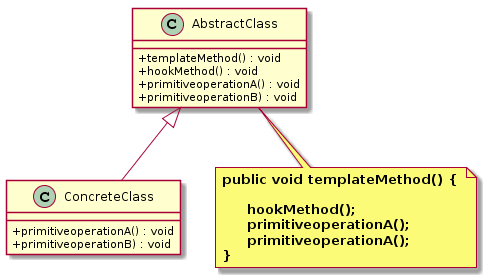

模板方法模式（`Template Method Pattern`）
====================
### **意图**
> 在一个方法中定义一个算法得骨架，而将一些步骤延迟到子类中。模板方法使得子类可以在不改变算法结构的情况下，重新定义算法中的某些步骤。


### **动机**
在设计一个系统时，明确了算法所需的关键步骤，而且确定了这些步骤的执行顺序，但某些步骤的具体实现还未知或需依赖于具体的环境。我们可以在父类中把明确的算法步骤定义为模板方法，而未知具体实现部分延迟到子类中实现。

### **适用性**
模板方法模式通常适用于以下场景：
- 算法的整体步骤很固定，但其中个别部分易变时，这时候可以使用模板方法模式，将容易变的部分抽象出来，在子类中实现。
- 当多个子类存在公共的行为时，可以将其提取出来并集中到一个公共父类中以避免代码重复。首先，要识别现有代码中的不同之处，并且将不同之处分离为新的操作。最后，用一个调用这些新的操作的模板方法来替换这些不同的代码。
- 当需要控制子类的扩展时，模板方法只在特定点调用钩子操作，这样就只允许在这些点进行扩展。

### **结构**
模板方法模式的主要角色有：
- 抽象类（AbstractClass）：定义模板方法，给出一个算法的轮廓和骨架。它由一个模板方法和若干个基本方法构成。
- 具体子类（ConcreteClass）：实现父类中所定义的抽象方法和选择性实现钩子方法。

<div align="center">  </div><br>

### **实现**
```java
// 抽象类
public abstract class AbstractClass {
	// 模板方法，定义了一系列的逻辑步骤，每个步骤由一个方法表示
	public void templateMethod() {
		hookMethod();
		primitiveoperationA();
		primitiveoperationB();

	}

	// 钩子方法，钩子可以让子类实现算法中可选部分
	public void hookMethod() {
		System.out.println("钩子方法，空（或默认）实现，子类重写实现相应的逻辑。");
	}

	// 抽象方法，由子类实现
	public abstract void primitiveoperationA();

	public abstract void primitiveoperationB();

}

// 具体类
public class ConcreteClass extends AbstractClass {

	@Override
	public void primitiveoperationA() {
		System.out.println("primitiveoperationA() 被调用。。。");
	}

	@Override
	public void primitiveoperationB() {
		System.out.println("primitiveoperationA() 被调用。。。");
	}

}

// 测试客户端
public class TestClient {

	public static void main(String[] args) {
		
		AbstractClass concrete = new ConcreteClass();
		concrete.templateMethod();
	}

}
```

从代码实现可以看出：父类（高层组件）控制何时以及如何让（子类方法）低层组件参与，也就是说，高层组件对低层组件的方式是“别调用我，我会调用你们”，完美的体现了好莱坞原则。

### **已知应用**

- java.util.Collections#sort()
- java.io.InputStream#read()

### **相关模式**
   模板方法、策略模式


# 参考资料
- 《`Head First` 设计模式》
- [图说设计模式](https://design-patterns.readthedocs.io/zh_CN/latest/index.html)
- [Java设计模式：23种设计模式全面解析（超级详细）](http://c.biancheng.net/design_pattern/)
