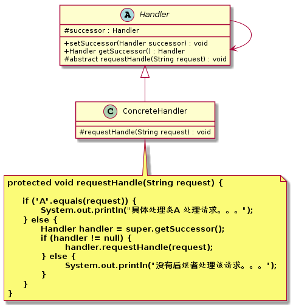

职责链模式（`Chain of Responsibility Pattern`）
====================
### **意图**
> 为了避免请求发送者与多个请求处理者耦合在一起，将所有请求的处理者通过前一对象记住其下一个对象的引用而连成一条链；当有请求发生时，可将请求沿着这条链传递，直到有对象处理它为止。

### **动机**
生活中，常常会出现这样的事例：一个请求有多个对象可以处理，但每个对象的处理条件或权限不同。例如：员工请假，审批流程往往需要公司不同职责的同事批准。

### **适用性**
责任链模式通常适用如下情况：
- 有多个对象可以处理一个请求，哪个对象处理该请求由运行时刻自动确定。
- 可动态指定一组对象处理请求，或添加新的处理者。
- 在不明确指定请求处理者的情况下，向多个处理者中的一个提交请求。

### **结构**
职责链模式主要角色有：
- 抽象处理类（``Handler``）：定义一个处理请求的接口，包含抽象处理方法和一个后继连接。
- 具体处理类（``ConcreteHandler``）：实现抽象处理者的处理方法，判断能否处理本次请求，如果可以处理请求则处理，否则将该请求转给它的后继者。
- 客户类（``Client``）：创建处理链，并向链头的具体处理者对象提交请求，它不关心处理细节和请求的传递过程。

<div align="center">  </div><br>

### **实现**
```java
// 抽象处理类
public abstract class Handler {

	protected Handler successor;

	public void setSuccessor(Handler successor) {
		this.successor = successor;
	}

	public Handler getSuccessor() {
		return successor;
	}

	protected abstract void requestHandle(String request);

}

// 具体处理类A
public class ConcreteHandlerA extends Handler {

	@Override
	protected void requestHandle(String request) {
		if ("A".equals(request)) {
			System.out.println("具体处理类A 处理请求。。。");
		} else {
			Handler handler = super.getSuccessor();
			if (handler != null) {
				handler.requestHandle(request);
			} else {
				System.out.println("没有后继者处理该请求。。。");
			}
		}
	}

}

//具体处理类B
public class ConcreteHandlerB extends Handler {

	@Override
	protected void requestHandle(String request) {
		if ("B".equals(request)) {
			System.out.println("具体处理类B 处理请求。。。");
		} else {
			Handler handler = super.getSuccessor();
			if (handler != null) {
				handler.requestHandle(request);
			} else {
				System.out.println("没有后继者处理该请求。。。");
			}
		}
	}

}

// 测试客户端
public class TestClient {

	public static void main(String[] args) {
		 //组装责任链 
        Handler handlerA=new ConcreteHandlerA(); 
        Handler handlerB=new ConcreteHandlerB(); 
        handlerA.setSuccessor(handlerB);
        //提交请求 
        handlerA.requestHandle("B");
     
	}
}
```
### **已知应用**
- Apache Commons Chain
- javax.servlet.Filter#doFilter()
- Struts2 的拦截器

### **相关模式**


# 参考资料
- 《`Head First` 设计模式》
- [图说设计模式](https://design-patterns.readthedocs.io/zh_CN/latest/index.html)
- [Java设计模式：23种设计模式全面解析（超级详细）](http://c.biancheng.net/design_pattern/)
