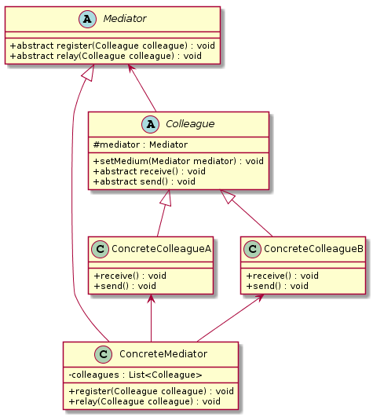

中介者模式（`Mediator Pattern`）
====================
### **意图**
> 定义一个中介对象来封装一系列对象之间的交互，使原有对象之间的耦合松散，且可以独立地改变它们之间的交互。

中介者模式又叫调停模式，是迪米特法则的典型应用。

### **动机**
在现实生活中，常常会出现好多对象之间存在复杂的交互关系，这种交互关系常常是“网状结构”，它要求每个对象都必须知道它需要交互的对象。例如，每个人必须记住他（她）所有朋友的电话；而且，朋友中如果有人的电话修改了，他（她）必须告诉其他所有的朋友修改，这叫作“牵一发而动全身”，非常复杂。

如果把这种“网状结构”改为“星形结构”的话，将大大降低它们之间的“耦合性”，这时只要找一个“中介者”就可以了。如前面所说的“每个人必须记住所有朋友电话”的问题，只要在网上建立一个每个朋友都可以访问的“通信录”就解决了。这样的例子还有很多，例如，你刚刚参力口工作想租房，可以找“房屋中介”。

### **适用性**
中介者模式通常适用于如下场景：
- 当对象之间存在复杂的网状结构关系而导致依赖关系混乱且难以复用时。
- 当想创建一个运行于多个类之间的对象，又不想生成新的子类时。

### **结构**
<div align="center">  </div><br>

### **实现**
```java
// 抽象中介者
public abstract class Mediator {
	// 注册
	public abstract void register(Colleague colleague);

	// 转发
	public abstract void relay(Colleague colleague);
}

// 具体中介者
public class ConcreteMediator extends Mediator {

	private List<Colleague> colleagues = new ArrayList<Colleague>();

	@Override
	public void register(Colleague colleague) {
		if (!colleagues.contains(colleague)) {
			colleagues.add(colleague);
			colleague.setMedium(this);
		}
	}

	@Override
	public void relay(Colleague colleague) {
		for (Colleague ob : colleagues) {
			if (!ob.equals(colleague)) {
				ob.receive();
			}
		}
	}

}

//抽象同事类
public abstract class Colleague {

	protected Mediator mediator;

	public void setMedium(Mediator mediator) {
		this.mediator = mediator;
	}

	public abstract void receive();

	public abstract void send();
}

// 具体同事类A
public class ConcreteColleagueA extends Colleague {

	@Override
	public void receive() {
		System.out.println("具体同事类A 接收到了请求。。。");
	}

	@Override
	public void send() {
		System.out.println("具体同事类A 发出了请求。。。");
		// 请中介者转发
		mediator.relay(this);
	}

}

// 具体同事类B
public class ConcreteColleagueB extends Colleague {

	@Override
	public void receive() {
		System.out.println("具体同事类B 接收到了请求。。。");
	}

	@Override
	public void send() {
		System.out.println("具体同事类B 发出了请求。。。");
		// 请中介者转发
		mediator.relay(this);
	}

}

// 测试客户端
public class TestClient {

	public static void main(String[] args) {
		Mediator mediator = new ConcreteMediator();
		ConcreteColleagueA colleagueA = new ConcreteColleagueA();
		ConcreteColleagueB colleagueB = new ConcreteColleagueB();
		mediator.register(colleagueA);
		mediator.register(colleagueB);
		colleagueA.send();
		colleagueB.send();

	}
}
```
### **已知应用**
- All scheduleXXX() methods of java.util.Timer
- java.util.concurrent.Executor#execute()
- submit() and invokeXXX() methods of  
- java.util.concurrent.ExecutorService
- java.util.concurrent.ScheduledExecutorService
- java.lang.reflect.Method#invoke()

### **相关模式**
    描述此模式和其他模式之间的关系。


# 参考资料
- 《`Head First` 设计模式》
- [图说设计模式](https://design-patterns.readthedocs.io/zh_CN/latest/index.html)
- [Java设计模式：23种设计模式全面解析（超级详细）](http://c.biancheng.net/design_pattern/)
