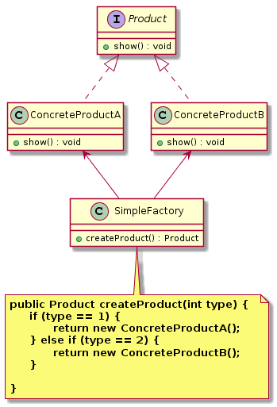
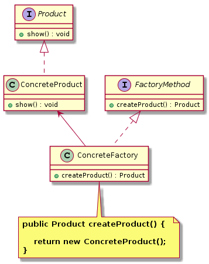
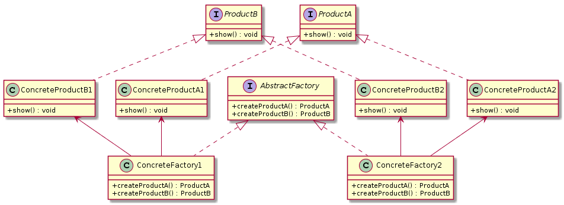
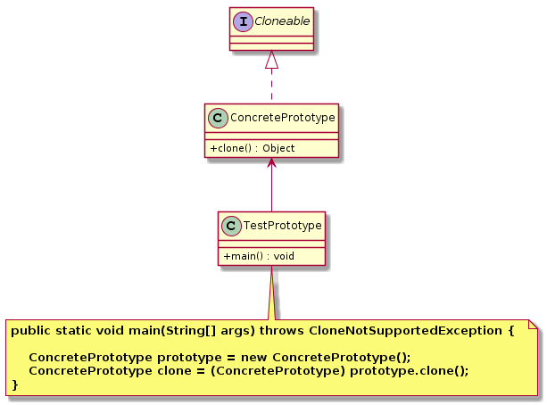
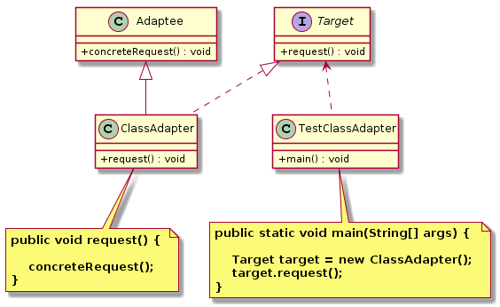
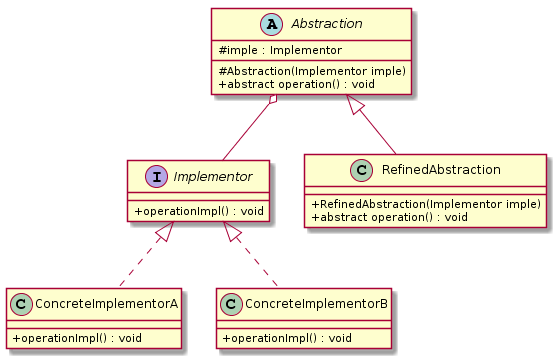
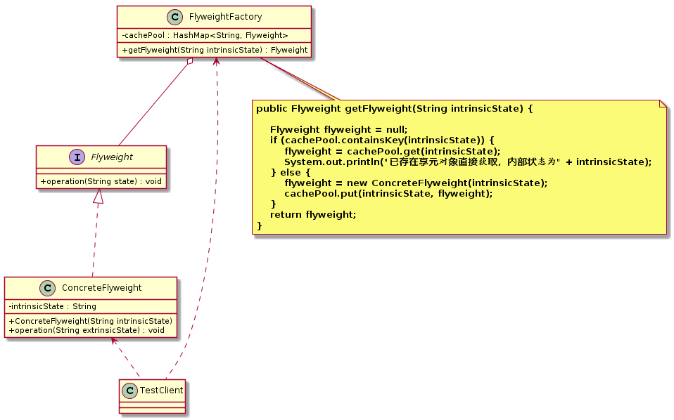
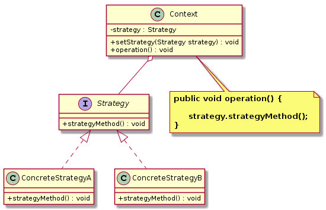
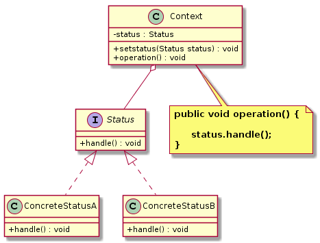
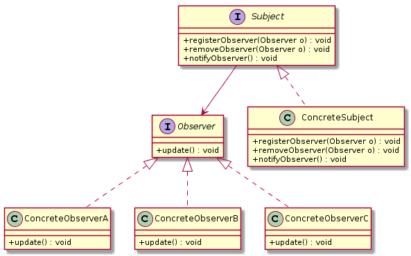

PATTERN_UML_CODE
====================
`PATTERN_UML_CODE` 记录了设计模式章节的 UML 模型图相关代码。

## 11.单例模式

<div align="center">  </div><br>

```text
@startuml

skinparam classAttributeIconSize 0
class Singleton {
 - {static} singleton : Singleton
 - Singleton()
 + getSingleton() : Singleton
}

Singleton  -->  Singleton

note bottom  of Singleton
  <b>public static Singleton getInstance() {  </b>
  <b>     // 第一次检查，用来避免 singleton 已经被实例化之后的加锁操作</b>
  <b>     if (singleton != null) { </b>
  <b>           // 不创建  </b>
  <b>     }else { </b>
  <b>           synchronized (Singleton.class) { </b>
  <b>           // 第二次检查，加锁确保只有一个线程进行实例化操作 </b>
  <b>           if(singleton == null) { </b>
  <b>               singleton = new Singleton(); </b>
  <b>           }</b>
  <b>     }</b>
  <b>} </b>
end note
```

## 12.简单工厂模式
<div align="center">  </div><br>

```text
@startuml

interface Product {
    + show() : void
}

class ConcreteProductA {
  + show() : void
}
Product <|.. ConcreteProductA
class ConcreteProductB {
  + show() : void
}
Product <|.. ConcreteProductB

class SimpleFactory{
    + createProduct() : Product
}
ConcreteProductA <-- SimpleFactory
ConcreteProductB <-- SimpleFactory

note bottom  of SimpleFactory
  <b>public Product createProduct(int type) {  </b>
  <b>     if (type == 1) { </b>
  <b>           return new ConcreteProductA();  </b>
  <b>     } else if (type == 2) { </b>
  <b>           return new ConcreteProductB(); </b>
  <b>     } </b>
  <b>} </b>
end note

@enduml
```

## 13.工厂方法模式

<div align="center">  </div><br>

```text
@startuml

interface Product {
    + show() : void
}

interface FactoryMethod {
    + createProduct() : Product
}

class ConcreteProduct {
  + show() : void
}
Product <|.. ConcreteProduct

class ConcreteFactory {
   + createProduct() : Product
}
FactoryMethod <|.. ConcreteFactory

ConcreteProduct <-- ConcreteFactory

note bottom  of ConcreteFactory
  <b>public Product createProduct() {  </b>
  
  <b>    return new ConcreteProduct(); </b>
  <b>} </b>
end note

@enduml
```

## 14.抽象工厂模式

<div align="center">  </div><br>

```text
@startuml
skinparam classAttributeIconSize 0
interface AbstractFactory {
    + createProductA() : ProductA
    + createProductB() : ProductB
}
class ConcreteFactory1{
    + createProductA() : ProductA
    + createProductB() : ProductB
}
AbstractFactory <|.. ConcreteFactory1
class ConcreteFactory2{
    + createProductA() : ProductA
    + createProductB() : ProductB
}
AbstractFactory <|.. ConcreteFactory2

interface ProductA {
    + show() : void
}
class ConcreteProductA1 {
  + show() : void
}
class ConcreteProductA2 {
  + show() : void
}
ProductA <|.. ConcreteProductA1
ProductA <|.. ConcreteProductA2

interface ProductB {
    + show() : void
}
class ConcreteProductB1 {
  + show() : void
}
class ConcreteProductB2 {
  + show() : void
}

ProductB <|.. ConcreteProductB1
ProductB <|.. ConcreteProductB2

ConcreteProductA1 <-- ConcreteFactory1
ConcreteProductB1 <-- ConcreteFactory1

ConcreteProductA2 <-- ConcreteFactory2
ConcreteProductB2 <-- ConcreteFactory2

class TestClient {

}
AbstractFactory <-- TestClient
ProductA <-- TestClient
ProductB <-- TestClient

@enduml
```

## 15.原型模式

<div align="center">  </div><br>

```text

@startuml
skinparam classAttributeIconSize 0
interface Cloneable {

}

class ConcretePrototype{
    + clone() : Object
}
Cloneable <|.. ConcretePrototype

class TestPrototype{
    + main() : void
}
ConcretePrototype<-- TestPrototype

note bottom  of TestPrototype
  <b>public static void main(String[] args) throws CloneNotSupportedException {  </b>
  
  <b>    ConcretePrototype prototype = new ConcretePrototype(); </b>
  <b>    ConcretePrototype clone = (ConcretePrototype) prototype.clone(); </b>
  <b>} </b>
end note

@enduml
```

## 16.建造者模式

<div align="center">  </div><br>


```text
@startuml
skinparam classAttributeIconSize 0

class Product {
    - partA : String
    - partB : String
    - partC : String
    + setPartA(String partA) : void
    + setPartB(String partB) : void
    + setPartC(String partC) : void
    + show() : void
}

abstract class Builder {
    # product : Product
    + {abstract} buildPartA() : void
    + {abstract} buildPartB() : void
    + {abstract} buildPartC() : void
    + getResult() : Product
}
Builder o-- Product

class ConcreteBuilder {
    + buildPartA() : void
    + buildPartB() : void
    + buildPartC() : void
}
Builder <|-- ConcreteBuilder

class Director {
    - builder : Builder
    + Director(Builder builder)
    + buildProduct() : Product
}
Director o-- Builder

@enduml
```


## 21.代理模式

<div align="center">  </div><br>


```text

@startuml
skinparam classAttributeIconSize 0
interface Subject {
    + request() : void
}

class RealSubject{
     + request() : void
}
Subject <|.. RealSubject

class Proxy{
     - realSubject : RealSubject
     + request() : void
     + preRequest() : void
     + postRequest() : void
}
Subject <|.. Proxy
RealSubject <-- Proxy

@enduml
```

## 22.适配器模式

<div align="center">  </div><br>

```text

@startuml
skinparam classAttributeIconSize 0
interface Target {
    + request() : void
}

class Adaptee{
     + concreteRequest() : void
}

class ClassAdapter{
     + request() : void
}
Target <|.. ClassAdapter
Adaptee <|-- ClassAdapter
note bottom  of ClassAdapter
  <b>public void request() { </b>
  
  <b>    concreteRequest(); </b>
  <b>} </b>
end note

class TestClassAdapter{
     + main() : void
}
Target <.. TestClassAdapter
note bottom  of TestClassAdapter
  <b>public static void main(String[] args) { </b>
  
  <b>    Target target = new ClassAdapter(); </b>
  <b>    target.request(); </b>
  <b>} </b>
end note
@enduml
```

<div align="center">  </div><br>

```text

@startuml
skinparam classAttributeIconSize 0
interface Target {
    + request() : void
}

class Adaptee{
     + concreteRequest() : void
}

class ObjectAdapter{
     - adaptee : Adaptee
     + ObjectAdapter(Adaptee adaptee) 
     + request() : void
}
Target <|.. ObjectAdapter
Adaptee <--  ObjectAdapter
note bottom  of ObjectAdapter
  <b>public void request() { </b>
  
  <b>    adaptee.concreteRequest(); </b>
  <b>} </b>
end note

class TestObjectAdapter{
     + main() : void
}
Target <.. TestObjectAdapter
note bottom  of TestObjectAdapter
  <b>public static void main(String[] args) { </b>
  
  <b>    Target target = new ObjectAdapter(new Adaptee()); </b>
  <b>    target.request(); </b>
  <b>} </b>
end note
@enduml
```

## 23.外观模式

<div align="center">  </div><br>

```text

@startuml
skinparam classAttributeIconSize 0

class SubSystemA{
    + oprationA() : void
}
class SubSystemB{
    + oprationB() : void
}
class SubSystemC{
    + oprationC() : void
}

class Facade{
    - subA : SubSystemA
    - subB : SubSystemB
    - subC : SubSystemC
     + wrapOpration() : void
}
note bottom  of Facade
  <b>public void wrapOpration() { </b>
  
  <b>    subA.oprationA();</b>
  <b>    subA.oprationB();</b>
  <b>    subA.oprationC();</b>
  <b>} </b>
end note

SubSystemA <--  Facade
SubSystemB <--  Facade
SubSystemC <--  Facade

class TestClient{

}
Facade <.. TestClient

@enduml
```

## 24.装饰者模式

<div align="center">  </div><br>

```text

@startuml
skinparam classAttributeIconSize 0
interface Component {
    + operation() : void
}

class ConcreteComponent{
    + ConcreteComponent() 
    + operation() : void
}
Component <|.. ConcreteComponent

class Decorator{
    - component : Component
    + Decorator(Component component) 
    + operation() : void
}
Component <|.. Decorator
Decorator "1" *-- "1" Component
 
class ConcreteDecoratorA{
    + ConcreteDecoratorA(Component component) 
    + operation() : void
    + addBehaviorA() : void
}
Decorator <|-- ConcreteDecoratorA
note bottom  of ConcreteDecoratorA
  <b>public void operation() { </b>
  <b>    // 调用被装饰者方法，保留了被装饰者的功能 </b>
  <b>    super.operation(); </b>
  <b>    // 在被装饰者的基础上扩展 addBehaviorA() 功能 </b>
  <b>    addBehaviorA(); </b>
  <b>} </b>
end note

class ConcreteDecoratorB{
    + ConcreteDecoratorB(Component component) 
    + operation() : void
    + addBehaviorB() : void
}
Decorator <|-- ConcreteDecoratorB

@enduml
```

## 25.组合模式

<div align="center">  </div><br>

```text

@startuml
skinparam classAttributeIconSize 0
interface Component {
    + add(Component com) : void
    + remove(Component com) : void
    + getChild(int i) : Component
    + operation() : void
}

class Leaf{
    - name : String
    + Leaf(String name)
    + add(Component com) : void
    + remove(Component com) : void
    + getChild(int i) : Component
    + operation() : void
}
Component <|.. Leaf

class Composite{
    - children : List<Component>
    + add(Component com) : void
    + remove(Component com) : void
    + getChild(int i) : Component
    + operation() : void
}
Component <|.. Composite
Composite o-- Component
note bottom  of Composite
  <b>public void operation() { </b>
  
  <b>     for (Component c : children) { </b>
  <b>         c.operation();</b>
  <b>     }</b>
  <b>} </b>
end note

@enduml

```

<div align="center">  </div><br>

```text

@startuml
skinparam classAttributeIconSize 0
interface Component {
    + operation() : void
}

class Leaf{
    - name : String
    + Leaf(String name)
    + operation() : void
}
Component <|.. Leaf

class Composite{
    - children : List<Component>
    + add(Component com) : void
    + remove(Component com) : void
    + getChild(int i) : Component
    + operation() : void
}
Component <|.. Composite
Composite o-- Component
note bottom  of Composite
  <b>public void operation() { </b>
  
  <b>     for (Component c : children) { </b>
  <b>         c.operation();</b>
  <b>     }</b>
  <b>} </b>
end note

@enduml
```

## 26.桥接模式

<div align="center">  </div><br>

```text

@startuml
skinparam classAttributeIconSize 0
interface Implementor {
    + operationImpl() : void
}

class ConcreteImplementorA {
    + operationImpl() : void
}
Implementor <|.. ConcreteImplementorA

class ConcreteImplementorB {
    + operationImpl() : void
}
Implementor <|.. ConcreteImplementorB

abstract class Abstraction{
    # imple : Implementor
    # Abstraction(Implementor imple)
    + abstract operation() : void
}
Abstraction o-- Implementor

class RefinedAbstraction{
    + RefinedAbstraction(Implementor imple)
    + abstract operation() : void
}
Abstraction <|-- RefinedAbstraction

@enduml
```

## 27.享元模式

<div align="center">  </div><br>

```text

@startuml
skinparam classAttributeIconSize 0
interface Flyweight {
    + operation(String state) : void
}

class ConcreteFlyweight {
    - intrinsicState : String
    + ConcreteFlyweight(String intrinsicState)
    + operation(String extrinsicState) : void
}
Flyweight <|.. ConcreteFlyweight

class TestClient{
}
ConcreteFlyweight <.. TestClient
FlyweightFactory <.. TestClient

class FlyweightFactory {
    - cachePool : HashMap<String, Flyweight> 
    + getFlyweight(String intrinsicState) : Flyweight
}
FlyweightFactory o-- Flyweight
note bottom  of FlyweightFactory
  <b>public Flyweight getFlyweight(String intrinsicState) { </b>
  
  <b>    Flyweight flyweight = null; </b>
  <b>    if (cachePool.containsKey(intrinsicState)) { </b>
  <b>        flyweight = cachePool.get(intrinsicState); </b>
  <b>        System.out.println("已存在享元对象直接获取，内部状态为" + intrinsicState); </b>
  <b>    } else { </b>
  <b>        flyweight = new ConcreteFlyweight(intrinsicState); </b>
  <b>        cachePool.put(intrinsicState, flyweight); </b>
  <b>    } </b>
  <b>    return flyweight; </b>
  <b>} </b>
end note

@enduml
```

## 31.模板方法模式

<div align="center">  </div><br>

```text

@startuml
skinparam classAttributeIconSize 0
class AbstractClass {
    + templateMethod() : void
    + specificMethod() : void
    + primitiveoperationA() : void
    + primitiveoperationB) : void
}

class ConcreteClass {
    + primitiveoperationA() : void
    + primitiveoperationB) : void
}
AbstractClass <|-- ConcreteClass

note bottom  of AbstractClass
  <b>public void templateMethod() { </b>
  
  <b>     specificMethod(); </b>
  <b>     primitiveoperationA(); </b>
  <b>     primitiveoperationA(); </b>
  <b>} </b>
end note

@enduml
```

## 32.策略模式模式

<div align="center">  </div><br>

```text

@startuml
skinparam classAttributeIconSize 0
interface Strategy {
    + strategyMethod() : void
}

class ConcreteStrategyA {
    + strategyMethod() : void
}
Strategy <|.. ConcreteStrategyA

class ConcreteStrategyB {
    + strategyMethod() : void
}
Strategy <|.. ConcreteStrategyB

class Context {
    - strategy : Strategy
    + setStrategy(Strategy strategy) : void
    + operation() : void
}
Context o-- Strategy
note bottom  of Context
  <b>public void operation() { </b>
  
  <b>     strategy.strategyMethod(); </b>
  <b>} </b>
end note

@enduml
```

## 33.状态模式
<div align="center">  </div><br>

```text

@startuml
skinparam classAttributeIconSize 0
interface Status {
    + handle() : void
}

class ConcreteStatusA {
    + handle() : void
}
Status <|.. ConcreteStatusA

class ConcreteStatusB {
    + handle() : void
}
Status <|.. ConcreteStatusB

class Context {
    - status : Status
    + setstatus(Status status) : void
    + operation() : void
}
Context o-- Status
note bottom  of Context
  <b>public void operation() { </b>
  
  <b>     status.handle(); </b>
  <b>} </b>
end note

@enduml
```

## 34.观察者模式
<div align="center">  </div><br>

```text

@startuml
skinparam classAttributeIconSize 0
interface Subject {
    + registerObserver(Observer o) : void
	+ removeObserver(Observer o) : void
	+ notifyObserver() : void
}
Subject --> Observer
class ConcreteSubject {
    + registerObserver(Observer o) : void
	+ removeObserver(Observer o) : void
	+ notifyObserver() : void
}
Subject <|.. ConcreteSubject

interface Observer {
    + update() : void
}

class ConcreteObserverA {
    + update() : void
}
Observer <|.. ConcreteObserverA

class ConcreteObserverB {
    + update() : void
}
Observer <|.. ConcreteObserverB

class ConcreteObserverC {
    + update() : void
}
Observer <|.. ConcreteObserverC
@enduml
```

## 35.命令模式

<div align="center">  </div><br>

```text

@startuml
skinparam classAttributeIconSize 0
interface Command {
    + execute() : void
}

class ConcreteCommand {
    - receiver : Receiver
	+ ConcreteCommand()
    + execute() : void
}
Command <|.. ConcreteCommand
Receiver <-- ConcreteCommand
note bottom  of ConcreteCommand
  <b>public void execute() { </b>
  
  <b>     receiver.action();</b>
  <b>} </b>
end note

class Invoker {
    - command : Command
	+ Invoker(Command command)
	+ setCommand(Command command) : void
    + call() : void
}
Invoker  o-- Command
note bottom  of Invoker
  <b>public void call() { </b>
  
  <b>     command.execute();</b>
  <b>} </b>
end note

class Receiver {
    + action() : void
}

@enduml
```

## 36.责任链模式

<div align="center">  </div><br>

```text

@startuml
skinparam classAttributeIconSize 0
abstract class Handler {
    # successor : Handler
	+ setSuccessor(Handler successor) : void
	+ Handler getSuccessor() : Handler
	# abstract requestHandle(String request) : void
}
Handler --> Handler

class ConcreteHandler {
    # requestHandle(String request) : void
}
Handler <|-- ConcreteHandler
note bottom  of ConcreteHandler
  <b>protected void requestHandle(String request) { </b>
  
  <b>     if ("A".equals(request)) {</b>
  <b>           System.out.println("具体处理类A 处理请求。。。");</b>
  <b>     } else {</b>
  <b>           Handler handler = super.getSuccessor();</b>
  <b>           if (handler != null) {</b>
  <b>                   handler.requestHandle(request);</b>
  <b>           } else {</b>
  <b>                   System.out.println("没有后继者处理该请求。。。");</b>
  <b>           }</b>
  <b>     }</b>
  <b>} </b>
end note

@enduml
```

## 35.状态模式

<div align="center">  </div><br>


