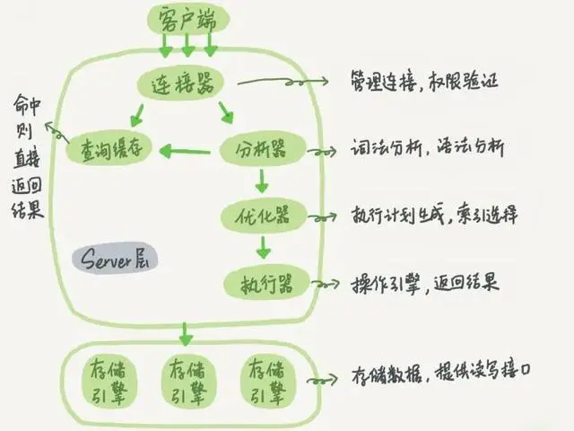
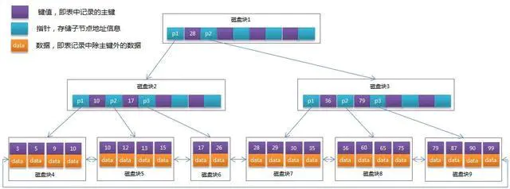
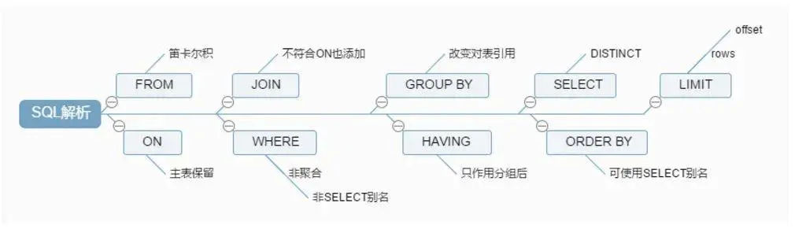

MySQL 进阶（上）
====================
# 1 MySQL 架构
和其它数据库相比，MySQL 有点与众不同，**插件式的存储引擎架构将查询处理和其它的系统任务以及数据的存储提取相分离**。这种架构可以根据业务的需求和实际需要选择合适的存储引擎。

<div align="center">  </div><br>

- 连接层（Connection Pool）：主要完成类似于连接处理、授权认证、及相关的安全方案。该层引入了线程池的概念，为通过认证安全接入的客户端提供线程。同样在该层上可以实现基于 SSL 的安全链接，服务器会为安全接入的每个客户端验证它所具有的操作权限。

- 服务层（Services）：主要完成大部分的核心服务功能，包括 SQL 查询解析、分析、优化、缓存、以及所有的内置函数，所有跨存储引擎的功能也都在这一层实现，包括触发器、存储过程、视图等。

- 存储引擎层（Storage Engines）：负责 MySQL 中数据的存储和提取，服务器通过 API 与存储引擎进行通信。不同的存储引擎具有的功能不同，可以根据实际需要进行选择。

- 数据存储层：主要是将数据存储在运行于该设备的文件系统之上，并完成与存储引擎的交互。

## MySQL 的查询流程
> MySQL 的查询流程是什么？或者一条 SQL 语句在 MySQL 中如何执行的？

<div align="center">  </div><br>

文字说明如下：
- 客户端发起请求
- 连接器（验证用户身份，给予权限）
- 查询缓存（存在缓存则直接返回，不存在则执行后续操作）
- 分析器（对SQL进行词法分析和语法分析操作）
- 优化器（对执行的sql优化并选择最优的执行方案方法）
- 执行器（执行时会先看用户是否有执行权限，有才去使用这个引擎提供的接口）
- 去引擎层获取数据返回（如果开启查询缓存则会缓存查询结果）。

# 2 存储引擎
存储引擎是 MySQL 的组件，用于处理不同表类型的 SQL 操作。不同的存储引擎提供不同的存储机制、索引技巧、锁定水平等功能。

MySQL 服务器使用**可插拔**的存储引擎体系结构，可以从运行中的 MySQL 服务器加载或卸载存储引擎。一个数据库中多个表可以使用不同引擎以满足各种性能和实际需求，选用合适的存储引擎，可提高整个数据库的性能。

### 查看存储引擎
```text
-- 查看支持的存储引擎
SHOW ENGINES

-- 查看默认存储引擎
SHOW VARIABLES LIKE 'storage_engine'

--查看具体某一个表所使用的存储引擎
show create table tablename

--准确查看某个数据库中的某一表所使用的存储引擎
show table status like 'tablename'
show table status from database where name="tablename"
```

### 设置存储引擎
```text
-- 建表时指定存储引擎。默认的就是INNODB，不需要设置
CREATE TABLE t1 (i INT) ENGINE = INNODB;
CREATE TABLE t2 (i INT) ENGINE = CSV;
CREATE TABLE t3 (i INT) ENGINE = MEMORY;

-- 修改存储引擎
ALTER TABLE t ENGINE = InnoDB;

-- 修改默认存储引擎，也可以在配置文件my.cnf中修改默认引擎
SET default_storage_engine=NDBCLUSTER;
```

## 2.1 存储引擎对比
常见的存储引擎有：InnoDB、MyISAM、Memory、NDB。

InnoDB 是 MySQL 默认的存储引擎，支持事务、行级锁定和外键。

## 2.2 文件存储结构对比
在 MySQL 中建立任何一张数据表，在其数据目录对应的数据库目录下都有对应表的 .frm 文件，**.frm 文件用于保存每个数据表的元数据(meta)信息**，包括表结构的定义等，与数据库存储引擎无关，命名方式为数据表名.frm，如 user.frm。

查看 MySQL 数据保存位置：show variables like 'data%'

### MyISAM 物理文件结构：
- .frm 文件：存放与表相关的元数据信息，包括表结构的定义信息等；
- .MYD (MYData)文件：MyISAM 存储引擎专用，用于存储 MyISAM 表的数据；
- .MYI (MYIndex)文件：MyISAM 存储引擎专用，用于存储 MyISAM 表的索引相关信息。

### InnoDB 物理文件结构：
- .frm 文件：存放与表相关的元数据信息，包括表结构的定义信息等；
- .ibd 或 .ibdata 文件：存放 InnoDB 数据的文件，包括表数据和索引等信息；InnoDB 的数据存储方式可通过配置来决定是使用共享表空间存放存储数据，还是用独享表空间存放存储数据。
  - 独享表空间存储方式使用.ibd 文件，并且每个表一个.ibd文件；
  - 共享表空间存储方式使用.ibdata文件，所有表共同使用一个.ibdata 文件（或多个，可自己配置）。  
- 之所以有两种文件形式存放 InnoDB 的数据，是因为 InnoDB 的数据存储方式能够通过配置来决定是使用共享表空间存放存储数据，还是用独享表空间存放存储数据。独享表空间存储方式使用.ibd 文件，并且每个表一个.ibd文件；共享表空间存储方式使用。

## 2.3 InnoDB 和 MyISAM 对比
- InnoDB 支持事务，MyISAM 不支持事务；
- InnoDB 支持外键，MyISAM 不支持。将包含外键的 InnoDB 表转为 MYISAM 会失败；
- InnoDB 是聚簇索引，MyISAM 是非聚簇索引（参考：索引）；
- InnoDB 不保存表的具体行数，执行 select count(*) from table 时需要全表扫描；MyISAM 用一个变量保存了整个表的行数，执行上述语句时只需要读出该变量即可，速度较快；
- InnoDB 最小的锁粒度是行锁，MyISAM 最小的锁粒度是表锁；MyISAM 中，一个更新语句会锁住整张表，导致其他查询和更新都会被阻塞，因此并发访问受限。

### 问题扩展
```text
1.一张表，有ID自增主键，当insert了17条记录之后，删除了第15,16,17条记录，再把Mysql重启，再insert一条记录，这条记录的ID是18还是15 ？

2.哪个存储引擎执行 select count(*) 更快，为什么?
```

# 3 数据类型
<div align="center">  </div><br>
<div align="center">  </div><br>
<div align="center">  </div><br>

### 主要有五大类：

- 整数类型：BIT、BOOL、TINY INT、SMALL INT、MEDIUM INT、 INT、 BIG INT
- 浮点数类型：FLOAT、DOUBLE、DECIMAL
- 字符串类型：CHAR、VARCHAR、TINY TEXT、TEXT、MEDIUM TEXT、LONGTEXT、TINY BLOB、BLOB、MEDIUM BLOB、LONG BLOB
- 日期类型：Date、DateTime、TimeStamp、Time、Year
- 其他数据类型：BINARY、VARBINARY、ENUM、SET、Geometry、Point、MultiPoint、LineString、MultiLineString、Polygon、GeometryCollection 等。

### CHAR 和 VARCHAR 的区别：
- 相同点：
  - 都是字符类型，char(n)、varchar(n) 中的n都代表字符的个数；
  - 超过 char，varchar 最大长度 n 的限制后，字符串会被截断。
- 不同点：
  - char 是固定长度，varchar 长度可变。char 不论实际存储的字符数都会占用 n 个字符的空间，而 varchar 只会占用实际字符应该占用的字节空间加1（实际长度length，0<=length<255）或加2（length>255）。因为varchar保存数据时除了要保存字符串之外还会加一个字节来记录长度（如果列声明长度大于255则使用两个字节来保存长度）。
  - 能存储的最大空间限制不一样，char的存储上限为255字节。
  - char 在存储时会截断尾部的空格，而 varchar 不会。

# 4 索引
MYSQL 官方对索引的定义为：索引（Index）是帮助 MySQL 高效获取数据的数据结构，所以索引的本质是：数据结构。

## 4.1 基本语法
```text
- 创建索引（若是CHAR，VARCHAR类型，length可小于字段实际长度；若是BLOB和TEXT类型，须指定 length）
CREATE [UNIQUE] INDEX indexName ON mytable(username(length));
- 修改表结构(添加索引)
ALTER table tableName ADD [UNIQUE] INDEX indexName(columnName);
- 删除索引
DROP INDEX [indexName] ON mytable;
- 查看索引，通过添加 \G 来格式化输出信息
SHOW INDEX FROM table_name \G;

- 添加主键
ALTER TABLE tbl_name ADD PRIMARY KEY (column_list);
- 添加唯一索引
ALTER TABLE tbl_name ADD UNIQUE index_name (column_list);
- 添加普通索引，索引值可出现多次
ALTER TABLE tbl_name ADD INDEX index_name (column_list);
- 添加全文索引
ALTER TABLE tbl_name ADD FULLTEXT index_name (column_list);
```

## 4.2 MySQL 索引分类

### 从数据结构角度：
- B+树索引
- Hash索引
- Full-Text 全文索引
- R-Tree 索引

### 从物理存储角度：
- 聚集索引（clustered index）
- 非聚集索引（non-clustered index），也叫辅助索引（secondary index）聚集索引和非聚集索引都是 B+树结构。

### 从逻辑角度：
- 主键索引：是一种特殊的唯一索引，不允许有空值；
- 普通索引/单列索引：每个索引只包含单个列，一个表可以有多个单列索引；
- 联合索引/多列索引/复合索引：指多个字段上创建的索引，只有在查询条件中使用了创建索引时的第一个字段，索引才会被使用（遵循最左前缀集合）；
- 唯一索引或者非唯一索引；
- 空间索引：是对空间数据类型的字段建立的索引，MYSQL 中的空间数据类型有4种：GEOMETRY、POINT、LINESTRING、POLYGON。MYSQL 使用 SPATIAL 关键字进行扩展，使得能够用于创建正规索引类型的语法创建空间索引。创建空间索引的列，必须将其声明为NOT NULL，空间索引只能在存储引擎为 MYISAM 的表中创建。

## 4.3 MySQL 索引结构
索引（index）是在存储引擎（storage engine）层面实现的，而不是 server 层面；不是所有的存储引擎都支持所有的索引类型，即使多个存储引擎支持某一索引类型，它们的实现和行为也可能有所差别。

MyISAM 和 InnoDB 存储引擎，都使用 B+Tree 的数据结构，它相对与 B-Tree 结构，所有的数据都存放在叶子节点上，且把叶子节点通过指针连接到一起，形成了一条数据链表，以加快相邻数据的检索效率。

几个概念：
- 磁盘块（block）：系统从磁盘读取数据到内存时是以磁盘块为基本单位的，位于同一个磁盘块中的数据会被一次性读取出来，而不是需要什么取什么。
- 页（Page）：页是其磁盘管理的最小单位。InnoDB 存储引擎中默认每个页的大小为 16KB，可通过参数 innodb_page_size 将页的大小设置为 4K、8K、16K。
  
MySQL 中可通过如下命令查看页的大小：show variables like 'innodb_page_size'。InnoDB 在把磁盘数据读入到磁盘时会以页为基本单位，在查询数据时如果一个页中的每条数据都能有助于定位数据记录的位置，可减少磁盘 I/O 次数，提高查询效率。

### 4.3.1 B-Tree
为了描述 B-Tree，首先定义一条记录为一个二元组[key, data] ，key为记录的键值，对应表中的主键值，data 为一行记录中除主键外的数据。对于不同的记录，key 值互不相同。

<div align="center">  </div><br>

如上图：以根节点为例，关键字为17和35，P1指针指向的子树的数据范围为小于17，P2指针指向的子树的数据范围为17~35，P3指针指向的子树的数据范围为大于35。   

 一棵 m 阶的 B-Tree 有如下特性：
- 每个节点最多有 m 个孩子；
- 除了根节点和叶子节点外，其它每个节点至少有 m/2 个孩子；
- 所有叶子节点都在同一层，且不包含其它关键字信息；
- 每个非终端节点包含n个关键字信息（P0,P1,…Pn, k1,…kn）；
- 关键字的个数n满足：ceil(m/2)-1 <= n <= m-1；
- ki(i=1,…n)为关键字，且关键字升序排序；
- Pi(i=1,…n)为指向子树根节点的指针。P(i-1)指向的子树的所有节点关键字均小于ki，但都大于k(i-1)。

模拟查找关键字 29 的过程：
- 根据根节点找到磁盘块1，读入内存。【磁盘I/O操作第1次】；
- 比较关键字29在区间（17,35），找到磁盘块1的指针P2；
- 根据P2指针找到磁盘块3，读入内存。【磁盘I/O操作第2次】；
- 比较关键字29在区间（26,30），找到磁盘块3的指针P2；
- 根据P2指针找到磁盘块8，读入内存。【磁盘I/O操作第3次】；
- 在磁盘块8中的关键字列表中找到关键字29。

从如上过程分析得出：查找关键字 29 需要3次磁盘I/O操作，和3次内存查找操作。由于内存中的关键字是一个有序表结构，可以利用二分法查找提高效率。而3次磁盘I/O操作是影响整个B-Tree查找效率的决定因素。B-Tree相对于AVLTree缩减了节点个数，使每次磁盘I/O取到内存的数据都发挥了作用，从而提高了查询效率。

### 4.3.2 B+Tree
B+Tree 是在 B-Tree 基础上的一种优化，InnoDB 存储引擎就是用 B+Tree 实现其索引结构。

在 B+Tree 中，所有数据记录节点都是按照键值大小顺序存放在同一层的叶子节点上，而非叶子节点上只存储 key 值信息，这样可大大加大每个节点存储的 key 值数量，降低 B+Tree 的高度。

B+Tree相对于B-Tree有几点不同：
- 非叶子节点只存储键值信息；
- 所有叶子节点之间都有一个链指针；
- 数据记录都存放在叶子节点中。

<div align="center">  </div><br>

通常在 B+Tree 上有两个头指针，一个指向根节点，另一个指向关键字最小的叶子节点，而且所有叶子节点（即数据节点）之间是一种链式环结构。因此，可对 B+Tree 进行两种查找运算：1.对于主键的范围查找和分页查找；2.从根节点开始，进行随机查找。

B+Tree 的高度一般为 2-4 层。MySQL 的 InnoDB 存储引擎在设计时是将根节点常驻内存的，也就是说查找某一键值的行记录时最多只需要 1~3 次磁盘 I/O 操作。

B+Tree 性质：
- IO 次数取决于 B+Tree 的高度h。假设当前数据表的数据为 N，每个磁盘块的数据项的数量是 m，则有 h=㏒(m+1)N：
  - 当数据量 N 一定的情况下，m 越大，h 越小；
  - m = 磁盘块的大小 / 数据项的大小，数据页（磁盘块）的大小是固定的，如果**数据项占的空间越小，数据项的数量越多，树的高度越低**。  
  这是索引字段要尽量的小的原因，如：int占4字节，要比bigint8字节少一半。也是为什么 b+树 要求把真实的数据放到叶子节点而不是内层节点的原因（一旦放到内层节点，磁盘块的数据项会大幅度下降，导致树增高）。

- 当 B+Tree 的数据项是复合的数据结构，如：(name,age,sex)时，B+Tree 是按照从**左到右的顺序来建立搜索树**的。如：检索 (张三,20,F)，B+Tree 会优先比较 name 来确定下一步的所搜方向，如果 name 相同再依次比较 age 和 sex ，最后得到检索的数据，这就是索引的**最左匹配特性**。

### 4.3.3 MyISAM 索引结构
MyISAM 引擎的索引文件和数据文件是分离的。MyISAM 引擎索引结构的叶子节点的数据域，存放的并不是实际的数据记录，而是数据记录的地址。

索引文件与数据文件分离，这样的索引称为"非聚簇索引"。MyISAM 的主索引与辅助索引区别并不大，只是主键索引不能有重复的关键字。

<div align="center">  </div><br>
在 MyISAM 中，索引（含叶子节点）存放在单独的 .myi 文件中，叶子节点存放的是数据的物理地址偏移量（通过偏移量访问就是随机访问，速度很快）。

主键索引，键值不可能重复；辅助索引（普通索引），键值可能重复。

通过索引查找数据的流程：先从索引文件中查找到索引节点，从中拿到数据的文件指针，再到数据文件中通过文件指针定位了具体的数据（辅助索引类似）。

### 4.3.4 InnoDB 索引结构
InnoDB 引擎索引结构的叶子节点的数据域，存放的是实际的数据记录（主索引，存放表中所有的数据记录；辅助索引，会引用主键，检索的时候通过主键找到主键索引中找到对应数据行）。

InnoDB 的数据文件本身就是主键索引文件，这样的索引被称为“聚簇索引”，一个表只能有一个聚簇索引。

#### 主键索引
InnoDB 索引是聚集索引，它的索引和数据是存入同一个.idb 文件中的（一个树节点中同时存放索引和数据），索引分叶子节点和非叶子节点，非叶子节点就像新华字典的目录，单独存放在索引段中，叶子节点则是顺序排列的，在数据段中。

Innodb 的数据文件可以按照表来切分（开启innodb_file_per_table)，切分后存放在 xxx.ibd 中，默认不切分，存放在 xxx.ibdata 中。

<div align="center">  </div><br>

#### 辅助（主键）索引
辅助索引的结构和主键索引的结构有很大差别。辅助索引在最底层的叶子结点有两行数据：第一行的字符串是辅助索引，按照ASCII码进行排序；第二行的整数是主键的值。

<div align="center">  </div><br>

对 name 列进行条件搜索，需要两个步骤：
- 在辅助索引上检索 name，到达其叶子节点获取对应的主键；
- 使用主键在主索引上再进行对应的检索操作。

这也就是所谓的“回表查询”。

InnoDB 索引结构需要注意的点：
- 数据文件本身就是索引文件；
- 表数据文件就是按 B+Tree 组织的一个索引结构文件；
- 聚集索引中叶节点包含了完整的数据记录；
- InnoDB 表必须要有主键，并且推荐使用整型自增主键。

那为什么推荐使用整型自增主键而不是选择UUID？
- UUID 是字符串，比整型消耗更多的存储空间；
- 在 B+Tree 中进行查找时需要跟经过的节点值比较大小，整型数据的比较运算比字符串更快速；
- 自增的整型索引在磁盘中会连续存储，在读取一页数据时也是连续；UUID 是随机产生的，读取的上下两行数据存储是分散的，不适合执行 where id > 5 && id < 20 的条件查询语句。
- 在插入或删除数据时，整型自增主键会在叶子结点的末尾建立新的叶子节点，不会破坏左侧子树的结构；UUID 主键很容易出现这样的情况，B+Tree 为了维持自身的特性，有可能会进行结构的重构，消耗更多的时间。

### 4.3.5 Hash 索引
通过 Hash 算法，将数据库字段数据转换成定长的 Hash 值，与这条数据的行指针一并存入 Hash 表的对应位置；如果发生 Hash 碰撞（两个不同关键字的 Hash 值相同），则在对应 Hash 键下以链表形式存储。

检索算法：在检索查询时，就再次对待查关键字再次执行相同的 Hash算法，得到 Hash 值，到对应 Hash 表对应位置取出数据即可，如果发生 Hash 碰撞，则需要在取值时进行筛选。

MySQL 目前有 Memory 引擎和 NDB 引擎支持 Hash 索引。

常见的 Hash 算法有：直接定址法、平方取中法、折叠法、除数取余法、随机数法。

### 4.3.6 full-text 全文索引
全文索引是 MyISAM 的一种特殊索引类型，主要用于全文索引，InnoDB 从 MYSQL5.6 版本提供对全文索引的支持。

它用于替代效率较低的 like 模糊匹配操作，而且可以通过多字段组合的全文索引一次性全模糊匹配多个字段。

使用 B-Tree 存放索引数据，但使用的是特定的算法，将字段数据分割后再进行索引（一般每4个字节一次分割），索引文件存储的是分割前的索引字符串集合，与分割后的索引信息，对应 Btree 结构的节点存储的是分割后的词信息以及它在分割前的索引字符串集合中的位置。

### 4.3.7 R-Tree 空间索引
空间索引是 MyISAM 的一种特殊索引类型，主要用于地理空间数据类型。

## 4.4 索引使用

### 哪些情况需要创建索引
- 主键自动建立唯一索引；
- 频繁作为查询条件的字段；
- 查询中与其他表关联的字段，外键关系建立索引；
- 单键/组合索引的选择问题，高并发下倾向创建组合索引；
- 查询中排序的字段，排序字段通过索引访问大幅提高排序速度；
- 查询中统计或分组字段。

### 哪些情况不要创建索引
- 表记录太少；
- 经常增删改的表；
- 数据重复且分布均匀的表字段，只应该为最经常查询和最经常排序的数据列建立索引；
- 频繁更新的字段不适合创建索引（会加重IO负担）；
- where 条件里用不到的字段不创建索引。

### MySQL 高效索引
覆盖索引（Covering Index）,或者叫索引覆盖， 也就是平时所说的不需要回表操作。

- select 的数据列只用从索引中就能够取得，不必读取数据行，MySQL 可以利用索引返回 select 列表中的字段，而不必根据索引再次读取数据文件，换句话说查询列要被所建的索引覆盖。
- 索引是高效找到行的一个方法，但是一般数据库也能使用索引找到一个列的数据，因此它不必读取整个行。毕竟索引叶子节点存储了它们索引的数据，当能通过读取索引就可以得到想要的数据，那就不需要读取行了。一个索引包含（覆盖）满足查询结果的数据就叫做覆盖索引。
- 判断标准使用 explain，可以通过输出的 extra 列来判断，对于一个索引覆盖查询，显示为 using index，MySQL查询优化器在执行查询前会决定是否有索引覆盖查询。

# 5 MySQL 查询

## 5.1 SQL 执行顺序
手写 SQL
```text
SELECT DISTINCT <select_list>
FROM <left_table> <join_type>
JOIN <right_table> ON <join_condition>
WHERE <where_condition>
GROUP BY <group_by_list>
HAVING <having_condition>
ORDER BY <order_by_condition>
LIMIT <limit_number>
```

机读 SQL
```Text
FROM <left_table>
ON <join_condition>
<join_type> JOIN <right_table>
WHERE <where_condition>
GROUP BY <group_by_list>
HAVING <having_condition>
SELECT
DISTINCT <select_list>
ORDER BY <order_by_condition>
LIMIT <limit_number>
```
<div align="center">  </div><br>

## 5.2 Join 图
<div align="center"> </div><br>

## 5.3 问题

> 1.count(*) 和 count(1)和count(列名)区别？

执行效果上：
- count(*)包括了所有的列，相当于行数，在统计结果的时候，不会忽略列值为 NULL；
- count(1) 包括了所有列，用1代表代码行，在统计结果的时候，不会忽略列值为 NULL；
- count(列名)只包括列名那一列，在统计结果的时候，会忽略列值为空（不是指空字符串或者0，而是表示 null）的计数，即某个字段值为NULL时，不统计。

执行效率上：
- 列名为主键，count(列名)会比 count(1) 快；
- 列名不为主键，count(1) 会比 count(列名)快；
- 如果表多个列并且没有主键，则 count(1) 的执行效率优于 count(*)；
- 如果有主键，则 select count（主键）的执行效率是最优的；
- 如果表只有一个字段，则 select count(*) 最优。

> 2.MySQL 中 in 和 exists 的区别？
- in：in 查询相当于多个 or 条件的叠加；
- exists：exists 对外表用 loop 逐条查询，每次查询都会查看exists 的条件语句，当 exists 里的条件语句能够返回记录行时（无论记录行是的多少，只要能返回），条件就为真，返回当前loop到的这条记录；反之，如果 exists 里的条件语句不能返回记录行，则当前 loop 到的这条记录被丢弃。

> 3.UNION 和 UNION ALL 的区别？
- UNION 和 UNION ALL 都是将两个结果集合并为一个，**两个要联合的 SQL 语句字段个数必须一样，而且字段类型要“相容”（一致）。**
- UNION 在进行表连接后会筛选掉重复的数据记录（效率较低），而UNION ALL 则不会去掉重复的数据记录；
- UNION 会按照字段的顺序进行排序，而 UNION ALL 只是简单的将两个结果合并就返回。

# 参考：
- [MySQL 万字精华总结](https://www.jianshu.com/p/c189439fb32e)

