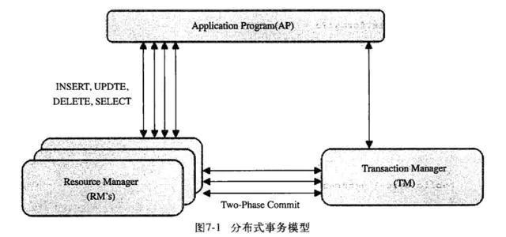

MySQL 进阶（中）
====================
## 1 MySQL 事务
MySQL 事务主要用于处理操作量大，复杂度高的数据。实际业务中，对数据信息的增、删、改等操作语句都将构成一个事务。

### 1.1 事务的 4 要素
事务是由一组 SQL 语句组成的逻辑处理单元，具有 4 个属性：原子性（Atomicity，简称 A）、一致性（Consistency，C）、隔离性（Isolation，I）、持久性（Durability，D），简称为事务的 ACID 属性。

- **原子性（A）**：整个事务中的所有操作，要么全部完成，要么全部不完成，不可能停滞在中间某个环节。事务在执行过程中发生错误，会被回滚（Rollback）到事务开始前的状态，就像这个事务从来没有执行过一样；

- **一致性（C）**：在事务开始之前和事务结束以后，数据库的完整性约束没有被破坏；

- **隔离性（I）**：一个事务的执行不能其它事务干扰。即一个事务内部的操作及使用的数据对其它并发事务是隔离的，并发执行的各个事务之间不能互相干扰。

- **持久性（D）**：在事务完成以后，该事务所对数据库所作的更改便持久的保存在数据库之中，并不会被回滚。

### 1.2 并发事务处理带来的问题
- **更新丢失（Lost Update)**：事务A和事务B选择同一行，然后基于最初选定的值更新该行时，由于两个事务都不知道彼此的存在，就会发生丢失更新问题。

- **脏读(Dirty Reads)**：事务 A 读取了事务 B **更新**的数据，然后 B **回滚**操作，那么 A 读取到的数据是脏数据。
  
- **不可重复读（Non-Repeatable Reads)**：事务 A 多次读取同一数据，事务B在事务A多次读取的过程中，对数据作了**更新**并**提交**，导致事务A多次读取同一数据时，结果不一致。

- **幻读（Phantom Reads)**：幻读与不可重复读类似。事务 A 多次读取同一数据，事务B在事务A多次读取的过程中，对数据作了**新增或删除**并**提交**。导致在随后的查询中，事务A发现多了一些原本不存在的记录，就好像发生了幻觉一样，所以称为幻读。

**幻读和不可重复读的区别**：

- **不可重复读的重点是修改**。在同一事务中，同样的条件，第一次读的数据和第二次读的数据不一样。（因为中间有其他事务提交了修改）
- **幻读的重点在于新增或者删除**。在同一事务中，同样的条件,，第一次和第二次读出来的记录数不一样。（因为中间有其他事务提交了插入/删除）

#### 并发事务带来问题的解决办法
- “更新丢失”通常是应该完全避免的。但防止更新丢失，并不能单靠数据库事务控制器来解决，需要应用程序对要更新的数据加必要的锁来解决，因此，防止更新丢失应该是应用的责任。

- “脏读” 、“不可重复读”和“幻读” ，都是**数据库读一致性问题**，必须由数据库提供一定的事务隔离机制来解决：
  - 加锁：在读取数据前，对其加锁，阻止其他事务对数据进行修改。
  - 数据多版本并发控制（MultiVersion Concurrency Control，简称 MVCC 或 MCC）：不用加任何锁， 通过一定机制生成一个数据请求时间点的一致性数据快照（Snapshot)， 并用这个快照来提供一定级别（语句级或事务级）的一致性读取。从用户的角度来看，好象是数据库可以提供同一数据的多个版本。

### 1.3 事务隔离级别
数据库事务的隔离级别有 4 种，由低到高分别为:
- **READ-UNCOMMITTED(读未提交)**：最低的隔离级别，允许读取尚未提交的数据变更，可能会导致脏读、幻读或不可重复读。

- **READ-COMMITTED(读已提交)**：允许读取并发事务已经提交的数据，可以阻止脏读，但是幻读或不可重复读仍有可能发生。

- **REPEATABLE-READ(可重复读)**：对同一字段的多次读取结果都是一致的，除非数据是被本身事务自己所修改，可以阻止脏读和不可重复读，但幻读仍有可能发生。（InnoDB 存储引擎的默认隔离级别）

- **SERIALIZABLE(可串行化)**：最高的隔离级别，完全服从 ACID 的隔离级别。所有的事务依次逐个执行，这样事务之间就完全不可能产生干扰，也就是说，该级别可以防止脏读、不可重复读以及幻读。

查看当前数据库的事务隔离级别：`show variables like 'tx_isolation';`

数据库的事务隔离越严格，并发副作用越小，但付出的代价就越大，因为事务隔离实质上就是使事务在一定程度上“串行化”进行，这显然与“并发”是矛盾的。同时，不同的应用对读一致性和事务隔离程度的要求也是不同的，比如许多应用对“不可重复读”和“幻读”并不敏感，可能更关心数据并发访问的能力。

因为隔离级别越低，事务请求的锁越少，所以大部分数据库系统的隔离级别都是 READ-COMMITTED(读已提交):，但是 InnoDB 存储引擎默认使用 REPEATABLE-READ（可重读）并不会有任何性能损失。

### 1.4 数据多版本并发控制（MVCC）
MySQL 的大多数事务型存储引擎实现都不是简单的行级锁。基于提升并发性考虑，一般都同时实现了多版本并发控制（MVCC），包括Oracle、PostgreSQL，只是实现机制各不相同。

MVCC 的实现是**通过保存数据在某个时间点的快照来实现的**。也就是说不管需要执行多长时间，每个事物看到的数据都是一致的。MVCC 是行级锁的一个变种，但它在很多情况下避免了加锁操作，开销更低。虽然实现机制有所不同，但大都实现了非阻塞的读操作，写操作也只是锁定必要的行。

典型的 MVCC 实现方式，分为乐观并发控制和悲观并发控制。下边通过 InnoDB 的简化版行为来说明 MVCC 是如何工作的。

InnoDB 的 MVCC，是**通过在每行记录后面保存两个隐藏的列来实现**。其中，一列保存了**行的创建时间**，另一列**保存行的过期时间**（删除时间。当然存储的并不是真实的时间，而是**系统版本号**，每开始一个新的事务，系统版本号都会自动递增；事务开始时刻的系统版本号会作为事务的版本号，用来和查询到的每行记录的版本号进行比较。

#### REPEATABLE READ（可重复读）隔离级别下 MVCC 如何工作
- `SELECT 语句`，InnoDB 会根据以下两个条件检查每行记录，只有符合上述两个条件的才会被查询出来；
  - InnoDB 只查找版本早于当前事务版本的数据行，这样可以确保事务读取的行，要么是在开始事务之前已经存在要么是事务自身插入或者修改过的；
  - 行的删除版本号要么未定义，要么大于当前事务版本号，这样可以确保事务读取到的行在事务开始之前未被删除；

- `INSERT 语句`，InnoDB 为新插入的每一行保存当前系统版本号作为行版本号；

- `DELETE 语句`，InnoDB 为删除的每一行保存当前系统版本号作为行删除标识；

- `UPDATE 语句`，InnoDB 为插入的一行新纪录保存当前系统版本号作为行版本号，同时保存当前系统版本号到原来的行作为删除标识。

保存这两个额外系统版本号，使大多数操作都不用加锁。使数据操作简单，性能很好，并且也能保证只会读取到符合要求的行。不足之处是每行记录都需要额外的存储空间，需要做更多的行检查工作和一些额外的维护工作。

MVCC 只在 COMMITTED READ（读提交）和REPEATABLE READ（可重复读）两种隔离级别下工作。

### 1.5 事务日志
InnoDB 使用日志来减少提交事务时的开销。因为日志中已经记录了事务，就无须在每个事务提交时把缓冲池的脏块刷新(flush)到磁盘中。

事务修改的数据和索引通常会映射到表空间的随机位置，所以刷新这些变更到磁盘需要很多随机 IO。InnoDB 假设使用常规磁盘，随机 IO 比顺序 IO 昂贵得多，因为一个 IO 请求需要时间把磁头移到正确的位置，然后等待磁盘上读出需要的部分，再转到开始位置。

InnoDB 用日志把随机 IO 变成顺序 IO。一旦日志安全写到磁盘，事务就持久化了，即使断电了，InnoDB 可以重放日志并且恢复已经提交的事务。InnoDB 使用一个后台线程智能地刷新这些变更到数据文件。这个线程可以批量组合写入，使得数据写入更顺序，以提高效率。目前来说，大多数存储引擎都是这样实现的，我们通常称之为**预写式日志**（Write-Ahead Logging），**修改数据需要写两次磁盘**。

事务日志可以帮助提高事务效率：
- 使用事务日志，存储引擎在修改表的数据时只需要修改其内存拷贝，再把该修改行为记录到持久在硬盘上的事务日志中，而不用每次都将修改的数据本身持久到磁盘。
- 事务日志采用的是追加的方式，因此写日志的操作是磁盘上一小块区域内的顺序I/O，而不像随机I/O需要在磁盘的多个地方移动磁头，所以采用事务日志的方式相对来说要快得多。
- 事务日志持久以后，内存中被修改的数据在后台可以慢慢刷回到磁盘。
- 如果数据的修改已经记录到事务日志并持久化，但数据本身没有写回到磁盘，此时系统崩溃，存储引擎在重启时能够自动恢复这一部分修改的数据。

### 1.6 事务实现
事务的实现是基于数据库的存储引擎。不同的存储引擎对事务的支持程度不一样。MySQL 中支持事务的存储引擎有 InnoDB 和 NDB。

事务的实现就是如何实现 ACID 特性。**事务的隔离性是通过锁实现**，而**事务的原子性、一致性和持久性则是通过事务日志实现** 。事务日志分为：重做日志（redo log）和回滚日志（undo log）。

#### 重做日志（redo log）
实现持久化和原子性。在 innoDB 的存储引擎中，事务日志通过 redo log 和 innoDB 存储引擎的日志缓冲(InnoDB Log Buffer)实现。
- 事务开启时，事务中的操作，都会先写入存储引擎的日志缓冲中；
- 在事务提交之前，这些缓冲的日志都需要提前刷新到磁盘上持久化，这就是 DBA 们口中常说的“日志先行”(Write-Ahead Logging)；
- 当事务提交之后，在 Buffer Pool 中映射的数据文件才会慢慢刷新到磁盘。
- 此时如果数据库崩溃或者宕机，那么当系统重启进行恢复时，就可以根据 redo log 中记录的日志，把数据库恢复到崩溃前的一个状态。未完成的事务，可以继续提交，也可以选择回滚，这基于恢复的策略而定。
- 在系统启动的时候，为 redo log 分配了一块连续的存储空间，以顺序追加的方式记录 Redo Log，通过顺序 IO 来改善性能。所有的事务共享 redo log 的存储空间，它们的 Redo Log 按语句的执行顺序，依次交替的记录在一起。

#### 回滚日志（undo log）
实现一致性，undo log 主要为事务的回滚服务。在事务执行的过程中，除了记录 redo log，还会记录一定量的 undo log。undo log 记录了数据在每个操作前的状态，如果事务执行过程中需要回滚，就可以根据 undo log 进行回滚操作。单个事务的回滚，只会回滚当前事务做的操作，并不会影响到其他的事务做的操作。**undo 记录的是已部分完成并且写入硬盘的未完成的事务**，默认情况下回滚日志是记录下表空间中的（共享表空间或者独享表空间）。

二种日志均可以视为一种恢复操作，redo log 是**恢复提交事务修改的页操作**，而 undo log 是**回滚行记录到特定版本**。二者记录的内容也不同，redo log 是物理日志，记录页的物理修改操作，而 undo log 是逻辑日志，根据每行记录进行记录。

### 1.7 MySQL 日志的种类
- 错误日志：记录出错信息，也记录一些警告信息或者正确的信息；
- 查询日志：记录所有对数据库请求的信息，不论这些请求是否得到了正确的执行；
- 慢查询日志：设置一个阈值，将运行时间超过该值的所有SQL语句都记录到慢查询的日志文件中；
- 二进制日志：记录对数据库执行更改的所有操作；
- 中继日志：中继日志也是二进制日志，用来给 slave 库恢复；
- 事务日志：重做日志和回滚日志。

### 1.8 MySQL 对分布式事务的支持
分布式事务的实现方式有很多，既可以采用 InnoDB 提供的原生的事务支持，也可以采用消息队列来实现分布式事务的最终一致性。

MySQL 从 5.0.3 InnoDB 存储引擎开始支持XA协议的分布式事务。一个分布式事务会涉及多个行动，这些行动本身是事务性的。所有行动都必须一起成功完成，或者一起被回滚。

在 MySQL 中，使用分布式事务涉及一个或多个资源管理器和一个事务管理器。
<div align="center"> </div><br>

如上图，MySQL 的分布式事务模型。模型中分三块：应用程序（AP）、资源管理器（RM）、事务管理器（TM）。
- 应用程序：定义了事务的边界，指定需要做哪些事务；
- 资源管理器：提供了访问事务的方法，通常一个数据库就是一个资源管理器；
- 事务管理器：协调参与了全局事务中的各个事务。

#### 两段式提交（2PC）

MySQL 分布式事务采用两段式提交（two-phase commit，2PC）的方式：

- 第一阶段，所有的事务节点开始准备，告诉事务管理器 ready。
- 第二阶段，事务管理器告诉每个节点是 commit 还是 rollback。如果有一个节点失败，就需要全局的节点全部 rollback，以此保障事务的原子性。

## 2 MySQL 锁机制

### 2.1 锁的分类

从对数据操作的**类型**分类：

- 读锁（共享锁）：针对同一份数据，多个读操作可以同时进行，不会互相影响；
- 写锁（排他锁）：当前写操作没有完成前，它会阻断其他写锁和读锁。

从对数据操作的**粒度**分类：

为了尽可能提高数据库的并发度，每次锁定的数据范围越小越好，理论上每次只锁定当前操作的数据的方案会得到最大的并发度，但是管理锁是很耗资源的事情（涉及获取，检查，释放锁等动作），因此数据库系统需要在高并发响应和系统性能两方面进行平衡，这样就产生了“锁粒度（Lock granularity）”的概念。

- **表级锁**：开销小，加锁快；不会出现死锁；锁定粒度大，发生锁冲突的概率最高，并发度最低（MyISAM 和 MEMORY 存储引擎采用的是表级锁）；

- **行级锁**：开销大，加锁慢；会出现死锁；锁定粒度最小，发生锁冲突的概率最低，并发度也最高（InnoDB 存储引擎既支持行级锁也支持表级锁，默认情况下采用行级锁）；
  
- **页面锁**：开销和加锁时间界于表锁和行锁之间；会出现死锁；锁定粒度界于表锁和行锁之间，并发度一般。

适用：从锁的角度来说，表级锁更适合于以查询为主，只有少量按索引条件更新数据的应用，如 Web 应用；而行级锁则更适合于有大量按索引条件并发更新少量不同数据，同时又有并发查询的应用，如一些在线事务处理（OLTP）系统。

### 2.2 MyISAM 表锁
MyISAM 的表锁有两种模式：
- 表共享读锁 （Table Read Lock）：不会阻塞其他用户对同一表的读请求，但会阻塞对同一表的写请求；
- 表独占写锁 （Table Write Lock）：会阻塞其他用户对同一表的读和写操作；

默认情况下，写锁比读锁具有更高的优先级：当一个锁释放时，这个锁会优先给写锁队列中等候的获取锁请求，然后再给读锁队列中等候的获取锁请求。

### 2.3 InnoDB 行锁
InnoDB 实现了以下两种类型的行锁：
- 共享锁（S）：允许一个事务去读一行，阻止其他事务获得相同数据集的排他锁。
- 排他锁（X）：允许获得排他锁的事务更新数据，阻止其他事务取得相同数据集的共享读锁和排他写锁。

为了允许行锁和表锁共存，实现多粒度锁机制，InnoDB 还有两种内部使用的**意向锁**（Intention Locks），这两种意向锁都是表锁：
- 意向共享锁（IS）：事务打算给数据行加行共享锁，事务在给一个数据行加共享锁前必须先取得该表的 IS 锁。
- 意向排他锁（IX）：事务打算给数据行加行排他锁，事务在给一个数据行加排他锁前必须先取得该表的 IX 锁。

索引失效会导致行锁变表锁。如:vchar 查询不写单引号的情况。

### 2.4 加锁机制
乐观锁与悲观锁是两种并发控制的思想，可用于解决丢失更新问题。

- 乐观锁：“乐观地”假定大概率不会发生并发更新冲突，访问、处理数据过程中不加锁，只在更新数据时再根据版本号或时间戳判断是否有冲突，有则处理，无则提交事务。用数据版本（Version）记录机制实现，这是乐观锁最常用的一种实现方式

- 悲观锁：“悲观地”假定大概率会发生并发更新冲突，访问、处理数据前就加排他锁，在整个数据处理过程中锁定数据，事务提交或回滚后才释放锁。与乐观锁相对应的，悲观锁是由数据库自己实现了的，要用的时候，直接调用数据库的相关语句就可以了。

### 2.5 锁模式

InnoDB 三种行锁的算法：记录锁、间隙锁、临键锁。

#### 记录锁(Record Locks)
**单个行记录**上的锁。对索引项加锁，锁定符合条件的行。其他事务不能修改和删除加锁项。

```sql
-- id 列为主键列或唯一索引列
SELECT * FROM table WHERE id = 1 FOR UPDATE;
UPDATE SET age = 50 WHERE id = 1;
```
它会在 id=1 的记录上加上记录锁，以阻止其他事务插入、更新、删除；id=1 这一行在通过“主键索引”与“唯一索引”对数据行进行 UPDATE 操作时，也会对该行数据加记录锁。

#### 间隙锁（Gap Locks）
当我们使用**范围条件**而不是相等条件检索数据，并请求共享或排他锁时，InnoDB 会给符合条件的已有数据记录的索引项加锁。对于键值在条件范围内但并不存在的记录，叫做“间隙”。InnoDB 也会对这个“间隙”加锁，这种锁机制就是间隙锁。

对索引项之间的“间隙”加锁，锁定记录的范围（对第一条记录前的间隙或最后一条将记录后的间隙加锁），不包含索引项本身。其他事务不能在锁范围内插入数据，这样就防止了别的事务新增幻影行。**间隙锁基于非唯一索引，它锁定一段范围内的索引记录**。间隙锁基于Next-Key Locking 算法。

使用间隙锁锁住的是一个区间，而不仅仅是这个区间中的每一条数据。
```Text
SELECT * FROM table WHERE id BETWEN 1 AND 5 FOR UPDATE;
```
即所有在[1，5] 区间内的记录行都会被锁住，所有id 为1、2、3、4、5 的数据行的插入会被阻塞，但是 1 和 5 两条记录行并不会被锁住。间隙锁的目的，是为了**防止同一事务的两次当前读，出现幻读的情况**。

#### 临键锁(Next-key Locks)
是记录锁与间隙锁的组合，它的封锁范围，既包含索引记录，又包含索引区间。

每个数据行上的**非唯一索引列**上都会存在一把临键锁，**当某个事务持有该数据行的临键锁时，会锁住一段左开右闭区间的数据**。需要强调的一点是，InnoDB 中行级锁是基于索引实现的，临键锁只与非唯一索引列有关，在唯一索引列（包括主键列）上不存在临键锁。对于行的查询，都是采用该方法，主要目的是**解决幻读的问题**。(如果把事务的隔离级别降级为 RC，临键锁则会失效)。

### 2.6 死锁

#### 产生死锁的原因
- 死锁是指两个或多个事务在同一资源上相互占用，并请求锁定对方占用的资源，从而导致恶性循环
- 当事务试图以不同的顺序锁定资源时，就可能产生死锁。多个事务同时锁定同一个资源时也可能会产生死锁
- 锁的行为和顺序和存储引擎相关。以同样的顺序执行语句，有些存储引擎会产生死锁有些不会死锁有双重原因：真正的数据冲突；存储引擎的实现方式。

#### 检测死锁
数据库系统实现了各种死锁检测和死锁超时的机制。InnoDB 存储引擎能检测到死锁的循环依赖并立即返回一个错误。

#### 死锁恢复
死锁发生以后，只有部分或完全回滚其中一个事务，才能打破死锁，InnoDB 目前处理死锁的方法是，**将持有最少行级排他锁的事务进行回滚**。所以事务型应用程序在设计时必须考虑如何处理死锁，多数情况下只需要重新执行因死锁回滚的事务即可。

#### 外部锁的死锁检测
发生死锁后，InnoDB 一般都能自动检测到，并使一个事务释放锁并回退，另一个事务获得锁，继续完成事务。但在涉及外部锁，或涉及表锁的情况下，InnoDB 并不能完全自动检测到死锁， 这需要通过设置锁等待超时参数 innodb_lock_wait_timeout 来解决。

#### 死锁影响性能
死锁会影响性能而不是会产生严重错误，因为 InnoDB 会自动检测死锁状况并回滚其中一个受影响的事务。在高并发系统上，当许多线程等待同一个锁时，死锁检测可能导致速度变慢。有时当发生死锁时，禁用死锁检测（使用innodb_deadlock_detect配置选项）可能会更有效，这时可以依赖 innodb_lock_wait_timeout 设置进行事务回滚。

#### 避免死锁
在自动加锁的情况下，MyISAM 总是一次获得 SQL 语句所需要的全部锁，所以 MyISAM 表不会出现死锁。

**InnoDB 避免死锁**

- 为了在单个 InnoDB 表上执行多个并发写入操作时避免死锁，可以在事务开始时通过为预期要修改的每个元祖（行）使用 `SELECT ... FOR UPDATE` 语句来获取必要的锁，即使这些行的更改语句是在之后才执行的。
- 在事务中，如果要更新记录，应该直接申请足够级别的锁，即排他锁，而不应先申请共享锁、更新时再申请排他锁，因为这时候当用户再申请排他锁时，其他事务可能又已经获得了相同记录的共享锁，从而造成锁冲突，甚至死锁。
- 如果事务需要修改或锁定多个表，则应在每个事务中以相同的顺序使用加锁语句。在应用中，如果不同的程序会并发存取多个表，应尽量约定以相同的顺序来访问表，这样可以大大降低产生死锁的机会
- 通过 `SELECT ... LOCK IN SHARE MODE` 获取行的读锁后，如果当前事务再需要对该记录进行更新操作，则很有可能造成死锁。
- 改变事务隔离级别。

如果出现死锁，可以用 `show engine innodb status;` 命令来确定最后一个死锁产生的原因。返回结果中包括死锁相关事务的详细信息，如引发死锁的 SQL 语句，事务已经获得的锁，正在等待什么锁，以及被回滚的事务等。据此可以分析死锁产生的原因和改进措施。

## 3 MySQL调优

### 3.1 影响 mysql 的性能因素
- 业务需求对 MySQL 的影响(合适合度)
- 存储定位对 MySQL 的影响
- 系统各种配置及规则数据
- 活跃用户的基本信息数据
- 活跃用户的个性化定制信息数据
- 准实时的统计信息数据
- 其他一些访问频繁但变更较少的数据
- 二进制多媒体数据
- 流水队列数据
- 超大文本数据
- 不适合放进 MySQL 的数据
- 需要放进缓存的数据
- Schema 设计对系统的性能影响
- 尽量减少对数据库访问的请求
- 尽量减少无用数据的查询请求
- 硬件环境对系统性能的影响

### 3.2 性能分析
MySQL 中有专门负责优化 SELECT 语句的优化器模块，提供了分析器进行性能分析（MySQL Query Optimizer）。主要功能：通过计算分析系统中收集到的统计信息，为客户端请求的 Query 提供他认为最优的执行计划（他认为最优的数据检索方式，但不一定是 DBA 认为是最优的，这部分最耗费时间）。

当客户端向 MySQL 请求一条 Query，命令解析器模块完成请求分类，区别出是 SELECT 并转发给 MySQL Query Optimizer 时，MySQL Query Optimizer 首先会对整条 Query 进行优化，处理掉一些常量表达式的预算，直接换算成常量值。并对 Query 中的查询条件进行简化和转换，如去掉一些无用或显而易见的条件、结构调整等。然后分析 Query 中的 Hint 信息（如果有），看显示 Hint 信息是否可以完全确定该 Query 的执行计划。如果没有 Hint 或 Hint 信息还不足以完全确定执行计划，则会读取所涉及对象的统计信息，根据 Query 进行写相应的计算分析，然后再得出最后的执行计划。

#### MySQL 常见瓶颈
- CPU：CPU 在饱和的时候一般发生在数据装入内存或从磁盘上读取数据时候；
- IO：磁盘I/O瓶颈发生在装入数据远大于内存容量的时候；
- 服务器硬件的性能瓶颈：top，free，iostat 和 vmstat来查看系统的性能状态。

#### 性能下降 SQL 慢、执行时间长、等待时间长原因分析
- 查询语句写的烂
- 索引失效（单值、复合）
- 关联查询太多join（设计缺陷或不得已的需求）
- 服务器调优及各个参数设置（缓冲、线程数等）          

### 3.3 MySQL 常见性能分析手段
在优化 MySQL 时，通常需要对数据库进行分析，常见的分析手段有**慢查询日志**，**EXPLAIN 分析查询**，**profiling 分析**以及 **show 命令查询系统状态及系统变量**，通过定位分析性能的瓶颈，才能更好的优化数据库系统的性能。

#### 3.3.1 慢查询日志
MySQL 的慢查询日志是 MySQL 提供的一种日志记录，它用来记录在 MySQL 中响应时间超过阈值的语句，具体指运行时间超过 long_query_time 值的 SQL，则会被记录到慢查询日志中。

- long_query_time 的默认值为10，运行10秒以上的语句;
- 默认情况下，MySQL数据库没有开启慢查询日志，需要手动设置参数开启。

```Text
- 查看开启状态
SHOW VARIABLES LIKE '%slow_query_log%';

- 开启慢查询日志，临时配置
mysql> set global slow_query_log='ON';
mysql> set global slow_query_log_file='/var/lib/mysql/hostname-slow.log';
mysql> set global long_query_time=2;

- 永久配置修改配置文件my.cnf或my.ini，在[mysqld]
[mysqld]
slow_query_log = ON
slow_query_log_file = /var/lib/mysql/hostname-slow.log
long_query_time = 3
```
在生产环境中，可使用 MySQ L提供的日志分析工具 mysqldumpslow。

#### 3.3.2 执行计划（Explain）
使用 Explain 关键字可以模拟优化器执行SQL查询语句，从而知道 MySQL 是如何处理你的 SQL 语句的。分析你的查询语句或是表结构的性能瓶颈。

能干吗：
- 表的读取顺序；
- 数据读取操作的操作类型；
- 哪些索引可以使用；
- 哪些索引被实际使用；
- 表之间的引用；
- 每张表有多少行被优化器查询。

怎么用：
- Explain + SQL 语句；
- 执行计划包含的信息（如果有分区表的话还会有partitions）。

<div align="center"> </div><br>

expalin 各字段解释：
- id：select 查询的序列号，包含一组数字，表示查询中执行select子句或操作表的顺序（从大到小，从上到下）。
  - id 相同，执行顺序从上往下；
  - id 全不同，如果是子查询，id 的序号会递增，id 值越大优先级越高，越先被执行；
  - id 部分相同，执行顺序是先按照数字大的先执行，然后数字相同的按照从上往下的顺序执行。

- select_type：查询类型，用于区别普通查询、联合查询、子查询等复杂查询。
  - SIMPLE ：简单的 select 查询，查询中不包含子查询或 UNION；
  - PRIMARY：查询中若包含任何复杂的子部分，最外层查询被标记为PRIMARY；
  - SUBQUERY：在 select 或 where 列表中包含了子查询；
  - DERIVED：在 from 列表中包含的子查询被标记为 DERIVED，MySQL 会递归执行这些子查询，把结果放在临时表里；
  - UNION：若第二个 select 出现在 UNION 之后，则被标记为UNION，若 UNION 包含在 from 子句的子查询中，外层 select 将被标记为 DERIVED；
  - UNION RESULT：从 UNION 表获取结果的 select。

- table：显示这一行的数据是关于哪张表的；

- type：显示查询使用了那种类型，从最好到最差依次排列 `system > const > eq_ref > ref > fulltext > ref_or_null > index_merge > unique_subquery > index_subquery > range > index > ALL` 。(一般来说，得保证查询至少达到range级别，最好到达ref)
  - system：表只有一行记录（等于系统表），是 const 类型的特例，平时不会出现；
  - const：表示通过索引一次就找到了，const 用于比较 primary key 或 unique 索引，因为只要匹配一行数据，所以很快，如将主键置于 where 列表中，mysql 就能将该查询转换为一个常量
  - eq_ref：唯一性索引扫描，对于每个索引键，表中只有一条记录与之匹配，常见于主键或唯一索引扫描；
  - ref：非唯一性索引扫描，范围匹配某个单独值得所有行。本质上也是一种索引访问，他返回所有匹配某个单独值的行，然而，它可能也会找到多个符合条件的行，多以他应该属于查找和扫描的混合体。
  - range：只检索给定范围的行，使用一个索引来选择行。key列显示使用了哪个索引，一般就是在你的where语句中出现了between、<、>、in等的查询，这种范围扫描索引比全表扫描要好，因为它只需开始于索引的某一点，而结束于另一点，不用扫描全部索引
  - index：Full Index Scan，index于ALL区别为index类型只遍历索引树。通常比ALL快，因为索引文件通常比数据文件小。（也就是说虽然all和index都是读全表，但index是从索引中读取的，而all是从硬盘中读的）
  - ALL：Full Table Scan，将遍历全表找到匹配的行。

- possible_keys：显示可能应用在这张表中的索引，一个或多个，查询涉及到的字段若存在索引，则该索引将被列出，但不一定被查询实际使用；

- key，实际使用的索引，如果为NULL，则没有使用索引。查询中若使用了覆盖索引，则该索引和查询的 select 字段重叠，仅出现在key列表中

- key_len：表示索引中使用的字节数，可通过该列计算查询中使用的索引的长度。在不损失精确性的情况下，长度越短越好。key_len显示的值为索引字段的最大可能长度，并非实际使用长度，即key_len 是根据表定义计算而得，不是通过表内检索出的

- ref：显示索引的哪一列被使用了，如果可能的话，是一个常数。哪些列或常量被用于查找索引列上的值。

- rows：根据表统计信息及索引选用情况，大致估算找到所需的记录所需要读取的行数。

- Extra：包含不适合在其他列中显示但十分重要的额外信息。
  - using filesort: 说明mysql会对数据使用一个外部的索引排序，不是按照表内的索引顺序进行读取。mysql中无法利用索引完成的排序操作称为“文件排序”。常见于order by和group by语句中。
  - Using temporary：使用了临时表保存中间结果，mysql 在对查询结果排序时使用临时表。常见于排序 order by 和分组查询group by。
  - using index：表示相应的select操作中使用了覆盖索引，避免访问了表的数据行，效率不错，如果同时出现using where，表明索引被用来执行索引键值的查找；否则索引被用来读取数据而非执行查找操作。
  - using where：使用了where过滤。
  - using join buffer：使用了连接缓存。
  - impossible where：where子句的值总是false，不能用来获取任何元祖。
  - select tables optimized away：在没有group by子句的情况下，基于索引优化操作或对于MyISAM存储引擎优化COUNT(*)操作，不必等到执行阶段再进行计算，查询执行计划生成的阶段即完成优化。
  - distinct：优化distinct操作，在找到第一匹配的元祖后即停止找同样值的动作。

#### 3.3.3 索引优化
- 全值匹配我最爱；
- 最佳左前缀法则，如建立了一个联合索引(a,b,c)，那么其实我们可利用的索引就有(a), (a,b), (a,b,c)；
- 不在索引列上做任何操作（计算、函数、(自动or手动)类型转换），会导致索引失效而转向全表扫描；
- 存储引擎不能使用索引中范围条件右边的列；
- 尽量使用覆盖索引(只访问索引的查询(索引列和查询列一致))，减少select；
- is null ,is not null 也无法使用索引；
- like "xxxx%" 是可以用到索引的，like "%xxxx" 则不行(like "%xxx%" 同理)。like以通配符开头('%abc...')索引失效会变成全表扫描的操作；
- 字符串不加单引号索引失效；
- 少用or，用它来连接时会索引失效；
- <，<=，=，>，>=，BETWEEN，IN 可用到索引，<>，not in ，!= 则不行，会导致全表扫描。

一般性建议：
- 对于单键索引，尽量选择针对当前 query 过滤性更好的索引；
- 在选择组合索引的时候，当前 Query 中过滤性最好的字段在索引字段顺序中，位置越靠前越好。
- 在选择组合索引的时候，尽量选择可以能够包含当前query中的where字句中更多字段的索引；
- 尽可能通过分析统计信息和调整 query 的写法来达到选择合适索引的目的；
- 少用 Hint 强制索引。

#### 3.3.4 查询优化

- 永远小标驱动大表（小的数据集驱动大的数据集）；

- order by 关键字优化：
  - order by子句，尽量使用 Index 方式排序，避免使用 FileSort 方式排序；
  - MySQL 支持两种方式的排序，FileSort 和 Index，Index效率高，它指 MySQL 扫描索引本身完成排序，FileSort 效率较低。ORDER BY 满足两种情况，会使用Index方式排序：1.ORDER BY语句使用索引最左前列；使用where子句与ORDER BY子句条件列组合满足索引最左前列。
  - 尽可能在索引列上完成排序操作，遵照索引建的最佳最前缀；
  - 如果不在索引列上，filesort 有两种算法，mysql就要启动双路排序和单路排序；
  
- GROUP BY关键字优化
  - group by 实质是先排序后进行分组，遵照索引建的最佳左前缀；
  - 当无法使用索引列，增大 max_length_for_sort_data 参数的设置，增大sort_buffer_size参数的设置；
  - where高于having，能写在where限定的条件就不要去having限定了。

#### 3.3.5 数据类型优化
MySQL 支持的数据类型非常多，选择正确的数据类型对于获取高性能至关重要。不管存储哪种类型的数据，下面几个简单的原则都有助于做出更好的选择。

- 更小的通常更好。一般情况下，应该尽量使用可以正确存储数据的最小数据类型。如：整数比字符操作代价更低，因为字符集和校对规则（排序规则）使字符比较比整型比较复杂。
- 尽量避免 NULL：通常情况下最好指定列为 NOT NULL。


# 参考
- [MySQL 万字精华总结](https://www.jianshu.com/p/c189439fb32e)
- [MySQL的锁机制 - 记录锁、间隙锁、临键锁](https://zhuanlan.zhihu.com/p/48269420)
