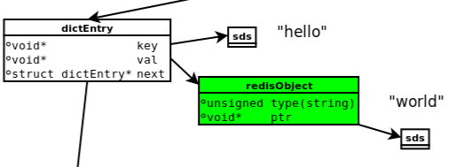
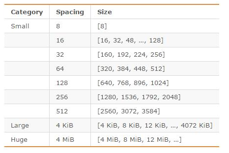
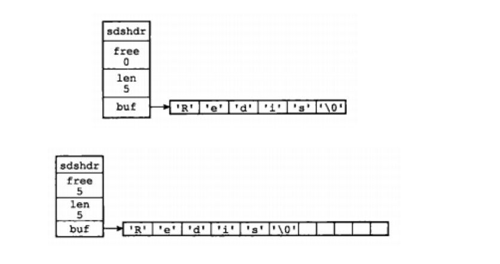

Redis 学习笔记--内存模型
====================
Redis 是一个 C 语言编写的、开源的 k-v 数据库。它支持多种类型的数据结构，如：字符串（string）、散列（hash）、列表（list）、集合（set）、有序集合（sorted set）。

# 1 Redis 内存统计
通过 redis-cli 连接服务器后，输入 `info` 命令，可查看 redis 服务器的相关信息如：服务器、内存、客户端、集群、持久化等信息。

其中输入 `info memory` 命令，查看内存信息：
```Text
127.0.0.1:6379> info memory
# Memory
used_memory:816720
used_memory_human:797.58K
used_memory_rss:2469888
used_memory_peak:817560
used_memory_peak_human:798.40K
used_memory_lua:35840
mem_fragmentation_ratio:3.02
mem_allocator:jemalloc-3.6.0
```
参数说明如下：

(1).`used_memory`：Redis 分配器分配的内存总量（单位为 byte），包括使用的虚拟内存（swap）；used_memory_human 为其友好显示。

(2).`used_memory_rss`：Redis 进程占据操作系统的内存，与 top 及 ps 命令看到的值是一致的；除了分配器分配的内存之外，used_memory_rss 还包括进程运行本身需要的内存、内存碎片等，但是不包括虚拟内存。

used_memory 和 used_memory_rss，前者是从 Redis 角度得到的量，后者是从操作系统角度得到的量。两者不同的原因是：a.内存碎片和 Redis 进程运行需要占用内存，使得前者可能比后者小；b.虚拟内存的存在，使得前者可能比后者大。

(3).`mem_fragmentation_ratio`：内存碎片比率，mem_fragmentation_ratio = used_memory_rss / used_memory。

mem_fragmentation_ratio 一般大于1，且该值越大，内存碎片比例越大。 mem_fragmentation_ratio<1，说明 Redis 使用了虚拟内存，由于虚拟内存的媒介是磁盘，比内存速度要慢很多，当这种情况出现时，应该及时排查，如果内存不足应该及时处理，如：增加 Redis 节点、增加 Redis 服务器的内存、优化应用等。

(4).`mem_allocator`：Redis 使用的内存分配器，在编译时指定；可以是 libc 、jemalloc 或 tcmalloc，默认是 jemalloc。

# 2 Redis 内存划分
Redis 的内存占用主要分为：
- **数据**。Redis 使用键值对存储数据，其中的值（对象）包括 5 种类型（`String、Hash、List、Set、Sorted Set`）。这部分占用的内存会统计在 used_memory 中。

- **进程本身运行需要的内存**。Redis 主进程本身运行需要占用内存，如代码、常量池等（约几M）；在生产环境中与 Redis 数据占用的内存相比可以忽略。这部分内存不是由 jemalloc 分配，因此不会统计在 used_memory中。

- **缓冲内存**。缓冲内存包括客户端缓冲区、复制积压缓冲区、AOF 缓冲区等。这部分内存由 jemalloc 分配，因此会统计在 used_memory 中。
  - 客户端缓冲存储客户端连接的输入输出缓冲；
  - 复制积压缓冲用于部分复制功能；
  - AOF 缓冲区用于在进行 AOF 重写时，保存最近的写入命令。

- **内存碎片**。内存碎片是 Redis 在分配、回收物理内存过程中产生的。内存碎片不会统计在 used_memory 中。

  内存碎片的产生与对数据进行的操作、数据的特点等有关；此外，与使用的内存分配器也有关系：如果内存分配器设计合理，可以尽可能的减少内存碎片的产生。

# 3 Redis 数据存储的细节
从执行 set hello world ，了解所涉及到的数据模型，如下：
<div align="center"> </div><br>

- dictEntry：Redis 是 Key-Value 数据库，因此对每个键值对都会有一个 dictEntry，里面存储了指向 Key 和 Value 的指针；next 指向下一个dictEntry，与本 k-v 无关。

- Key：Key（”hello”）并不是直接以字符串存储，而是存储在 SDS 结构中。

- redisObject：Value(“world”) 存储在 redisObject 中，不论 Value 是 5 种类型的哪一种，都是通过 redisObject 来存储的；而redisObject 中的 type 字段指明了Value对象的类型，ptr字段则指向对象所在的地址。

## 3.1 jemalloc
Redis 在编译时便会指定内存分配器；内存分配器可以是 libc 、jemalloc或 tcmalloc，默认为 jemalloc。

jemalloc 在 64 位系统中，将内存空间划分为小、大、巨大三个范围；每个范围内又划分了许多小的内存块单位；当 Redis 存储数据时，会选择大小最合适的内存块进行存储。

jemalloc 划分的内存单元如下图所示：
<div align="center"> </div><br>

*例如：若需要存储大小为130字节的对象，jemalloc会将其放入160字节的内存单元中。*

## 3.2 redisObject
Redis 对象有 5 种类型；无论是哪种类型，Redis 都不会直接存储，而是通过 redisObject 对象进行存储。

redisObject 对象非常重要，Redis 对象的类型、内部编码、内存回收、共享对象等功能，都需要 redisObject 支持。redisObject 的定义如下：
```Text
typedef struct redisObject {
　　unsigned type:4;
　　unsigned encoding:4;
　　unsigned lru:REDIS_LRU_BITS; /* lru time (relative to server.lruclock) */
　　int refcount;
　　void *ptr;
} robj;
```
- type：表对象的类型，占 4 个 byte。包括 REDIS_STRING(字符串)、REDIS_LIST(列表)、REDIS_HASH(哈希)、REDIS_SET(集合)、REDIS_ZSET(有序集合)。

- encoding：表对象的内部编码，占 4 个 byte。


# 1 Redis 常用数据结构及应用场景

## 1.1 String 

常用命令：`set, get, decr, incr, mget` 等。

String 数据结构是简单的 key-value 类型，value 其实不仅可以是字符串，也可以是数字。

**应用场景**：k-v 缓存应用；常规计数，微博数，粉丝数等。

## 1.2 Hash

常用命令：`hget, hset, hgetall` 等。

Hash 是一个 string 类型的 field 和 value 的映射表，hash 适用于存储对象。如：用 Hash 数据结构来存储用户信息，商品信息等。

## 1.3 List
常用命令: `lpush, rpush, lpop, rpop, lrange` 等。

Redis list 的实现为一个双向链表，即可以支持反向查找和遍历，更方便操作，不过带来了部分额外的内存开销。

**应用场景**：微博的关注列表，粉丝列表，最新消息排行等。

## 1.4 Set
常用命令：`sadd, spop, smembers, sunion` 等。

set 对外提供的功能与 list 类似是一个列表的功能，特殊之处在于 set 是可以自动去重的。

在微博应用中，可以将一个用户所有的关注人存在一个集合中，将其所有粉丝存在一个集合。Redis 可以非常方便的实现如共同关注、共同喜好、二度好友等功能。

## 1.5 Sorted Set
常用命令：`zadd, zrange, zrem, zcard` 等。

和 set 相比，sorted set 增加了一个权重参数 score，使得集合中的元素能够按 score 进行有序排列。

在直播系统中，实时排行信息包含直播间在线用户列表，各种礼物排行榜，弹幕消息（可以理解为按消息维度的消息排行榜）等信息，适合使用Redis中的SortedSet 结构进行存储。

*在 redis-cli 中通过命令查看，输入"?"或者"help"回车。*

# 2 redis 主从模式
主从复制，是指将一台 Redis 服务器的数据，复制到其他的 Redis 服务器。前者称为**主节点(master)**，后者称为**从节点(slave)**。数据的**复制是单向的**，只能由**主节点到从节点**。

默认情况下，每台 Redis 服务器都是主节点；且 1 个主节点可以 0 ~ n 个从节点，但 1 个从节点只能有 1 个主节点。

## 2.1 主从复制的作用
- **数据冗余**：主从复制实现了数据的热备份，是持久化之外的一种数据冗余方式。
- **故障恢复**：当主节点出现问题时，可以由从节点提供服务，实现快速的故障恢复；实际上是一种服务的冗余。
- **读写分离**：可以用于实现读写分离，主库写、从库读，读写分离不仅可以提高服务器的负载能力，同时可根据需求的变化，改变从库的数量；
- **负载均衡**：在主从复制的基础上，配合读写分离，可以由主节点提供写服务，由从节点提供读服务，分担服务器负载。

## 2.2 主从复制启用
从节点开启主从复制，有3种方式：
- 从服务器配置文件： 在从服务器的配置文件中加入：slaveof <masterip> <masterport>
- 启动命令： redis-server启动命令后加入 --slaveof <masterip> <masterport>
- 客户端命令： Redis服务器启动后，直接通过客户端执行命令：slaveof <masterip> <masterport>，则该 Redis 实例成为从节点。

通过  info replication 命令可以看到复制的一些信息。

## 2.3 主从复制原理
主从复制过程大体可以分为3个阶段：连接建立阶段（即准备阶段）、数据同步阶段、命令传播阶段。
<div align="center"> </div><br>

在从节点执行 slaveof 命令后，复制过程便开始运作。从上图可看出复制过程大致分为6个过程：
- 保存主节点（master）信息。

- 主从建立建立 socket 连接；从节点（slave）内部通过定时任务维护复制相关逻辑，当定时任务发现存在新的主节点后，会尝试与该节点建立网络连接。

- 发送 ping 命令；连接建立成功后从节点发送 ping 请求进行首次通信，ping 请求主要目的如下：
  - 检测主从之间 socket 连接是否可用；
  - 检测主节点当前是否可接受处理命令。

- **权限验证**；如果主节点设置了 requirepass 参数，则需要密码验证，从节点必须配置 masterauth 参数保证与主节点相同的密码才能通过验证；如果验证失败复制将终止，从节点**重新发起复制流程**。

- **同步数据集**。主从复制连接正常通信后，对于首次建立复制的场景，**主节点会把持有的数据全部推送给从节点**，这部分操作是耗时最长的步骤。

- **命令持续复制**。当主节点把当前的数据同步给从节点后，便完成了复制的建立流程。接下来**主节点会持续地把写命令推送给从节点**，保证主从数据一致性。

## 2.4 存在的问题
当 master down，需要手动将一台 slave 使用 slaveof no one 提升为master 要实现自动，就需要 redis 哨兵。

# 3 redis 哨兵模式
为了解决 Redis 主从复制不支持高可用，Redis 实现了 Sentinel 哨兵机制解决方案。

## 3.1 架构图
<div align="center"> </div><br>

redis 哨兵模式由两部分组成：
- 数据节点：主节点和从节点都是数据节点。
- 哨兵节点：哨兵系统由一个或多个哨兵节点组成，哨兵节点是特殊的redis节点，不存储数据。

## 3.2 哨兵节点支持的命令
- info sentinel：获取监控的所有主节点的基本信息；
- sentinel masters：获取监控的所有主节点的详细信息；
- sentinel master mymaster：获取监控的主节点mymaster的详细信息；
- sentinel slaves mymaster：获取监控的主节点mymaster的从节点的详细信息；
- sentinel sentinels mymaster：获取监控的主节点mymaster的哨兵节点的详细信息
- sentinel get-master-addr-by-name mymaster：获取监控的主节点mymaster的地址信息；
- sentinel is-master-down-by-addr：哨兵节点之间可以通过该命令询问主节点是否下线，从而对是否客观下线做出判断。

## 3.3 基本原理
关于哨兵的原理，关键是了解以下几个概念。

（1）定时任务：每个哨兵节点维护了 3 个定时任务。定时任务的功能分别如下：
- 通过向主从节点发送 info 命令获取最新的主从结构；
- 通过发布订阅功能获取其他哨兵节点的信息；
- 通过向其他节点发送 ping 命令进行心跳检测，判断是否下线。

（2）主观下线：在心跳检测的定时任务中，如果其他节点超过一定时间没有回复，哨兵节点就会将其进行主观下线（一个哨兵节点“主观地”判断下线；与主观下线相对应的是客观下线）。

（3）客观下线：哨兵节点在对主节点进行主观下线后，会通过 sentinel is-master-down-by-addr 命令询问其他哨兵节点该主节点的状态；如果判断主节点下线的哨兵数量达到一定数值，则对该主节点进行客观下线。

（4）选举领导者哨兵节点：当主节点被判断客观下线以后，各个哨兵节点会进行协商，选举出一个领导者哨兵节点，并由该领导者节点对其进行故障转移操作。

监视该主节点的所有哨兵都有可能被选为领导者，选举使用的算法是 Raft 算法；Raft 算法的基本思路是先到先得：即在一轮选举中，哨兵 A 向 B 发送成为领导者的申请，如果 B 没有同意过其他哨兵，则会同意 A 成为领导者。

（5）故障转移：选举出的领导者哨兵，开始进行故障转移操作，该操作大体可以分为3个步骤：
- 在从节点中选择新的主节点。选择的原则是：
  - 首先过滤掉不健康的从节点；
  - 然后选择优先级最高的从节点(由slave-priority指定)；
  - 如果优先级无法区分，则选择复制偏移量最大的从节点；
  - 如果仍无法区分，则选择 runid 最小的从节点。

- 更新主从状态。通过 slaveof no one 命令，让选出来的从节点成为主节点；并通过 slaveof 命令让其他节点成为其从节点。

- 将已经下线的主节点(即6379)设置为新的主节点的从节点，当 6379 重新上线后，它会成为新的主节点的从节点。

## 3.4 客户端访问哨兵系统
### 伪代码
```Text
public static void testSentinel() throws Exception {
    String masterName = "mymaster";
    Set<String> sentinels = new HashSet<>();
    sentinels.add("192.168.92.128:26379");
    sentinels.add("192.168.92.128:26380");
    sentinels.add("192.168.92.128:26381");
    //初始化过程做了很多工作
    JedisSentinelPool pool = new JedisSentinelPoo(masterName, sentinels); 
    Jedis jedis = pool.getResource();
    jedis.set("key1", "value1");
    pool.close();
}
```
### 客户端实现原理
如上述代码所示，我们只需要向 Jedis 提供哨兵节点集合和 masterName，构造 JedisSentinelPool 对象；然后便可以像使用普通redis连接池一样来使用了：通过 pool.getResource() 获取连接，执行具体的命令。JedisSentinelPool 主要逻辑为：
- **遍历哨兵节点，获取主节点信息**。遍历哨兵节点，通过其中一个哨兵节点+masterName 获得主节点的信息；该功能是通过调用哨兵节点的 `sentinel get-master-addr-by-name` 命令实现。

- **增加对哨兵的监听**。这样当发生故障转移时，客户端便可以收到哨兵的通知，从而完成主节点的切换。具体做法是：利用redis提供的发布订阅功能，为每一个哨兵节点开启一个单独的线程，订阅哨兵节点的+switch-master 频道，当收到消息时，重新初始化连接池。


# 参考：
- [redis中文官方网站](http://www.redis.cn/)
- [Redis的文档](http://www.redis.cn/documentation.html)
- [Redis 命令参考 ](http://redisdoc.com/string/set.html)
- [深入学习Redis（1）：Redis内存模型](https://www.cnblogs.com/kismetv/p/8654978.html)
