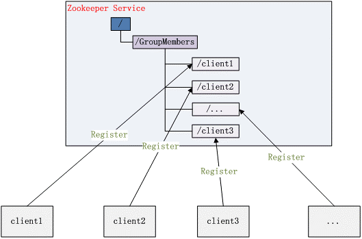

zookeeper 学习笔记
====================

# 1 Zookeeper 简介

ZooKeeper 致力于提供一个高性能、高可用，且具备严格的**顺序访问控制**能力的分布式协调服务，是雅虎公司创建，是 Google 的 Chubby 一个开源的实现，也是 Hadoop 和 Hbase 的重要组件。

## 1.1 特点

- 简单的数据结构：共享的树形结构，类似文件系统，存储于内存；
- 可以构建集群：避免单点故障，3-5 台机器就可以组成集群，超过半数正常工作就能对外提供服务；
- 顺序访问：对于每个读请求，zk 会分配一个全局唯一的递增编号，利用这个特性可以实现高级协调服务；
- 高性能：基于内存操作，服务于非事务请求，适用于读操作为主的业务场景。3 台 zk 集群能达到 13w QPS；

## 1.2 应用场景

- 数据发布订阅
- 负载均衡
- 命名服务
- Master 选举
- 集群管理
- 配置管理
- 分布式队列
- 分布式锁

# 2 单机部署
下文描述单机模式部署步骤：
- 安装 JDK1.8；
- 安装 zookeeper-3.4.14，也可从 [zookeeper 官网](https://zookeeper.apache.org/releases.html) 获取其他版本；   
  ```test
  // 下载
  wget https://mirrors.tuna.tsinghua.edu.cn/apache/zookeeper/zookeeper-3.4.14/zookeeper-3.4.14.tar.gz
  // 安装在指定路径
  mv zookeeper-3.4.14.tar.gz /opt/zookeeper
  // 解压
  tar -xzvf zookeeper-3.4.14.tar.gz
  // 新建 data 及 datalog 目录
  mkdir data datalog
  // 复制 zk 配置文件 zoo.cfg
  cp zoo_sample.cfg zoo.cfg 
  // 修改 zoo.cfg，指定 dataDir
  dataDir=/opt/zookeeper/data
  dataLogDir=/opt/zookeeper/datalog
  // 启动 zk
  cd /opt/zookeeper/zookeeper-3.4.14/bin
  ./zkServer.sh start
  // 查看启动状态
  ./zkServer.sh status 或 jps
  ```

## 2.1 目录结构
- bin：存放系统脚本
- conf：存放配置文件
- contrib：zk 附加功能支持
- dist-maven：maven 仓库文件
- docs：zk 文档
- lib：依赖的第三方库
- recipes：经典场景样例代码
- src：zk 源码 

## 2.2 zoo.cfg 配置参数
conf 目录为配置文件存放的目录，`zoo.cfg` 为核心的配置文件，常用的配置参数有：

- clientPort：用于配置当前服务器对外的服务端口，一般设置为2181（无默认值，必须设值）；
- dataDir：用于指定存放内存数据库快照的文件夹，同时用于集群的 myid 文件也存在这个文件夹里（注：一个配置文件只能包含一个 dataDir，即使它被注释掉了）；
- dataLogDir：用于单独设置 transaction log 的目录，transaction log 分离可以避免和普通 log 还有快照的竞争；
- tickTime：心跳时间，ZK 中的一个时间单元。ZK 中所有时间都是以这个时间单元为基础，进行整数倍配置的。如：session 的最小超时时间是 2*tickTime；
- initLimit：多少个 tickTime 内，允许其他 server 连接并初始化数据，如果 zk 管理的数据较大，则应相应增大这个值；
- syncLimit：多少个 tickTime 内，允许 follower  同步，如果 follower 落后太多，则会被丢弃。

# 3 ZK 的特性
Zk的特性从会话、数据节点、版本、Watcher、ACL 权限控制和集群角色来了解，其中数据节点与 Watcher 是重点。

## 3.1 会话
客户端与服务端的一次会话连接，本质是 TCP 长连接，通过会话可以进行心跳检测和数据传输。

会话状态分为：连接中（``CONNECTING``）、已连接（``CONNECTED``）、重新连接中（``RECONNECTING``）、已重新连接（``RECONNECTED``）、连接关闭（``CLOSE``）。

## 3.2 数据节点
ZooKeeper 的视图结构和标准的 Unix 文件系统类似，其中每个节点称为“数据节点”或 znode，每个 znode 可以存储数据，还可以挂载子节点，因此可以称之为“树”。
<div align="center">  </div><br>

- 每一个 znode 都必须有值，如果没有值，节点是不能创建成功的；
- 通过客户端可对 znode 进行增删改查的操作，还可以注册 watcher 监控 znode 的变化。

### znode 类型
每个 znode 都有不同的生命周期，而生命周期长短取决于 znode 的节点类型。Zoookeeper 提供了 4 种节点类型。
<div align="center">  </div><br>	

### znode 状态属性
<div align="center">  </div><br>

## 3.3 ACL 权限控制
ACL(Access Control List，访问控制列表)，zk 提供了一套完善的 ACL 权限控制机制保障数据安全性。

其表达式为 scheme:id:permissions（授权策略：用户：权限）

- 对于 scheme，zk 提供了如下几种授权策略：

| 授权策略 | 说明 |
| :--: | :--: |
| world | 默认方式，所有用户都可无条件访问，组合形式为：world:anyone:[permissions] |
| digest | 用户名:密码认证方式，最常用，组合形式为：digest:username:BASE64(SHA1(password)):[permissions] |
| ip | 对指定ip进行限制，组合形式为：ip:127.0.0.1:[permissions] |
| auth | 认证登录形式，需要用户获取权限后才可访问，组合形式为 auth:userpassword:[permissions] |


- 对于 permissions，zk 提供了如下 5 种操作权限：

| 权限 | 简写 | 说明 |
| :--: | :--: | :--: |
| CREATE | C  | 允许授权对象在当前节点下**创建**子节点 |
| DELETE | D  | 允许授权对象在当前节点下**删除**子节点 |
| WRITE | W  | 允许授权对象在当前节点进行**更新**操作 |
| READ | R  | 允许授权对象在当前节点**获取**节点内容或获取子节点列表 |
| ADMIN | A  | 允许授权对象对当前节点进行 ACL 相关的**设置**操作 |
# 4 常用命令

## 4.1 服务端常用命令
在 %zk_home%/bin 目录下的服务端命令：
- 启动 zk 服务: ./zkServer.sh start
- 停止 zk 服务: ./zkServer.sh stop
- 重启 zk 服务: ./zkServer.sh restart
- 查看 zk 服务状态: ./zkServer.sh status

## 4.2 客户端常用命令
在 %zk_home%/bin 目录下，使用 `./zkCli.sh -server 127.0.0.1:2181` 连接到 zk 服务，连接成功后，系统会输出 zk 的相关环境以及配置信息。

连接成功后，输入 `help` 查看 zk 客户端命令，常用命令描述如下：

- `ls path [watch]`：查看 path 路径下的节点。如：ls /，查看根路径下的数据。
- `ls2 path [watch]`：查看当前节点数据并且可以看到更新次数等信息，如：ls2 /。
- `create [-s] [-e] path data acl`：创建节点，[-e 临时节点] 、[-s 顺序节点]，如：create /zookeeper/zknode1 node1-d1。
- `get path [watch]`：查看节点数据信息，如：get /zookeeper/zknode1。
- `set path data [version]`：修改节点数据信息，如：set /zookeeper/zknode1 zknode1-dataupdate。
- `delete path [version]`：删除节点，如：delete /zookeeper/zknode1。
- `rmr path`：级联删除节点及其子节点。
- `quit`：退出客户端。  

### ACL 常用命令
参考 2.3 ACL 权限控制，常用命令如下：

- getAcl path：获取节点的 acl 权限信息，如：getAcl /zknode。
- setAcl path acl：设置节点的 acl 权限信息，如：setAcl /zknode world:anyone:crwa。

### 注册会话
注册会话授权信息命令：addauth scheme auth。
```text
## 先添加一个用户
addauth digest user1:123456
## 设置节点acl权限
setAcl /zknode auth:user1:123456:crwa
## 获取acl权限（密码以密文形式存储）
getAcl /zknode
```
退出客户端后会话信息消失，需要重新新增权限后才可以访问。

### 常用四字命令
linux 环境中，可通过如下命令查看 zk 当前的状态及相关信息，需要先安装 nc(路由命令)：

- `echo stat|nc 127.0.0.1 2181`：来查看哪个节点被选择作为 follower 或者 leader；
- `echo ruok|nc 127.0.0.1 2181`： 测试是否启动了该 Server，若回复 imok 表示已经启动； 
- `echo dump| nc 127.0.0.1 2181`：列出未经处理的会话和临时节点；
- `echo kill | nc 127.0.0.1 2181`：关闭 server；
- `echo conf | nc 127.0.0.1 2181`：输出相关服务配置的详细信息；
- `echo cons | nc 127.0.0.1 2181`：列出所有连接到服务器的客户端的完全的连接 / 会话的详细信息。

## 4.3 zk 日志可视化
zk 日志文件 /opt/zookeeper/datalog/version-2/log.1 是二进制的数据文件，可使用 org.apache.zookeeper.server.LogFormatter 工具，把日志文件可视化输出：

```text
java -cp ../../zookeeper-3.4.14/zookeeper-3.4.14.jar;../../zookeeper-3.4.14/lib/slf4j-api-1.7.25.jar org.apache.zookeeper.server.LogFormatter log.1
```

# 5 Java 客户端框架

## 5.1 zk 原生客户端
zk 官方提供的 java 客户端 API。

### Maven 依赖
```text
<dependency>
    <groupId>org.apache.zookeeper</groupId>
    <artifactId>zookeeper</artifactId>
    <version>${zookeeper.version}</version>
</dependency>
```

### 主要 AIP:
``` java
// 创建会话
public ZooKeeper(String connectString, int sessionTimeout, Watcher watcher, long sessionId, byte[] sessionPasswd, boolean canBeReadOnly)
// 创建节点
public String / void create(final String path, byte data[], List<ACL> acl,CreateMode createMode, StringCallback cb, Object ctx) 
// 读取子节点数据
public List<String> / void getChildren(final String path, Watcher watcher,Stat stat, Children2Callback cb, Object ctx)
// 读取当前节点数据
public List<String> / void getData(final String path, Watcher watcher, Stat stat, DataCallback cb, Object ctx) 
// 更新当前节点数据
public Stat / void setData(final String path, byte data[], int version, StatCallback cb, Object ctx)
// 权限控制
public void addAuthInfo(String scheme, byte auth[])
```

### zk 原生客户端在开发支持上的弊端:
- 会话的连接是异步的；
- Watch需要重复注册；
- Session重连机制；
- 开发复杂性较高。

## 5.2 ZkClient
开源的 zk 客户端，在原生 API 基础上封装，是一个更易于使用的 zk 客户端。

### Maven 依赖
```text
<dependency>
    <groupId>com.101tec</groupId>
    <artifactId>zkclient</artifactId>
    <version>${zkclient.version}</version>
</dependency>
```

## 5.3 Curator
开源的 zk 客户端，在原生 API 基础上封装，apache 顶级项目。

### Maven 依赖
```text
<dependency>
    <groupId>org.apache.curator</groupId>
    <artifactId>curator-framework</artifactId>
    <version>${curator.version}</version>
</dependency>
<dependency>
    <groupId>org.apache.curator</groupId>
    <artifactId>curator-recipes</artifactId>
    <version>${curator.version}</version>
</dependency>
```

### 创建会话（同步，重试）
```java
// 两种创建方式
CuratorFrameworkFactory.newClient(CONNECTION_URL, 5000, 5000, new ExponentialBackoffRetry(1000,3));

CuratorFrameworkFactory.builder().connectString(CONNECTION_URL).sessionTimeoutMs(5000).retryPolicy(new ExponentialBackoffRetry(1000, 3)).build();
```
retryPolicy 连接策略：
- RetryOneTime: 只重连一次.
- RetryNTime: 指定重连的次数N.
- RetryUtilElapsed: 指定最大重连超时时间和重连时间间隔,间歇性重连直到超时或者链接成功.
- ExponentialBackoffRetry: 基于"backoff"方式重连,和RetryUtilElapsed的区别是重连的时间间隔是动态的.
- BoundedExponentialBackoffRetry: 同ExponentialBackoffRetry,增加了最大重试次数的控制.

此外，Curator 框架除了包含 zk 原有节点的增、删、改、查、设置权限、监听器等 API，还增加了事务、异步的支持。并且 Curator 是 fluent 编码风格实现的。

# 参考
- [zookeeper的配置参数详解（zoo.cfg）](https://www.cnblogs.com/xiohao/p/5541093.html)
- [ZooKeeper日志与快照文件简单分析](http://www.linuxidc.com/Linux/2016-03/129509.htm)
