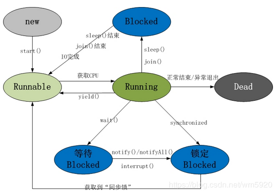

Java 面试概要--基础篇
===================================
# 1.Java 基础
## 1.1 面向对象的基本特征

封装：是包装、信息隐藏的意思。就一个对象而言它所封装的是自己的属性和方法，所以说封装实际上使用方法将类的数据隐藏起来，控制用户对类的修改和访问数据的程度。  
良好的封装可以降低耦合、提高程序的可复用性和可维护性。

继承：是从已有的类中派生出新的类，新的类能继承已有类的非私有属性和方法，并能扩展新的能力。  
java是单继承，但可以多重继承；继承破坏了封装，对于父类而言，它的实现细节对与子类来说都是透明的；继承是一种强耦合关系父类变，子类就必须变；在设计模式中我们提倡多用组合关系，少用继承关系，以降低程序的耦合度。

多态：是同一个行为具有多个不同表现形式。多态就是同一个接口，使用不同的实例而执行不同操作。

多态分为编译时多态和运行时多态：编译时多态是静态的，主要是指方法的重载;运行时多态是动态的，指程序中定义的对象引用所指向的具体类型在运行期间才确定，方法的重写。

## 1.2 重载和重写的区别

方法重载：是发生在一个类中多态性的一种表现（编译时多态）。
重载时，方法名相同，参数类型、个数不同，返回类型不做要求，访问修饰符不做要求，抛出异常不做要求。

方法重写：父类与子类之间的多态性，对父类的函数进行重新定义。  
若子类中的方法与父类中的某一方法具有相同的方法名、返回类型和参数表，则新方法将覆盖原有的方法。  
重写规则：
- 参数列表必须完全与被重写的方法相同，否则不能称其为重写而是重载。 
- 返回的类型必须一直与被重写的方法的返回类型相同，否则不能称其为重写而是重载。
- 访问修饰符的限制一定要大于被重写方法的访问修饰符（public>protected>default>private）
- 重写方法一定不能抛出新的检查异常或者比被重写方法申明更加宽泛的检查型异常。例如： 父类的一个方法申明了一个检查异常IOException，在重写这个方法是就不能抛出Exception,只能抛出IOException的子类异常，可以抛出非检查异常。

## 1.3 抽象类和接口有什么区别
抽象类是用来捕捉子类的通用特性的 。它不能被实例化，只能被用作子类的超类。  
接口是抽象方法的集合。如果一个类实现了某个接口，那么它就继承了这个接口的抽象方法。  

java 8中抽象类与接口的异同：  
**相同点**：
- 都是抽象类型；
- 都可以有实现方法（以前接口不行）；
- 都可以不需要实现类或者继承者去实现所有方法，（以前不行，现在接口中默认方法不需要实现者实现）

**不同点**：
- 抽象类不可以多重继承，接口可以（无论是多重类型继承还是多重行为继承）；
- 抽象类和接口所反映出的设计理念不同。其实抽象类表示的是"is-a"关系，接口表示的是"like-a"关系；
- 接口中定义的变量默认是 public static final 型，且必须给其初值，所以实现类中不能重新定义，也不能改变其值；抽象类中的变量默认是 friendly 型，其值可以在子类中重新定义，也可以重新赋值。

_friendly 型：如果一个类、类属变量及方法不以 public, protected, private 这三种修饰符来修饰，它就是friendly类型的。这种类、类属变量及方法对包内的其他类是友好的，开放的，而对包外的其他类是关闭的。_

## 1.4 int 和 Integer 有什么区别
区别 ：
- Integer是int的包装类，int则是java的一种基本数据类型 
- Integer变量必须实例化后才能使用，而int变量不需要 
- Integer实际是对象的引用，当new一个Integer时，实际上是生成一个指针指向此对象；而int则是直接存储数据值 
- Integer的默认值是null，int的默认值是0
- int类型是java内置的基本数据类型，其数据都是在栈中操作，对变量的创建、销毁速度非常快；而Integer是引用类型，其数据是在堆中操作，对象的创建、销毁都比较慢。

## 1.5 final, finally, finalize 的区别
- final 用于声明属性,方法和类, 分别表示属性不可变, 方法不可覆盖, 类不可继承。
- finally 是异常处理语句结构的一部分，表示总是执行。
- finalize 是Object类的一个方法，在垃圾收集器执行的时候会调用被回收对象的此方法，可以覆盖此方法提供垃圾收集时的其他资源回收，例如关闭文件等. JVM不保证此方法总被调用。

## 1.6 说说反射的用途及实现

### **用途**
反射的核心是JVM在运行时才动态加载类或调用方法/访问属性，它不需要事先知道运行对象是谁。

在很多的项目比如 Spring，MyBatis 都都可以看到反射的身影。我们还可以利用反射机制实现工厂模式和代理模式等设计模式，也可以解决 Java 泛型擦除等令人苦恼的问题。

### **实现**
获取一个对象对应的反射类，在 Java 中可以通过如下方式获取一个对象的反射类：
- 通过 getClass() 方法
- 通过 Class.forName() 方法
- 使用 类.class
- 通过类加载器实现，getClassLoader()

### **注意**
 由于反射会额外消耗一定的系统资源，因此如果不需要动态地创建一个对象，那么就不需要用反射。另外，反射调用方法时可以忽略权限检查，因此可能会破坏封装性而导致安全问题。

## 1.7 说说自定义注解的场景及实现
关于『注解』和『XML』两种不同的配置模式，各有各的优劣，注解可以提供更大的便捷性，易于维护修改，但耦合度高，而 XML 相对于注解则是相反的。

注解的本质: **所有的注解类型都继承自这个普通的接口（Annotation）**

一个注解准确意义上来说，只不过是一种特殊的注释而已，如果没有解析它的代码，它可能连注释都不如。而解析一个类或者方法的注解往往有两种形式，一种是编译期直接的扫描，一种是运行期反射。

## 元注解
java中的四种元注解：
- @Target：注解的作用目标
- @Retention：注解的生命周期
- @Documented：注解是否应当被包含在 JavaDoc 文档中
- @Inherited：是否允许子类继承该注解

## 自定义注解使用场景
- 类属性自动赋值。
- 验证对象属性完整性。
- 代替配置文件功能，像spring基于注解的配置。
- 可以生成文档，像java代码注释中的@see,@param等。

# 1.8 equals 与 == 的区别
== 对于基本类型来说是值比较，对于引用类型来说是比较的是引用；而 equals 默认情况下是引用比较，只是很多类重写了 equals 方法，比如 String、Integer 等把它变成了值比较，所以一般情况下 equals 比较的是值是否相等。

# 1.9 JDBC 流程

原生的jdbc操作数据库流程：
```java
// 1.注册驱动程序：
Class.forName("com.mysql.jdbc.Driver");
// 2.使用驱动管理类来获取连接:  
Connection conn = DriverManager.getConnection(url, user, password);
// 3.创建sql会话对象 
String sql = "select * from student ";
Statement stmt = conn.createStatement()
// 4.执行sql 
ResultSet set = stmt.executeQuery(sql);
// 5.处理结果集ResultSet，如果SQL前如果有参数值就设置参数值setXXX()
// 6.关闭连接。
```

# 2.Java 容器
## 2.1 List 和 Set 区别与联系
- List和Set接口都继承于 Collection 接口。
- 在List中允许插入重复的元素，而在Set中不允许重复元素存在，即使插入相同元素也会进行覆盖。
- List是有序集合，而Set是无序集合。
- List可以通过下标来访问，而Set不能。

## 2.2 Arraylist 与 LinkedList 区别，ArrayList 与 Vector 区别

Arraylist 与 LinkedList 区别:
- ArrayList是实现了**基于动态数组的数据结构**，而LinkedList是**基于链表的数据结构**；
- 对于**随机访问get和set**，ArrayList要优于LinkedList，因为LinkedList要移动指针；
- 对于添加和删除操作add和remove 的效率视情况而定。

 ArrayList想要在指定位置插入或删除元素时，主要耗时的是System.arraycopy动作，会移动index后面所有的元素；LinkedList主耗时的是要先通过for循环找到index，然后直接插入或删除。  
 因此主要有两个因素决定他们的效率，插入的**数据量**和插入的**位置**。当插入的数据量很小时，两者区别不太大，当插入的数据量大时，大约在容量的1/10之前，LinkedList会优于ArrayList，在其后就劣与ArrayList，且越靠近后面越差。

**ArrayList 与 Vector 区别**:
- Vector 是同步的，因此开销就比 ArrayList 要大，访问速度更慢。最好使用 ArrayList 而不是 Vector，因为同步操作完全可以由程序员自己来控制；
- Vector 每次扩容请求其大小的 2 倍空间，而 ArrayList 是 1.5 倍。

## 2.3 HashMap 和 Hashtable 的区别，HashMap 和 HashSet 区别，HashMap 和 ConcurrentHashMap 的区别

### HashMap 和 Hashtable 的区别:
- **继承和实现方式不同**。HashMap继承于AbstractMap，而Hashtable继承于Dictionary。
- **线程安全不同**。Hashtable的几乎所有函数都是同步的，即它是线程安全的，支持多线程；而HashMap的函数则是非同步的，它不是线程安全的。若要在多线程中使用HashMap，需要我们额外的进行同步处理。
- **对null值的处理不同**。HashMap的key、value都可以为null；Hashtable的key、value都不可以为null。
- **支持的遍历种类不同**。HashMap只支持Iterator(迭代器)遍历。而Hashtable支持Iterator(迭代器)和Enumeration(枚举器)两种方式遍历。
- **容量的初始值和增加方式都不一样**。HashMap默认的容量大小是16；增加容量时，每次将容量变为“原始容量x2”。Hashtable默认的容量大小是11；增加容量时，每次将容量变为“原始容量x2 + 1”。
- **添加key-value时的hash值算法不同**。HashMap添加元素时，是使用自定义的哈希算法。Hashtable没有自定义哈希算法，而直接采用的key的hashCode()。

## 2.4 HashMap的工作原理及代码实现，怎样找到index，size为什么是2的倍数，怎样resize，resize过后，之前的hash冲突还存在吗？

## 2.5 CurrentHashMap的工作原理及代码实现


# 3.Java 虚拟机


# 4.Java 并发
## 4.1 创建线程的方式及实现

### 一般来讲线程创建有四种方式
a.继承 Thread 类，覆盖run方法，调用 Thread#start 启动；

b.实现 Runnable 接口，创建实例，作为 Thread 构造参数传入，调用 Thread#start 启动；  
``new Thread(() -> {}).start()``

c.实现 Callable 接口，创建实例，作为 FutureTask<> 构造参数创建FutureTask 对象，将 FutureTask 对象作为 Thread 构造参数传入，调用 Thread#start 启动

```java
FutureTask<Object> future = new FutureTask<>(() -> null);
new Thread(future).start();
Object obj = future.get(); // 这里会阻塞，直到线程返回值
```

d.创建一个线程池,利用 ExecutorService#submit()提交线程,Future<Object> 接收返回

```java
ExecutorService executorService = Executors.newFixedThreadPool(2);
Future<Integer> future1 = executorService.submit(()-> 10);
int ans = future1.get();
```

### 区别与应用场景:
- 继承和实现接口的方式唯一区别就是继承和实现的区别，不存在共享变量的问题
- 需要获取返回结果时，结合 FutureTask和Callable来实现
- 线程池需要注意线程复用时，注意对ThreadLocal中变量的串用问题。

## 4.2 sleep()，wait()，yield()和join()方法的区别
<div align="center">  </div><br>

只有runnable到running时才会占用cpu时间片，其他都会出让cpu时间片。
线程的资源包含CPU资源和锁资源两类。

``sleep``：Thread类的方法，必须带一个时间参数。会让当前线程休眠进入阻塞状态并释放CPU（阿里面试题 Sleep释放CPU，wait 也会释放cpu，因为cpu资源太宝贵了，只有在线程running的时候，才会获取cpu片段），提供其他线程运行的机会且不考虑优先级，但如果有同步锁则sleep不会释放锁即其他线程无法获得同步锁，可通过调用interrupt()方法来唤醒休眠线程。

``yield``：让出CPU调度，Thread类的方法，类似sleep只是不能由用户指定暂停多长时间 ，并且yield()方法只能让同优先级的线程有执行的机会。 yield()只是使当前线程重新回到可执行状态，所以执行yield()的线程有可能在进入到可执行状态后马上又被执行。调用yield方法只是一个建议，告诉线程调度器我的工作已经做的差不多了，可以让别的相同优先级、或更高优先级的线程使用CPU了，没有任何机制保证采纳。

``wait()``：Object类的方法(notify()、notifyAll()  也是Object对象)，必须放在循环体和同步代码块中，执行该方法的线程会**释放锁**，进入线程等待池中等待被再次唤醒(notify随机唤醒，notifyAll全部唤醒，线程结束自动唤醒)即放入锁池中竞争同步锁。

``join``：一种特殊的wait，当前运行线程调用另一个线程的join方法，当前线程进入阻塞状态直到另一个线程运行结束等待该线程终止。 注意该方法也需要捕捉异常。

## 4.3 说说 CountDownLatch 原理
　　CountDownLatch类位于java.util.concurrent包下，利用它可以实现类似计数器的功能。比如有一个任务A，它要等待其他4个任务执行完毕之后才能执行，此时就可以利用CountDownLatch来实现这种功能了。

```java
// 唯一的构造方法，参数count为计数值
public CountDownLatch(int count) {  };  

// 调用 await()方法的线程会被挂起，它会等待直到count值为0才继续执行
public void await() throws InterruptedException { };   
// 和 await()类似，只不过等待一定的时间后count值还没变为0的话就会继续执行
public boolean await(long timeout, TimeUnit unit) throws InterruptedException { }; 
// 将count值减1
public void countDown() { };  
```

## 4.4 说说 CyclicBarrier 原理
字面意思回环栅栏，通过它可以实现让一组线程等待至某个状态之后再全部同时执行。叫做回环是因为当所有等待线程都被释放以后，CyclicBarrier可以被重用。我们暂且把这个状态就叫做barrier，当调用await()方法之后，线程就处于barrier了。

[CyclicBarrier实战、实现原理和源码分析](https://blog.csdn.net/yhl_jxy/article/details/87256321)

[Java并发32:CyclicBarrier的基本方法和应用场景实例](https://blog.csdn.net/hanchao5272/article/details/79779639)

## 4.5 说说 Semaphore 原理
Semaphore翻译成字面意思为 信号量，Semaphore可以控同时访问的线程个数，通过 acquire() 获取一个许可，如果没有就等待，而 release() 释放一个许可。Semaphore 和锁有点类似，它一般用于控制对某组资源的访问权限。

### 构造器
```java
// 参数permits表示许可数目，即同时可以允许多少线程进行访问
public Semaphore(int permits) {          
    sync = new NonfairSync(permits);
}
// 这个多了一个参数fair表示是否是公平的，即等待时间越久的越先获取许可
public Semaphore(int permits, boolean fair) {    
    sync = (fair)? new FairSync(permits) : new NonfairSync(permits);
}
```

### 常用方法
```java
// 获取一个许可，若无许可能够获得，则会一直等待，直到获得许可。
public void acquire() throws InterruptedException {  }     
public void acquire(int permits) throws InterruptedException { }   
//释放一个许可。注意，在释放许可之前，必须先获获得许可。
public void release() { }         
public void release(int permits) { }   

// 尝试获取一个许可，若获取成功，则立即返回true，若获取失败，则立即返回 false
public boolean tryAcquire() { };    
public boolean tryAcquire(long timeout, TimeUnit unit) throws InterruptedException { };  
public boolean tryAcquire(int permits) { }; 
public boolean tryAcquire(int permits, long timeout, TimeUnit unit) throws InterruptedException { }; 
```

## 4.6 说说 CountDownLatch 与 CyclicBarrier 区别
CountDownLatch与CyclicBarrier都是用于控制并发的工具类，都可以理解成维护的就是一个计数器，但是这两者还是各有不同侧重点的：

- CountDownLatch 一般用于某个线程A等待若干个其他线程执行完任务之后，它才执行；而 CyclicBarrier 一般用于一组线程互相等待至某个状态，然后这一组线程再同时执行；CountDownLatch 强调一个线程等多个线程完成某件事情。CyclicBarrier是多个线程互等，等大家都完成，再携手共进。
- 调用 CountDownLatch 的 countDown 方法后，当前线程并不会阻塞，会继续往下执行；而调用 CyclicBarrier 的 await 方法，会阻塞当前线程，直到 CyclicBarrier 指定的线程全部都到达了指定点的时候，才能继续往下执行；
- CountDownLatch 方法比较少，操作比较简单，而 CyclicBarrier 提供的方法更多，比如能够通过 getNumberWaiting()，isBroken() 这些方法获取当前多个线程的状态，并且 CyclicBarrier 的构造方法可以传入barrierAction，指定当所有线程都到达时执行的业务功能；
- CountDownLatch是不能复用的，而CyclicLatch是可以复用的。

## 4.7 说说 Exchanger 原理

 Exchange —— 交换器。用于在两个线程之间交换数据，A 线程将 a 数据交给 B 线程，B 线程将 b 数据交给 a 线程。

 Exchange 和 SynchronousQueue 类似，都是通过两个线程操作同一个对象实现数据交换，SynchronousQueue 使用的是同一个属性，通过不同的 isData 来区分，多线程并发时，使用了队列进行排队。
Exchange 使用了一个对象里的两个属性，item 和 match，就不需要 isData 属性了，因为在 Exchange 里面，没有 isData 这个语义。而多线程并发时，使用数组来控制，每个线程访问数组中不同的槽。

## 4.8 ThreadLocal 原理分析
我们创建的对象默认是所有线程可以访问的,多线程并发修改对象时就会可能出现数据不一致的问题,使用ThreadLocal创建的对象只能被当前线程访问，每个线程保存一个对象的副本,在多线程操作时是线程安全的。

ThreadLocal可以保证每个线程拥有一个变量的副本，实现了线程隔离,主要利用了每个Thread有个ThreadLocalMap,ThreadLocalMap保存了该线程拥有的所有ThreadLocal对象，并利用弱引用机制避免了Map无线增大导致内存泄露的问题。

解决线程隔离后线程隔离导致ThreadLocal数据丢失：https://blog.csdn.net/fengyun1990/article/details/87970192?utm_medium=distribute.pc_relevant_t0.none-task-blog-BlogCommendFromMachineLearnPai2-1.nonecase&depth_1-utm_source=distribute.pc_relevant_t0.none-task-blog-BlogCommendFromMachineLearnPai2-1.nonecase

## 4.9 讲讲线程池的实现原理


## 4.10 线程池的几种方式
ExecutorService是线程池接口。它定义了4中线程池：

- newCachedThreadPool：当有新任务到来，则插入到SynchronousQueue中，由于SynchronousQueue是同步队列，因此会在池中寻找可用线程来执行，若有可以线程则执行，若没有可用线程则创建一个线程来执行该任务；若池中线程空闲时间超过指定大小，则该线程会被销毁。**适用于执行很多短期异步的小程序或者负载较轻的服务器。**  

- newFixedThreadPool：创建可容纳固定数量线程的池子，每隔线程的存活时间是无限的，当池子满了就不在添加线程了；如果池中的所有线程均在繁忙状态，对于新任务会进入阻塞队列中(无界的阻塞队列)，但是，在线程池空闲时，即线程池中没有可运行任务时，它不会释放工作线程，还会占用一定的系统资源。**适用于执行长期的任务，性能好很多。**

- newSingleThreadExecutor：创建只有一个线程的线程池，且线程的存活时间是无限的；当该线程正繁忙时，对于新任务会进入阻塞队列中(无界的阻塞队列)。**适用于一个任务一个任务执行的场景。**

- newScheduledThreadPool:创建一个固定大小的线程池，线程池内线程存活时间无限制，线程池可以支持定时及周期性任务执行，如果所有线程均处于繁忙状态，对于新任务会进入DelayedWorkQueue队列中，这是一种按照超时时间排序的队列结构。**适用于周期性执行任务的场景。**

## 4.11 线程的生命周期


- 锁机制
- 说说线程安全问题
- volatile 实现原理
- synchronize 实现原理
- synchronized 与 lock 的区别
- CAS 乐观锁
- ABA 问题
- 乐观锁的业务场景及实现方式


# 参考
- [JAVA 注解的基本原理](https://www.cnblogs.com/yangming1996/p/9295168.html)
- [JAVA自定义注解、元注解介绍及自定义注解使用场景](https://blog.csdn.net/bluuusea/article/details/79996572)
- [java集合框架05——ArrayList和LinkedList的区别](https://blog.csdn.net/eson_15/article/details/51145788)
- [sleep()，wait()，yield()和join()方法的区别](https://www.cnblogs.com/aspirant/p/8876670.html)
- [大白话说java并发工具类-CountDownLatch，CyclicBarrier](https://juejin.im/post/5aeec3ebf265da0ba76fa327)
- [并发编程之 Exchanger 源码分析](https://juejin.im/post/5ae7554ff265da0b86360880)
- [Java ThreadLocal原理分析](https://juejin.im/entry/5a276bb36fb9a0451e3fab8c)
- [Java线程的生命周期](https://juejin.im/post/5a72d4bd518825735300f37b)
- [不可不说的Java“锁”事](https://tech.meituan.com/2018/11/15/java-lock.html)


