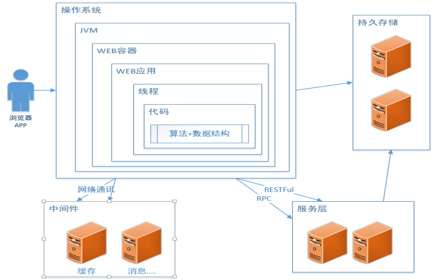
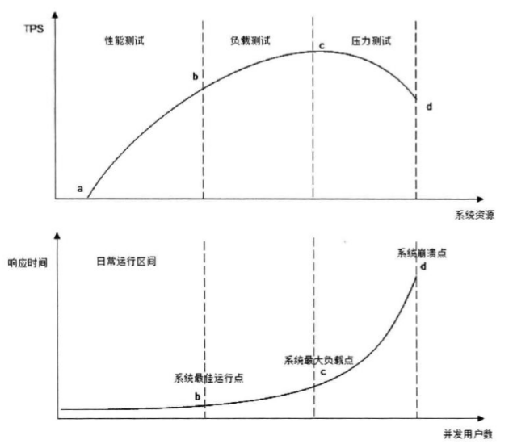

Java 虚拟机--深入了解性能优化
====================
从一张图看影响一个系统性能的方方面面： 

  
 

# 1 常用的性能评价/测试指标 

## 1.1 响应时间

提交请求和返回该请求的响应之间使用的时间，一般比较关注平均响应时间。如：数据库查询花费的时间，将字符回显到终端上花费的时间，访问 Web 页面花费的时间。

| 操作 | 响应时间 |
| :--: | :--: |
| 打开一个站点 | 几秒    |
| 数据库查询一条记录（有索引） | 十几毫秒              |
| 机械磁盘一次寻址定位 | 4 毫秒      |
| 从机械磁盘顺序读取 1M 数据 | 2 毫秒    |
| 从 SSD 磁盘顺序读取 1M 数据 | 0.3 毫秒     |
| 从远程分布式缓存 Redis 读取一个数据 | 0.5 毫秒     |
| 从内存读取1M数据 | 十几微秒     |
| Java 程序本地方法调用 | 几微妙     |
| 网络传输 2Kb 数据 | 1 微妙     |

## 1.2 并发数
 指同一时刻，对服务器有实际交互的请求数。和网站在线用户数想关联，一般为网站在线用户的 5%～15%。

## 1.3 吞吐量
对单位时间内完成的工作量(请求)的量度。 如：每分钟的数据库事务，每秒传送的文件千字节数，每分钟的 Web 服务器命中数。

### 1.3.1 吞吐量和响应时间的关系
通常，平均响应时间越短，系统吞吐量越大；平均响应时间越长，系统吞吐量越小。但是，系统吞吐量越大， 未必平均响应时间越短。

### 1.3.2 指标之间的关系曲线图

  
 

# 2 常用的性能优化方式

性能优化的原则：
- 避免过早优化；
- 进行系统性能测试；
- 寻找系统瓶颈，分而治之，逐步优化。 

## 2.1 前端优化

### 2.1.1 浏览器/App 优化
- **减少请求次数**。Http 请求是无连接的，所以如果我们能减少请求便是一种手段，合并 css/js/img 这些数据，一次性传送给客户端。HTTP1.1 的 “keep-alive” 可以确保 HTTP 请求不重复建立。
- **使用客户端缓冲**。对于 css/js/img 等静态数据，采用缓存到浏览器的方式。Cache-Control: 相对时间，浏览器自我控制的时间间隔；Expires :服务器发送过来的以服务器为准的绝对时间。
- **启用压缩**。服务器端对 css/js 等文件进行 gzip 压缩，服务器进行解压缩。对文本文件进行压缩可节省 80% 的空间。如 jQuary 的一些官方文件，传输的时候把空格都节省了。
- **资源文件加载顺序**。在 html 文件中，一般是 css 放最前面，js 放最后面。
- **客户端给用户友好提示**。即使系统性能再慢也要跟用户有交互，点了页面长时间没反应给用户体验很不友好。

### 2.1.2 CDN 加速
CDN（Content Delivery Network，内容分发网络）是构建在网络层之上的内容分发网络，依靠部署在各地的边缘服务器，通过中心平台的负载均衡、内容分发、调度等功能模块，使用户就近获取所需内容，降低网络拥塞，提高用户访问响应速度和命中率。CDN 的关键技术主要有内容存储和分发技术。

### 2.1.3 反向代理缓存
将 Web 服务器和应用服务器分离，使用 Nginx 作为反向代理服务器（Web 服务器）处理静态资源。

### 2.1.4 Web 组件分离
网站静态网页 HTML、js 脚本、css 样式、图片、动态数据称为网站的 Web 组件。在网站非常大的情况下（如：购物商城），将所有的 Web 组件放在一台 Web 服务器上，可能降低从 Web 服务器获取资源的性能，并且带宽的要求也更高。可以将不同的 Web 组件分别存放在不同的 Web 服务器上，而且可以在顶级域名（如：www.jd.com）下建若干个二级域名（如：wl.jd.com）来存储不同的类型数据。

## 2.2 应用服务器优化
### 2.2.1 缓存
优先考虑使用缓存对网站进行性能优化，并且缓存离用户越近越好。 

缓存的要点（详见参考）：
- 缓存的基本原理和本质 
- 合理使用缓冲的准则 
- 分布式缓存与一致性哈希 

### 2.2.2 异步
同步和异步，关注的是服务方结果信息的通信机制；阻塞和非阻塞，关注的是调用方等待结果时候的状态（详见参考）。

常见的异步方式：
- Servlet 异步。服务器收到服务器请求后，开启一个 A 线程，然后 A 线程将该任务打包转发给后端的一个集群服务B,B 搞定后再把信息发给 A，然后最终信息返回。
- 多线程，线程池。
- 消息队列，任务接后打包然后放到任务队列。

### 2.2.3 集群
相同的任务通过 nginx 实现反向代理，然后业务运算端通过集群来实现服务的扩展。常用的集群如：Redis 集群、MySQL 集群、Hadoop 集群等都是为增强系统性能以及业务稳定性。硬件级别的集群比如 F5。

### 2.2.4 程序

#### 代码级别
- 编写简洁的代码；
- 根据数据量大小选择合适的算法；
- 选择适当的数据结构，如：使用 LinkedList 或 ArrayLIst，需根据查询多还是增删多来选择；
- 参考《编写高效优雅的java程序》。

#### 并发编程 
- 充分利用 CPU 多核，尽量使用线程池，合理设置线程数量，尽量使用 JDK 提供的各种并发框架和工具；
- 实现线程安全的类，避免线程安全问题；
- 同步环境下减少锁的竞争
  - 缩小锁的范围，减少锁的粒度，锁分段；
  - 替换独占锁，读写锁，CAS 代替锁，ThreadLocal 等。  

#### 资源的复用
减少开销很大的系统资源的创建和销毁： 
- 单例模式 
- 池化技术

#### JVM
- JIT 编译器相关的优化
- GC 调优 

## 2.3 存储性能优化
- 尽量使用 SSD
- 定时清理数据或者按数据的性质分开存放
- 结果集处理 

# 参考
- [缓存](https://baike.baidu.com/item/%E7%BC%93%E5%AD%98)
- [Cache的基本原理](https://zhuanlan.zhihu.com/p/102293437)
- [缓存技术原理浅析](http://www.vlambda.com/wz_wzQTxGfCQr.html)
- [【Linux】阻塞I/O模型、非阻塞I/O模型、I/O复用模型、信号驱动I/O模型、异步I/O模型 概念普及](https://sowhat.blog.csdn.net/article/details/100996791)
- [深入浅出 JIT 编译器](https://developer.ibm.com/zh/articles/j-lo-just-in-time/)
