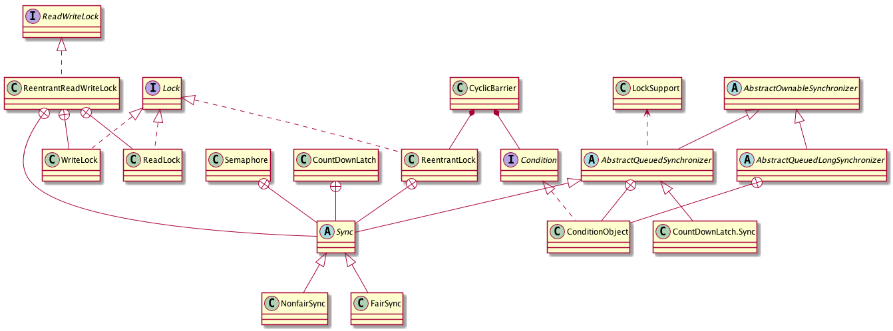
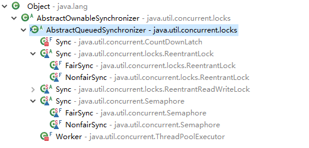
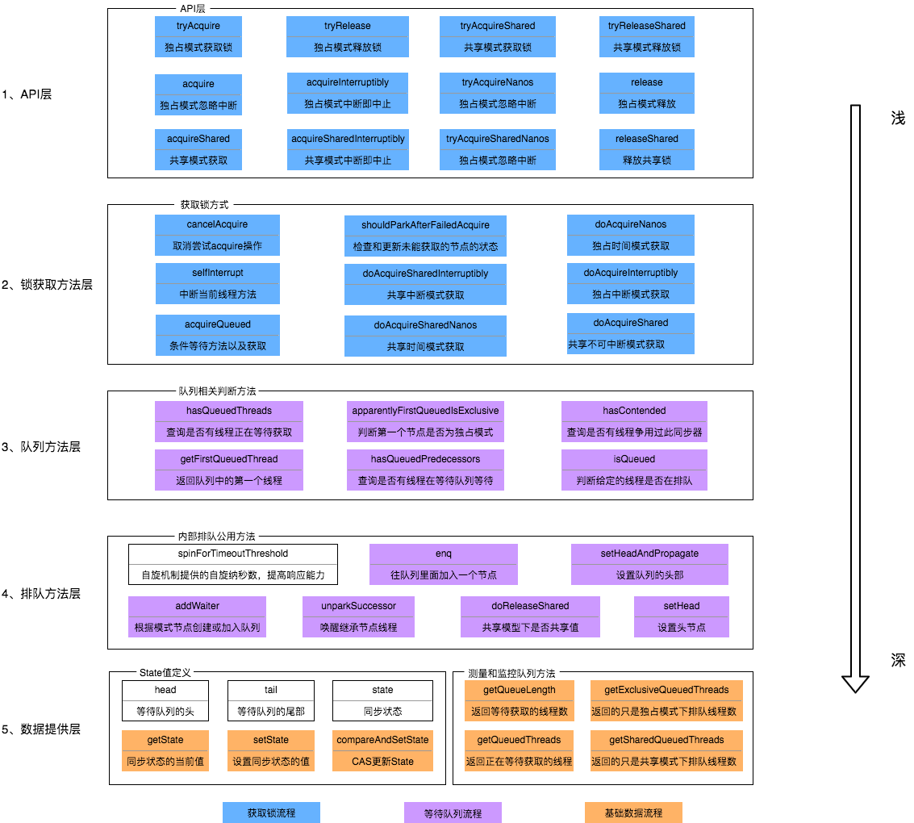
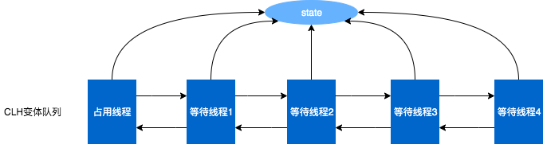

Java 并发编程--浅析 Java 锁
====================
锁作为并发共享数据，保证一致性的工具，在 JAVA 平台有多种实现(如 synchronized 等 ) 。这些现成的锁为我们开发提供了便利，下文将对常见的锁进行解析。

# 1 Java 锁的种类
## 1.1 乐观锁
乐观锁是乐观思想，即认为读多写少。遇到并发写的可能性低，每次去拿数据的时候都认为别人不会修改，所以不会上锁，但是在更新的时候会判断在此期间别人有没有去更新这个数据，采取在写时先读出当前版本号，然后加锁操作（比较跟上一次的版本号，如果一样则更新），如果失败则要重复读-比较-写的操作。

java 中的乐观锁基本都是通过 CAS 操作实现的。

## 1.2 悲观锁
悲观锁是悲观思想，即认为写多。遇到并发写的可能性高，每次去拿数据的时候都认为别人会修改，所以每次在读写数据的时候都会上锁，这样别人想读写这个数据就会 block 直到拿到锁。Synchronized、RetreenLock 就是悲观锁。

## 1.3 自旋锁
自旋锁原理：若持有锁的线程能在很短时间内释放锁资源，那么等待竞争锁的线程就不需要进入阻塞挂起状态，它们只需要等一等（自旋），等持有锁的线程释放锁后即可立即获取锁，这样可以避免线程切换带来的性能损耗。

线程自旋是需要消耗 cup 的（让 cup 在做无用功），如果一直获取不到锁，那线程也不能一直占用 cup 自旋做无用功，所以需要设定一个自旋等待的最大时间。若持有锁的线程执行的时间超过自旋等待的最大时间仍没有释放锁，则等待锁资源的线程会停止自旋并进入阻塞状态。

### 自旋锁的优缺点
自旋锁对于**锁资源竞争不激烈**，且**占用锁时间非常短**的代码块来说性能能大幅度的提升，因为自旋的消耗会小于线程阻塞挂起再唤醒的操作消耗（两次线程上下文切换的消耗）。

当锁资源竞争激烈，或者持有锁的线程需要长时间占用锁执行代码块，若使用自旋锁，则在获取锁前线程会一直都是占用cpu 做无用功，将导致其他需要 cpu 的线程无法使用 cpu，造成 cpu 资源浪费，这种情况应关闭自旋锁。

## 1.4 同步锁 Synchronized
synchronized 它可以把任意一个非NULL 的对象当作锁。他属于独占式的悲观锁，同时属于可重
入锁。参考：[深入理解Java并发之synchronized实现原理](https://blog.csdn.net/javazejian/article/details/72828483?utm_medium=distribute.pc_relevant.none-task-blog-BlogCommendFromMachineLearnPai2-3.add_param_isCf&depth_1-utm_source=distribute.pc_relevant.none-task-blog-BlogCommendFromMachineLearnPai2-3.add_param_isCf)

## 1.5 可重入锁（递归锁）
可重入锁，也称为递归锁，指的是同一线程外层函数获得锁之后，内层递归函数仍然有获取该锁的代码，但不受影响。ReentrantLock 和 synchronized 都是可重入锁。

## 1.6 公平锁与非公平锁
- 公平锁（Fair）：加锁前检查是否有排队等待的线程，优先排队等待的线程获得锁，先来先得；
- 非公平锁（Fair）：加锁时不考虑排队等待问题，直接尝试获取锁，获取不到自动到队尾等待。
  - 非公平锁性能比公平锁高 5~10 倍，因为公平锁需要在多核环境中维护一个队列；
  - synchronized 是非公平锁，ReentrantLock#lock() 默认采用的是非公平锁。

## 1.7 读写锁 ReadWriteLock
为了提高性能，Java 提供了读写锁，在读的地方使用读锁，在写的地方使用写锁，灵活控制。多个读锁不互斥，读锁与写锁互斥，这是由 jvm 控制的，我们只要用好相应的锁。

- 读锁：若代码中是只读数据，可以很多人同时读，但不能同时写，则使用读锁；在没有写锁的情况下，读是无阻塞的，在一定程度上提高了程序的执行效率。
- 写锁：若代码中是修改数据，只能有一个人写，且不能同时读取，则使用写锁。

Java 提供了如下工具类：java.util.concurrent.locks.ReadWriteLock（接口）、java.util.concurrent.locks.ReentrantReadWriteLock（实现类）。

## 1.8 独占锁和共享锁
Java 并发包中的加锁模式分为：独占锁和共享锁。

### 独占锁
独占锁每次只能有一个线程能持有锁，如：ReentrantLock 就是以独占方式实现的互斥锁。独占锁是一种悲观的加锁策略，它避免了读/读冲突，如果某个只读线程获取锁，则其他读线程都只能等待，这种情况下就限制了不必要的并发性，因为读操作并不会影响数据的一致性。

### 共享锁
共享锁则允许多个线程同时获取锁，并发访问共享资源，如：ReadWriteLock。共享锁是一种乐观的加锁策略，允许多个执行读操作的线程同时访问共享资源。

- AQS 的内部类 Node 定义了两个常量 SHARED 和 EXCLUSIVE，他们分别标识 AQS 队列中等待线程的锁获取模式。
- ReadWriteLock，允许一个资源可以被多个读操作访问，或者被一个 写操作访问，但两者不能同时进行。

## 1.9 Java 锁的状态
Java 锁有 4 状态：无锁状态、偏向锁、轻量级锁和重量级锁。

### 重量级锁
Synchronized 是通过对象内部的监视器锁（monitor）来实现的。而监视器锁本质是依赖于操作系统的 Mutex Lock 来实现的。这种依赖于操作系统 Mutex Lock 实现的锁称为“重量级锁”。

操作系统实现线程之间的切换需要从用户态转换到核心态，成本非常高，状态之间的转换需要相对比较长的时间，这就是之前 Synchronized 效率低的原因。JDK 中对 Synchronized 做的种种优化，其原理就是为了减少重量级锁的使用。JDK1.6 以后，为了减少获得锁和释放锁所带来的性能消耗，提高性能，引入了“轻量级锁”和“偏向锁”。

一般而言，synchronized 使用的锁对象是存储在 Java 对象头里的，其主要结构是由 Mark Word 和 Class Metadata Address 组成。

### 轻量级锁
轻量级锁是 Java6 之后加入的新锁，它是一种针对加锁操作的优化手段，可在没有多线程竞争的前提下，减少传统的重量级锁使用产生的性能消耗。

轻量级锁所适应的场景：线程交替执行同步块的场合，如果存在同一时间访问同一锁的场合，就会导致轻量级锁膨胀为重量级锁。

### 偏向锁
偏向锁是 Java6 之后加入的新锁，它是一种针对加锁操作的优化手段，经过研究发现，在大多数情况下，锁不仅不存在多线程竞争，而且总是由同一线程多次获得，因此为了减少同一线程获取锁(会涉及到一些CAS操作,耗时)的代价而引入偏向锁。

偏向锁的核心思想：如果一个线程获得了锁，那么锁就进入偏向模式，此时 Mark Word 的结构也变为偏向锁结构，当这个线程再次请求锁时，无需再做任何同步操作，即获取锁的过程，这样就省去了大量有关锁申请的操作，从而也就提供程序的性能。

对于没有锁竞争的场合，偏向锁有很好的优化效果，毕竟极有可能连续多次是同一个线程申请相同的锁。但是对于锁竞争比较激烈的场合，偏向锁就失效了，因为这样场合极有可能每次申请锁的线程都是不相同的，因此这种场合下不应该使用偏向锁，否则会得不偿失，需要注意的是，偏向锁失败后，并不会立即膨胀为重量级锁，而是先升级为轻量级锁。

### 锁升级
随着锁的竞争，锁可以从偏向锁升级到轻量级锁，再升级到重量级锁（锁的升级是单向的：只能从低到高升级，不会出现锁的降级）。

## 1.10 Java 锁的优化

### 分段锁
分段锁不是一种实际锁，而是一种优化思想。ConcurrentHashMap 是分段锁的一个完美实现。

### 减少持有锁的时间
只在有线程安全需求的程序上加锁。

### 减小锁的粒度
将大对象（这个对象可能会被很多线程访问），拆成小对象，大大增加并行度，降低锁竞争。
降低了锁的竞争，偏向锁、轻量级锁成功率才会提高。ConcurrentHashMap 是典型的减小锁粒度的案例。

### 锁分离
最常见的锁分离就是读写锁 ReadWriteLock，根据功能进行分离成读锁和写锁，这样读读不互斥，读写互斥，写写互斥，即保证了线程安全，又提高了性能。

读写分离思想可以延伸，只要操作互不影响，锁就可以分离。如：LinkedBlockingQueue 从头部取出，从尾部放数据。

### 锁粗化
一般的，为了保证多线程间的有效并发，会要求每个线程持有锁的时间尽量短，即在使用完公共资源后，应该立即释放锁。但是，凡事都有一个度，如果对同一个锁不停的进行请求、同步和释放，其本身也会消耗系统宝贵的资源，反而不利于性能的优化 。

### 锁消除
消除锁是虚拟机另外一种锁的优化，这种优化更彻底，Java 虚拟机在 JIT 编译时(可以简单理解为当某段代码即将第一次被执行时进行编译，又称即时编译)，通过对运行上下文的扫描，去除不可能存在共享资源竞争的锁，通过这种方式消除没有必要的锁，可以节省毫无意义的请求锁时间，如：StringBuffer#append() 是一个同步方法，但是在 add() 中的 StringBuffer 属于一个局部变量，并且不会被其他线程所使用，因此 StringBuffer 不可能存在共享资源竞争的情景，JVM 会自动将其锁消除。

# 2 CAS 的实现原理
CAS（Compare And Swap，比较和交换），是设计并发算法时用到的一种技术。

比较交换过程：它包含 3 个参数 CAS(V, E, N)。V 表要更新的变量值(内存值)，E 表预期值(原始值)，N 表示新值。当且仅当 V 值等于 E 值时，才会将 V 的值设为N，如果 V 值和 E 值不同，则说明已经有其他线程做了更新，则当前线程什么都不做。最后，CAS 返回当前 V 的真实值。

CAS 操作是抱着乐观的态度进行的（乐观锁），它总是认为自己可以成功完成操作。当多个线程同时使用 CAS 操作一个变量时，只有一个会胜出，并成功更新，其余均会失败。失败的线程不会被挂起，仅是被告知失败，并允许再次尝试，当然也允许失败的线程放弃操作。

## 2.1 实现原理
JAVA 中的 CAS 操作都是通过 sun.misc.Unsafe#compareAndSwapInt() 实现的，而 Unsafe#compareAndSwapInt() 利用 JNI 来完成 CPU 指令的操作。

C++ 源码分析参考：[java并发编程中的CAS机制，你理解嘛？](https://zhuanlan.zhihu.com/p/87136248)

## 2.2 CAS 存在的一些问题
cas 是一种非阻塞、轻量级的乐观锁，在资源竞争不激烈的情况下性能比重量级锁更高。但 cas 仍存在三个问题：
- 循环时间长开销很大。
- 只能保证一个变量的原子操作。
- ABA 问题。 

### 循环时间长开销很大
CAS 通常是配合无限循环一起使用的，如果 CAS 失败，会一直进行尝试，当 CAS 长时间不成功，可能会给 CPU 带来很大的开销。

### 只能保证一个变量的原子操作
当对一个变量执行操作时，可以使用循环 CAS 的方式来保证原子操作，但是对多个变量操作时，CAS 目前无法直接保证操作的原子性。但是我们可以通过以下两种办法来解决：
- 使用互斥锁来保证原子性；
- 将多个变量封装成对象，通过 AtomicReference 来保证原子性。

### ABA 问题
CAS 会导致“ABA 问题”。CAS 算法实现一个重要前提是需要取出内存中某时刻的数据，而在下一时刻比较并替换，那么在这个时间差类会导致数据的变化。

如：并发环境中，线程1 从内存位置 V 中取出 A，这时候线程2 也从内存中取出 A，并且
线程2 进行了一些操作变成了 B，然后 线程2 又将 V 位置的数据变成 A，这时线程1 进行CAS 操作发现内存中仍然是 A，然后线程1操作成功。尽管线程1 的 CAS 操作成功，但是不代表这个过程就是没有问题的（数据实际上已经被修改过，但 CAS 的机制无法察觉）。

Java 并发包提供了一个带有标记的原子引用类“AtomicStampedReference” 来解决“ABA 问题”，它可以通过**控制变量值的版本来保证 CAS 的正确性**。因此，在使用 CAS 前要考虑清楚“ABA 问题”是否会影响程序并发的正确性，如果需要解决“ABA 问题”，改用传统的互斥同步可能会比原子类更高效。

# 3 原子操作类
java.util.concurrent.atomic 包中提供了一组原子类。其基本的特性是在多线程环境下，当有多个线程同时执行这些类的实例包含的方法时，具有排他性，即当某个线程进入方法，执行其中的指令时，不会被其他线程打断，而别的线程就像自旋锁一样，一直等到该方法执行完成，才由 JVM 从等待队列中选择一个另一个线程进入（逻辑上的理解）。

java.util.concurrent.atomic 包中的原子类可细分为一下几种：
- 基本类型原子类
  - AtomicBoolean：布尔类型原子类
  - AtomicInteger：整型原子类
  - AtomicLong：长整型原子类
- 数组类型原子类
  - AtomicIntegerArray：整型数组原子类
  - AtomicLongArray：长整型数组原子类
  - AtomicReferenceArray：引用类型数组原子类
- 引用类型原子类：
  - AtomicReference：对象引用原子类
  - AtomicStampedReference：带有版本号的对象引用原子类
  - AtomicMarkableReference：带有标记位的对象引用原子类
- 原子属性更新类
  - AtomicIntegerFieldUpdater：原子更新volatile修饰的整型的字段的更新器
  - AtomicLongFieldUpdater：原子更新volatile修饰的长整型字段的更新器
  - AtomicReferenceFieldUpdater：原子更新volatile修饰的引用类型里的字段的更新器。

通过阅读原子类源码可以发现，sun.misc.Unsafe 类中提供了如下 3 个 CAS 操作方法：
```java
public final native boolean compareAndSwapInt(Object value, long valueOffset, int expect, int update);

public final native boolean compareAndSwapLong(Object value, long valueOffset, long expect, long update);

public final native boolean compareAndSwapObject(Object value, long valueOffset, Object expect, Object update);
```
其中
- value：需要操作的对象
- valueOffset：对象(value)的地址的偏移量（通过Unsafe.objectFieldOffset(Field valueField)获取）
- expect：更新时value的期待值
- update：将要更新的值

## 3.1 基本类型原子类 AtomicInteger
AtomicInteger 常用 API：
- int get()：AtomicInteger 对象返回基本类型值为 int 型。
- void lazySet(int newValue)：最终会设置成 newValue，使用 lazySet 设置值后，可导致其他线程在之后的一小段时间内还是可以读到旧的值。
- boolean compareAndSet(int expect，int update)：如果输入的数值等于预期值，则以原子方式将该值设置为输入的值。
- int addAndGet(int delta)：以原子方式将输入的数值与实例中的值（AtomicInteger 里的 value）相加，并返回结果。
- int getAndSet(int newValue)：以原子方式设置为 newValue 的值，并返回旧值。
- int getAndIncrement()：先返回后自增。
- int incrementAndGet()：先自增后返回。

示例代码：[AtomicIntegerDemo.java](https://github.com/IamDingj/corejava/blob/master/corejava-juc/src/main/java/com/dj/corejava/juc/lock/AtomicIntegerDemo.java)

## 3.2 引用类型原子类 

### AtomicStampedReference 源码解析
AtomicStampedReference 源码节选
```java
public class AtomicStampedReference<V> {

    // 封装需要更新的对象
    private static class Pair<T> {
        final T reference; // 维护对象引用
        final int stamp;   // int型的标志版本号
        private Pair(T reference, int stamp) {
            this.reference = reference;
            this.stamp = stamp;
        }
        static <T> Pair<T> of(T reference, int stamp) {
            return new Pair<T>(reference, stamp);
        }
    }
    // 保证 pair 在多线程中的可见性 
    private volatile Pair<V> pair;

    /**
      * expectedReference ：更新之前的原始引用
      * newReference : 将要更新的引用
      * expectedStamp : 更新之前的原始标志版本号
      * newStamp : 将要更新的标志版本号
      */
    public boolean compareAndSet(V   expectedReference,
                                 V   newReference,
                                 int expectedStamp,
                                 int newStamp) {
        Pair<V> current = pair; //当前pair
        return
            expectedReference == current.reference &&  //原始引用等于当前pair的引用，说明值未变化
            expectedStamp == current.stamp &&  //原始标志版本号等于当前pair标记版本号，说明标记未变化
            ((newReference == current.reference && newStamp == current.stamp) //将要更新的引用和标志版本号都等于当前值，说明将要更新的值都没有变化
              || casPair(current, Pair.of(newReference, newStamp))); //cas操作更新pair对象
    }
}
```
根据源码分析发现：AtomicStampedReference 通过维护包含1个对象引用和1个int型的标志版本号的pair对象，来解决ABA问题。在 zookeeper 中保持数据的一致性也是用的这种方式。

实现逻辑：在执行 compareAndSet（比较交换）时，会先判断当前值（“对象引用”和“标志版本号”，下同）和原始值是否分别相等，若不都相等说明值未变化，不用进行 CAS 操作；否则，判断当前值和将要更新值是否相等，若相等说明当前值就是将要更新的值，则当前值不需要更新；否则，将当前值和将要更新值进行 CAS 操作，一般的，新“标志版本号”在原“标志版本号”基础上递增。

示例代码：[AtomicStampedReferenceDemo.java](https://github.com/IamDingj/corejava/blob/master/corejava-juc/src/main/java/com/dj/corejava/juc/lock/AtomicStampedReferenceDemo.java)
### AtomicMarkableReference 源码解析
AtomicMarkableReference 实现逻辑和 AtomicStampedReference 类似，只是将一个 boolean 值作是否有更改的标记，就是说版本号只有两个：true 和false，修改的时候在这两个版本号之间来回切换，这样做并不能解决 ABA 的问题，只是降低了 ABA 问题发生的几率。

示例代码：[AtomicMarkableReferenceDemo.java](https://github.com/IamDingj/corejava/blob/master/corejava-juc/src/main/java/com/dj/corejava/juc/lock/AtomicMarkableReferenceDemo.java)

# 4 显示锁简介
Java 提供一系列的显示锁工具类，均位于 java.util.concurrent.locks 包中。通过一张图看显示锁相关类之间的关系：
<div align="center">  </div><br>

- Lock 和 ReadWriteLock 是两大锁的根接口，Lock 代表实现类是 ReentrantLock（可重入锁），ReadWriteLock（读写锁）的代表实现类是 ReentrantReadWriteLock。
- Condition 接口描述了可能会与锁有关联的条件变量。这些变量在用法上与使用 Object.wait 访问的隐式监视器类似，但提供了更强大的功能。需要特别指出的是，单个 Lock 可能与多个 Condition 对象关联。为了避免兼容性问题，Condition 方法的名称与对应的 Object 版本中的不同。

## 4.1 Lock
Lock 比传统线程模型中的 synchronized 方式更加面向对象，与生活中的锁类似，锁本身也应该是一个对象。两个线程执行的代码片段要实现同步互斥的效果，它们必须用同一个 Lock 对象。

### Lock 接口的 API
- void lock()：获取锁； 
- void lockInterruptibly()：如果当前线程未被中断，则获取锁，可以响应中断；
- Condition newCondition()：返回绑定到此 Lock 实例的新 Condition 实例；
- boolean tryLock()：仅在调用时锁为空闲状态才获取该锁，可以响应中断；  
- boolean tryLock(long time, TimeUnit unit)：如果锁在给定的等待时间内空闲，并且当前线程未被中断，则获取锁；
- void unlock()：释放锁。

## 4.2 ReadWriteLock
读写锁：可以被多个读者访问或者被一个写者访问。读写锁提供读写分离功能。
```java
public interface ReadWriteLock {
    Lock readLock();
    Lock writeLock();
}
```
特性：
- 读-读不互斥：读读之间不阻塞。
- 读-写互斥：读阻塞写，写也会阻塞读。
- 写-写互斥：写写阻塞。

ReadWriteLock 最大的特性就是读读共享（不互斥），例如：A 线程读锁正在进行读取操作，此时如果 B 线程请求读锁，那么 B 线程可以马上顺利获得读锁而无需等待，但此时如果 C 线程请求写锁，那么 C 线程需要等待锁可用。

ReadWriteLock 由于提供了读读共享而增加了复杂性，所以在读写都相当频繁的场景并不能体现出性能优势，只有在读操作极多而写操作极少的场景下才能体现其性能优势。比如，一个应用系统安装完成后需要导入一批维护性的初始化数据，这些数据可以通过界面修改，但需要修改的情况极少，当系统一启动就会自动加载初始化数据到指定数据结构（如 HashMap）供各个模块读取使用，那么可以为这些数据的读写加ReadWriteLock，以提高读取性能并保持数据的一致性。

## 4.3 Condition
线程之间除了同步互斥，还要考虑通信。在 Java5 之前我们的通信方式为：wait 和 notify。Condition 的优势是支持多路等待，即可以定义多个 Condition，每个 condition 控制线程的一条执行通路。传统方式只能是一路等待Condition 提供不同于 Object 监视器方法的行为和语义，如受保证的通知排序，或者在执行通知时不需要保持一个锁。

Condition 将 Object 监视器方法（wait、notify 和 notifyAll）分解成截然不同的对象，以便通过将这些对象与任意 Lock 实现组合使用，为每个对象提供多个等待 set（wait-set）。其中，Lock 替代了 synchronized 方法和语句的使用，Condition 替代了 Object 监视器方法的使用。
```java
public interface Condition {
    //使当前线程等待，同时释放当前锁，当其他线程中使用signal()时或者signalAll()方法时，线程会重新获得锁并继续执行。或者当线程被中断时，也能跳出等待。这和Object.wait()方法很相似。
    void await() throws InterruptedException;
    void awaitUninterruptibly();
    long awaitNanos(long nanosTimeout) throws InterruptedException;
    boolean await(long time, TimeUnit unit) throws InterruptedException;
    boolean awaitUntil(Date deadline) throws InterruptedException;
    //用于唤醒一个在等待中的线程。相对的singalAll()方法会唤醒所有在等待中的线程。这和Obejct.notify()方法类似。
    void signal();
    void signalAll();
}
```

# 5 AQS 的原理及应用
java.util.concurrent.locks.AbstractQueuedSynchronizer 简称 AQS，是一个抽象的队列式的同步器，它底层用了 CAS 技术来保证操作的原子性，同时利用 FIFO 队列控制线程间的锁资源竞争。

AQS 定义了一套多线程访问共享资源的同步器框架，许多同步类的实现都依赖于它，如：<div align="center">  </div><br>

## 5.1 AQS 主要方法框架
<div align="center">  </div><br>
- 上图中有颜色的为Method，无颜色的为Attribution。
- 总的来说，AQS框架共分为五层，自上而下由浅入深，从AQS对外暴露的API到底层基础数据。
- 当有自定义同步器接入时，只需重写第1层所需要的部分方法即可，不需要关注底层具体的实现流程。当自定义同步器进行加锁或者解锁操作时，先经过第1层的API进入AQS内部方法，然后经过第二层进行锁的获取，接着对于获取锁失败的流程，进入第3层和第4层的等待队列处理，而这些处理方式均依赖于第5层的基础数据提供层。
  
## 5.2 AQS 原理
AQS核心思想是，如果被请求的共享资源空闲，那么就将当前请求资源的线程设置为有效的工作线程，将共享资源设置为锁定状态；如果共享资源被占用，就需要一定的阻塞等待唤醒机制来保证锁分配。这个机制主要用的是CLH队列的变体实现的，将暂时获取不到锁的线程加入到队列中。

CLH队列（Craig、Landin and Hagersten），是单向链表，AQS中的队列是CLH变体的虚拟双向队列（FIFO），AQS是通过将每条请求共享资源的线程封装成一个节点来实现锁的分配。
主要原理图如下：

<div align="center">  </div><br>

## 5.3 AQS 中的数据结构
Node 相关源码：
```java
public abstract class AbstractQueuedSynchronizer
    extends AbstractOwnableSynchronizer
    implements java.io.Serializable { 
  
    // 等待队列的头节点，表示当前正在执行的节点
    private transient volatile Node head;
    // 等待队列的尾节点
    private transient volatile Node tail;

    static final class Node {
        //线程以共享的模式等待锁
        static final Node SHARED = new Node();
        //线程正在以独占的方式等待锁
        static final Node EXCLUSIVE = null;
        // waitStatus的4个枚举值，初始化node时，waitStatus默认值为0
        static final int CANCELLED =  1; //线程获取锁的请求已经取消了
        static final int SIGNAL    = -1; //线程已经准备好了，等资源释放
        static final int CONDITION = -2; //node在等待队列中，node线程等待唤醒
        static final int PROPAGATE = -3; //当前线程处在SHARED情况下，该字段才会使用
        //当前node节点在队列中的状态
        volatile int waitStatus;
        //前驱指针
        volatile Node prev;
        //后继指针
        volatile Node next;
        //处于该节点的线程
        volatile Thread thread;
        //指向下一个处于 CONDITION 状态的节点
        Node nextWaiter;
        final boolean isShared() {
            return nextWaiter == SHARED;
        }
        //返回前驱节点，没有的话抛出异常
        final Node predecessor() throws NullPointerException {
            Node p = prev;
            if (p == null)
                throw new NullPointerException();
            else
                return p;
        }
        // Used to establish initial head or SHARED marker
        Node() {}
        // Used by addWaiter
        Node(Thread thread, Node mode) {     
            this.nextWaiter = mode;
            this.thread = thread;
        }
        // Used by Condition
        Node(Thread thread, int waitStatus) { 
            this.waitStatus = waitStatus;
            this.thread = thread;
        }
    }
}
// Node
         +------+  prev +-----+       +-----+
    head |      | <---- |     | <---- |     |  tail
         +------+       +-----+       +-----+
```

## 5.4 AQS 同步状态
同步状态相关源码：
```java
    // 同步状态
    private volatile int state; 
    protected final int getState() {
        return state;
    }
    protected final void setState(int newState) {
        state = newState;
    }
    // 使用CAS操作修改state，保证 state 的原子性
    protected final boolean compareAndSetState(int expect, int update) {
        return unsafe.compareAndSwapInt(this, stateOffset, expect, update);
    }
```
从如上源码可以发现：
- 阅读 AbstractQueuedSynchronizer 源码发现有大量的 final 修饰的方法，也就是说，子类无法重写它们，这个父类是定规则的。
- volatile 关键字修饰state，以确保多线程环境下的可见性；state>0 为有锁状态，每次加锁就在原有 state 基础上加 1，即代表当前持有锁的线程加了state 次锁；反之解锁时每次减 1，当 statte=0 为无锁状态；
- boolean compareAndSetState(int expect, int update)的 CAS 操作存在 ABA 的问题，这个问题将在子类中解决。
- 另外，可以通过修改 state 字段表示的同步状态来实现多线程的独占模式和共享模式（加锁过程）。

## 5.5 AQS 等待队列
AQS 等待队列相关源码：
```java
// 1.什么时间加入等待队列
// acquire(1)时，通过tryAcquire获取锁;如果获取锁失败，会调用addWaiter加入到等待队列中去
public final void acquire(int arg) {
	if (!tryAcquire(arg) && acquireQueued(addWaiter(Node.EXCLUSIVE), arg))
		selfInterrupt();
}
// 获取锁（钩子方法，可根据子类特性定制）
protected boolean tryAcquire(int arg) {
	throw new UnsupportedOperationException();
}

// 2.如何加入等待队列
// 获取锁失败，会调用addWaiter加入
private Node addWaiter(Node node) {
  //通过当前的线程和锁模式新建一个节点
	Node node = new Node(Thread.currentThread(), node);
	//Pred指针指向尾节点Tail
	Node pred = tail;
	if (pred != null) {
    //将新Node的Prev指针指向Pred
		node.prev = pred;
    //通过CAS操作将node设为尾结点
		if (compareAndSetTail(pred, node)) {
			pred.next = node;
			return node;
		}
	}
  // 如果Pred指针是Null（等待队列中没有元素），或者当前Pred指针和Tail指向的位置不同（已经被别的线程修改）
	enq(node);
	return node;
}
// 通过对tailOffset和Expect进行比较，如果tailOffset的Node和Expect的Node地址是相同的，那么设置Tail的值为Update的值
private final boolean compareAndSetTail(Node expect, Node update) {
	return unsafe.compareAndSwapObject(this, tailOffset, expect, update);
}
// 获取一个对象的属性相对于该对象在内存当中的偏移量，tailOffset是tail对应的偏移量，所以将new出来的Node置为当前队列的尾节点。
static {
	try {
		stateOffset = unsafe.objectFieldOffset(AbstractQueuedSynchronizer.class.getDeclaredField("state"));
		headOffset = unsafe.objectFieldOffset(AbstractQueuedSynchronizer.class.getDeclaredField("head"));
		tailOffset = unsafe.objectFieldOffset(AbstractQueuedSynchronizer.class.getDeclaredField("tail"));
		waitStatusOffset = unsafe.objectFieldOffset(Node.class.getDeclaredField("waitStatus"));
		nextOffset = unsafe.objectFieldOffset(Node.class.getDeclaredField("next"));
	} catch (Exception ex) { 
    throw new Error(ex); 
  }
}
//若加入等待队列不成功，以自旋的方式重新加入队列
private Node enq(final Node node) {
  //自旋
	for (;;) {
		Node t = tail;
		if (t == null) { 
      // 如果没有被初始化，必须初始化一个头节点出来
			if (compareAndSetHead(new Node()))
				tail = head;
		} else {
      // 重新加入等待队列
			node.prev = t;
			if (compareAndSetTail(t, node)) {
				t.next = node;
				return t;
			}
		}
	}
}

// 3.什么时候出队列，怎么出
final boolean acquireQueued(final Node node, int arg) {
    //标记是否成功拿到锁资源
    boolean failed = true;
    try {
        //标记等待过程中是否中断过
        boolean interrupted = false;
        //自旋，要么获取锁，要么中断
        for (;;) {
            //取当前节点的前驱节点
            final Node p = node.predecessor();
            //若p是头节点，说明当前节点在真实数据队列的首部，且获取锁成功（结束自旋）
            if (p == head && tryAcquire(arg)) {
                //获取锁成功，头指针移动到当前node
                setHead(node);
                p.next = null; // help GC
                failed = false;
                return interrupted;
            }
            //p不是头节点或p为头节点且当前没有获取到锁（可能是非公平锁被抢占了），判断当前node是否要被阻塞
            if (shouldParkAfterFailedAcquire(p, node) &&
                parkAndCheckInterrupt())
                interrupted = true;
        }
    } finally {
        //如果一直拿不到锁，则取消自旋获取锁
        if (failed)
            cancelAcquire(node);
    }
}
//从setHead可看出头部节点是虚节点，thread、waitStatus都没设置
private void setHead(Node node) {
	head = node;
	node.thread = null;
	node.prev = null;
}
//通过前驱节点判断当前线程是否应该被阻塞
private static boolean shouldParkAfterFailedAcquire(Node pred, Node node) {
    //取前驱节点的节点状态
    int ws = pred.waitStatus;
    //前驱节点处于唤醒状态
    if (ws == Node.SIGNAL)
        return true;
    //通过枚举值(1、-1、-2、-3)知道ws为1，表取消状态
    if (ws > 0) {
        do {
            //循环向前查找取消节点，把取消节点从队列中剔除（出队）
            node.prev = pred = pred.prev;
            //被阻塞条件：前驱节点的waitStatus为-1
        } while (pred.waitStatus > 0);
        pred.next = node;
    } else {
        //设置前任节点的等待状态为SIGNAL
        compareAndSetWaitStatus(pred, ws, Node.SIGNAL);
    }
    return false;
}
//为了防止因死循环导致CPU资源被浪费，会根据前置节点的状态来决定是否要将当前线程挂起
private void cancelAcquire(Node node) {
    //过滤无效节点
    if (node == null)
        return;
    //设置该节点为虚节点（不关联任何线程）
    node.thread = null;
    Node pred = node.prev;
    //前驱节点，跳过取消状态的node
    while (pred.waitStatus > 0)
        node.prev = pred = pred.prev;
    //获取过滤后的前驱节点的后继节点
    Node predNext = pred.next;
    //把当前node的状态设置为CANCELLED
    node.waitStatus = Node.CANCELLED;
    // 如果当前节点是尾节点，将从后往前的第一个非取消状态的节点设置为尾节点
    if (node == tail && compareAndSetTail(node, pred)) {
        //更新成功，将tail的后继节点设置为null
        compareAndSetNext(pred, predNext, null);
    } else {
        int ws;
        // 如果当前节点不是head的后继节点：
        //    1:判断当前节点是否为SIGNAL，
        //    2:如果不是，则把前驱节点设置为SINGAL看是否成功
        if (pred != head &&
            ((ws = pred.waitStatus) == Node.SIGNAL ||
             (ws <= 0 && compareAndSetWaitStatus(pred, ws, Node.SIGNAL))) &&
            pred.thread != null) {
            //如果上述条件都满足，把当前节点的前驱节点的后继指针指向当前节点的后继节点
            Node next = node.next;
            if (next != null && next.waitStatus <= 0)
                compareAndSetNext(pred, predNext, next);
        } else {
            //若当前节点是head的后继节点，或上述条件不满足，则唤醒当前节点的后继节点
            unparkSuccessor(node);
        }
        node.next = node; // help GC
    }
}
```
## 5.6 AQS 解锁过程
```java
public final boolean release(int arg) {
    // 返回true，说明该锁没有被任何线程持有
    if (tryRelease(arg)) {
        //获取头节点
        Node h = head;
        //头节点不为空且头节点的waitStatus不是初始化节点情况，解除线程挂起状态
        if (h != null && h.waitStatus != 0)
            unparkSuccessor(h);
        return true;
    }
    return false;
}

private void unparkSuccessor(Node node) {
    //获取头节点waitStatus
    int ws = node.waitStatus;
    if (ws < 0)
        compareAndSetWaitStatus(node, ws, 0);
    //获取当前节点的下一个节点
    Node s = node.next;
    //如果下个节点是null或者下个节点被cancelled，就找到队列最开始的非cancelled的节点
    if (s == null || s.waitStatus > 0) {
        s = null;
        for (Node t = tail; t != null && t != node; t = t.prev)
            if (t.waitStatus <= 0)
                s = t;
    }
    //如果当前节点的下个节点不为空，而且状态<=0，就把当前节点unpark
    if (s != null)
        LockSupport.unpark(s.thread);
}
```
## 5.7 AQS 中断机制
回过头来看一遍代码：
```java
public final void acquire(int arg) {
    if (!tryAcquire(arg) &&
        acquireQueued(addWaiter(Node.EXCLUSIVE), arg))
        selfInterrupt();
}
final boolean acquireQueued(final Node node, int arg) {
    boolean failed = true;
    try {
        boolean interrupted = false;
        for (;;) {
            final Node p = node.predecessor();
            if (p == head && tryAcquire(arg)) {
                setHead(node);
                p.next = null; // help GC
                failed = false;
                return interrupted;
            }
            //当parkAndCheckInterrupt返回True或者False的时候，interrupted的值不同，但都会执行下次循环。如果这个时候获取锁成功，就会把当前interrupted返回。
            if (shouldParkAfterFailedAcquire(p, node) &&
                parkAndCheckInterrupt())
                interrupted = true;
        }
    } finally {
        if (failed)
            cancelAcquire(node);
    }
}
//返回的是当前执行线程的中断状态
private final boolean parkAndCheckInterrupt() {
	  LockSupport.park(this);
	  return Thread.interrupted();
}
//如果acquireQueued为True，就会执行selfInterrupt方法
static void selfInterrupt() {
	Thread.currentThread().interrupt();
}
```

## 5.8 AQS 的应用
JUC 中的几种同步工具及 AQS 的应用场景：
- ReentrantLock：使用AQS保存锁重复持有的次数。当一个线程获取锁时，ReentrantLock记录当前获得锁的线程标识，用于检测是否重复获取，以及错误线程试图解锁操作时异常情况的处理。
- Semaphore：使用AQS同步状态来保存信号量的当前计数。tryRelease会增加计数，acquireShared会减少计数。
- CountDownLatch：使用AQS同步状态来表示计数。计数为0时，所有的Acquire操作（CountDownLatch的await方法）才可以通过。
- ReentrantReadWriteLock：使用AQS同步状态中的16位保存写锁持有的次数，剩下的16位用于保存读锁的持有次数。
- ThreadPoolExecutor：Worker利用AQS同步状态实现对独占线程变量的设置（tryAcquire和tryRelease）。


# 参考：
- [并发编程网](http://ifeve.com/java-concurrency-thread-directory/)
- [java并发编程中的CAS机制，你理解嘛？](https://zhuanlan.zhihu.com/p/87136248)
- [原子操作是如何实现的？](https://github.com/luohaha/MyBlog/issues/3)
- [深入浅出 Java Concurrency (2): 原子操作](http://www.blogjava.net/xylz/archive/2010/07/01/324988.html)
- [用AtomicStampedReference解决ABA问题](https://hesey.wang/2011/09/resolve-aba-by-atomicstampedreference.html)
- [从ReentrantLock的实现看AQS的原理及应用](https://tech.meituan.com/2019/12/05/aqs-theory-and-apply.html)
- [Java并发——显示锁](https://www.cnblogs.com/shijiaqi1066/p/3412370.html)
