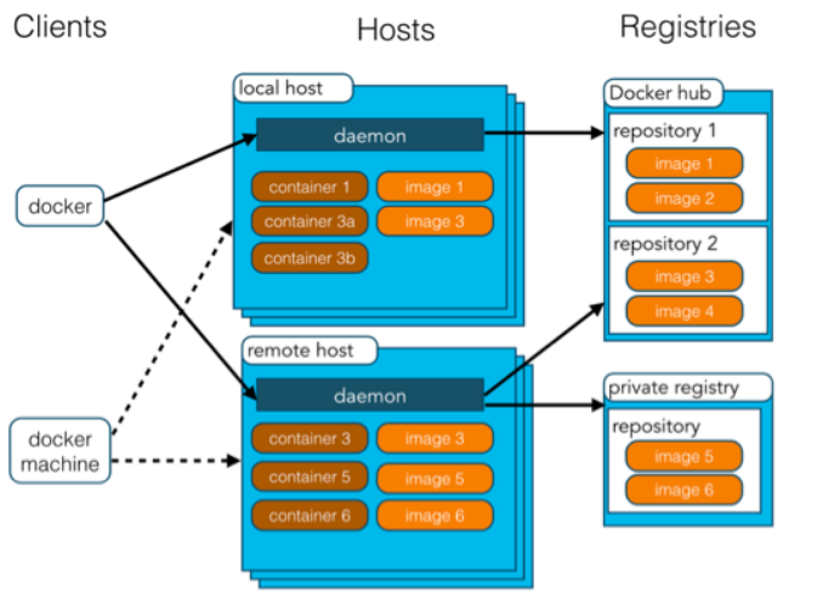
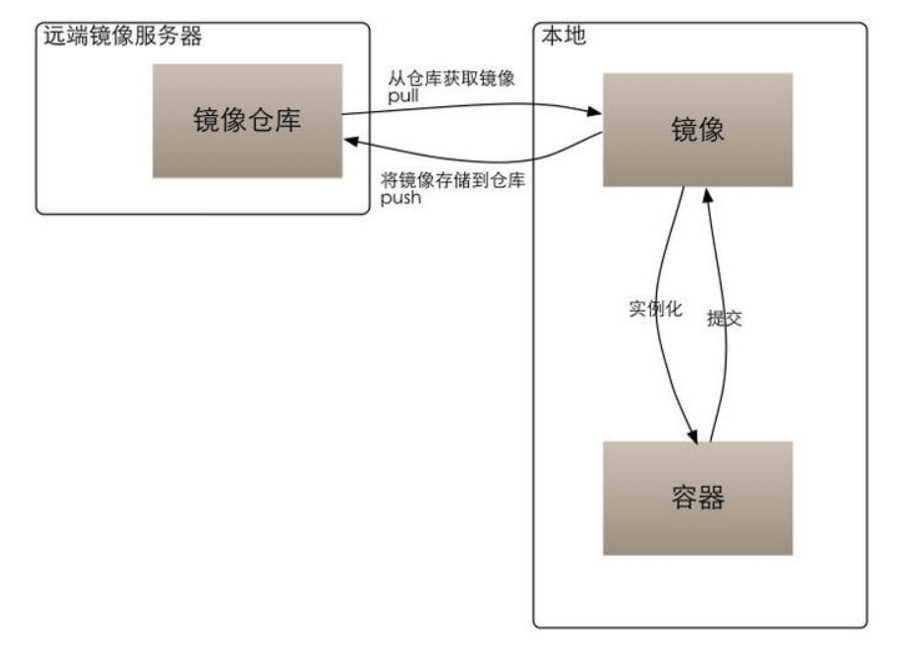

Docker笔记
====================
# 1 虚拟机与容器
## 1.1 虚拟机
虚拟机（Virtual Machine）指通过软件模拟的具有完整硬件系统功能的、运行在一个完全隔离环境中的完整计算机系统。在实体计算机中能够完成的工作在虚拟机中都能够实现。

在计算机中创建虚拟机时，需要将实体机的部分硬盘和内存容量作为虚拟机的硬盘和内存容量。每个虚拟机都有独立的 CMOS、硬盘和操作系统，可以像使用实体机一样对虚拟机进行操作。虚拟机的代表，是 VMWare 和 OpenStack。

## 1.2 容器
将操作系统层虚拟化，是一个标准的软件单元。容器是完全使用沙箱机制，相互之间不会有任何接口,更重要的是容器性能开销极低。

- 随处运行：容器可以将代码与配置文件和相关依赖库进行打包，从而确保在任何环境下的运行都是一致的。
- 高资源利用率：容器提供进程级的隔离，因此可以更加精细地设置 CPU 和内存的使用率，进而更好地利用服务器的计算资源。
- 快速扩展：每个容器都可作为单独的进程予以运行，并且可以共享底层操作系统的系统资源，这样一来可以加快容器的启动和停止效率。

## 1.3 区别与联系
- 虚拟机虽然可以隔离出很多「子电脑」，但占用空间更大，启动更慢。虚拟机软件可能还要花钱，例如VMWare；
- 容器技术不需要虚拟出整个操作系统，只需要虚拟一个小规模的环境，类似「沙箱」；
- 运行空间，虚拟机一般要几 GB 到 几十 GB 的空间，而容器只需要 MB 级甚至 KB 级；

|特性|虚拟机|容器|
|----|-----|-----|
| 隔离级别 | 操作系统级	| 进程 |
| 隔离策略 | Hypervisor（虚拟机监控器）	| Cgroups（控制组群） |
| 系统资源 | 5 ～ 15%	| 0 ～ 5% |
| 启动时间 | 分钟级	| 秒级 |
| 镜像存储 | GB - TB | KB - MB |
| 集群规模 | 上百	| 上万 |
| 高可用策略 | 备份、容灾、迁移	| 弹性、负载、动态 |

# 2 Docker 简介

## 2.1 什么是 Docker
Linux 容器是一种虚拟化技术，与虚拟机不同的是，他不是模拟一个完整的操作系统，而是对进程进行隔离。或者说，在正常进程的外面套了一个保护层。对于容器里面的进程来说，它接触到的各种资源都是虚拟的，从而实现与底层系统的隔离。

Docker 在容器的基础上，进行了进一步的封装，从文件系统、网络互联到进程隔离等，他提供简单易用的容器使用接口。Docker 将应用程序与该程序的依赖，打包在一个镜像文件里。运行这个文件，就会生成一个虚拟容器。程序在这个虚拟容器里运行，就好像在真实的物理机上运行一样。

## 2.2 为什么要用 Docker
由于容器是进程级别的，相比虚拟机有很多优势：
- 启动快
- 资源占用少
- 体积小

Docker 主要用途：
- 提供一次性的环境。如：本地测试他人的软件、持续集成的时候提供单元测试和构建的环境。
- 提供弹性的云服务。因为 Docker 容器可以随开随关，很适合动态扩容和缩容。
- 组建微服务架构。通过多个容器，一台机器可以跑多个服务，因此在本机就可以模拟出微服务架构。

# 3 Docker 架构和核心概念

## 3.1 Docker 架构图
<div align="center">  </div><br>

简介如下：
- Client：Docker 客户端，使用 Docker Api与 Docker 的守护进程通信；
- Machine：一个简化 Docker 安装的命令行工具，如：VirtualBox、Microsoft Azure；
- Host：Docker 主机，一个物理或者虚拟的机器，用于执行 Docker 守护进程和容器；
- Daemon：Docker 守护进程；
- Container：Docker 容器，独立运行的一个或一组应用，详见后文；
- Images：Docker 镜像，用于创建 Docker 容器的模板，详见后文；
- Registry：Docker 仓库，用来保存镜像，详见后文。

## 3.2 镜像（Image）
操作系统分为内核和用户空间,对于 Linux 而言，内核启动后，会挂 root 文件系统为其提供用户空间支持。**Docker 镜像（Image），就相当于一个 root 文件系统**。

Docker 镜像保存运行时所需程序、库、资源、配置、参数等的**静态文件**，它不包含任何动态数据，其内容在构建之后也不会被改变。

### 分层存储
镜像包含操作系统完整的 root	文件系统，Docker 在设计时充分利用	**UnionFS 的技术**，将其设计为**分层存储**的架构。Docker 镜像并不是像 ISO 那样的打包文件，镜像是一个虚拟的概念，**它由多层文件系统组成**。

镜像构建时，会一层层构建，前一层是后一层的基础。每一层构建完就不会再发生改变，后一层上的任何改变只发生在自己这一层。在构建镜像的时候，每一层尽量只包含该层需要添加的东西，任何额外的东西应该在该层构建结束前清理掉，以免镜像后期变的庞杂，难以维护。

## 3.3 容器（Container）
镜像和容器的关系，就像是面向对象程序设计中的类和实例一样，**镜像是静态的定义，容器是镜像运行时的实体**。容器可以被创建、启动、停止、删除、暂停等。

容器的实质是进程，但与直接在宿主执行的进程不同，容器进程运行于属于自己的独立的命名空间。因此容器可以拥有自己的 root 文件系统、网络配置、进程空间，甚至用户 ID 空间。容器内的进程是运行在一个隔离的环境里，使用起来就好像是在一个独立于宿主的系统下操作一样。

每一个容器运行时，会以镜像为基础层，在其上创建一个为容器运行时读写而准备的容器存储层。容器存储层的生存周期和容器一样，容器消亡时，容器存储层也随之消亡，并且缓存在容器存储层的数据也会随之清空。

按照 docker 最佳实践的要求，容器不应该向其存储层内写入任何数据，容器存储层要保持无状态化。所有的文件写入操作，都应该使用数据卷（Volume）、或者绑定宿主目录，在这些位置的读写会跳过容器存储层，直接对宿主（或网络存储）发生读写，其性能和稳定性更高（不会丢失数据）。

## 3.4 仓库（Repository）
``Docker Registry`` 用于集中存储、分发镜像的服务。

一个 ``Docker Registry`` 中可以包含多个仓库（``Repository``），每个仓库可以包含多个标签（``Tag``），每个标签对应一个镜像。

通常，一个仓库会包含同一个软件不同版本的镜像，而标签就常用于对应该软件的各个版本。我们可以通过	 <仓库名>:<标签> 的格式来指定具体是这个软件哪个版本的镜像。如果不给出标签，将以 ``latest`` 作为默认标签，如：``ubuntu:16.04、ubuntu:latest``。

### 公开服务 Docker Registry
Docker Registry	公开服务是开放给用户使用、允许用户管理镜像的	Registry 服务。一般公开服务允许用户免费上传、下载公开的镜像。常见的公开服务如：官方的 [Docker	Hub](https://hub.docker.com/) 、[网易云镜像服务](https://c.163.com/hub#/m/library/) 、[阿里云镜像库](https://cr.console.aliyun.com/) 。

### 私有 Docker Registry
用户还可以在本地搭建私有 Docker	Registry。Docker 官方提供了 Docker Registry 镜像，可以直接使用做为私有 Registry 服务。

## 3.5 镜像、容器、仓库的关系
镜像、容器、仓库的关系如下图：
<div align="center">  </div><br>

# 4 安装 Docker

```Text
## centos7 默认安装
yum install –y docker;
## 查看版本
docker version;
## 启动
systemctl enable docker;
systemctl start docker;
## 测试docker是否安装成功
docker run hello-world;
```
## centos 配置镜像加速
vim /etc/docker/daemon.json，写入内容：
```Text
{
  "registry-mirrors": [
    "https://hub-mirror.c.163.com",
    "https://mirror.baidubce.com"
  ]
}
```

# 5 Docker 常用命令
使用 `docker --help` 查看 docker 命令，可分为如下几类操作：

- docker 操作：
  - 版本/信息：docker [info | version]
- 容器操作 ：
  - 容器生命周期管理：docker [ run | start | stop | restart | kill | rm | pause | unpause ]
  - 容器操作运维：docker [ ps | inspect | exec | logs | export | import | port ]
  - 容器 rootfs 命令：docker [ commit | cp | diff ]
- 镜像操作：
  - 镜像管理：docker [ images | rmi | tag | build | history | save | import ]
- 仓库操作
  - 镜像仓库：docker [ login | pull | push | search ] 

# 6 使用镜像

## 6.1 管理本机镜像

### 6.1.1 获取镜像
使用 ``docker pull`` 命令从 Docker 镜像仓库获取镜像，命令格式为：
```text
docker pull [选项] [Registry 地址[:端口号]/]仓库名[:标签]
```
例如：
```text
[root@izwz98jvb8bcz3rf5ydvzpz docker]# docker pull ubuntu:18.04;
18.04: Pulling from library/ubuntu
f08d8e2a3ba1: Pull complete 
3baa9cb2483b: Pull complete 
94e5ff4c0b15: Pull complete 
1860925334f9: Pull complete 
Digest: sha256:05a58ded9a2c792598e8f4aa8ffe300318eac6f294bf4f49a7abae7544918592
Status: Downloaded newer image for ubuntu:18.04
docker.io/library/ubuntu:18.04
```
如上：镜像是由多层存储所构成。下载也是一层层的去下载，并非单一文件。下载过程中给出了**每一层的 ID 的前 12 位**。并且下载结束后，给出该镜像完整的 sha256 的摘要，以确保下载**一致性**。

#### 运行
```Text
[root@izwz98jvb8bcz3rf5ydvzpz docker]# docker run -it --rm ubuntu:18.04 bash;
root@39082814a166:/# cat /etc/os-release
NAME="Ubuntu"
VERSION="18.04.5 LTS (Bionic Beaver)"
ID=ubuntu
ID_LIKE=debian
PRETTY_NAME="Ubuntu 18.04.5 LTS"
VERSION_ID="18.04"
HOME_URL="https://www.ubuntu.com/"
SUPPORT_URL="https://help.ubuntu.com/"
BUG_REPORT_URL="https://bugs.launchpad.net/ubuntu/"
PRIVACY_POLICY_URL="https://www.ubuntu.com/legal/terms-and-policies/privacy-policy"
VERSION_CODENAME=bionic
UBUNTU_CODENAME=bionic
```
退出 `exit`;

### 6.1.2 列出镜像
使用 `docker image -a` 命令，查看本地仓库所有镜像：
```Text
# docker images -a
REPOSITORY          TAG                 IMAGE ID            CREATED             SIZE
ubuntu              18.04               6526a1858e5d        2 weeks ago         64.2MB
hello-world         latest              bf756fb1ae65        8 months ago        13.3kB
```
列表包含了**仓库名、标签、镜像 ID、创建时间以及所占用的空间**。

### 6.1.3 删除镜像
可以使用 `docker image rm` 命令，删除本地镜像：
```
docker image rm [选项] <镜像1> [<镜像2> ...]
```
<镜像> 可以是 镜像短 ID、镜像长 ID、镜像名 或者 镜像摘要。

查看镜像摘要：`docker image --digests`

镜像是多层存储结构，因此在删除的时候也是从上层向基础层方向依次进行判断删除。镜像的多层结构让镜像复用变得非常容易，因此很有可能某个其它镜像正依赖于当前镜像的某一层。这种情况，依旧不会触发删除该层的行为。直到没有任何层依赖当前层时，才会真实的删除当前层。

## 6.2 使用 docker commit 理解镜像构成
镜像是多层存储，每一层是在前一层的基础上进行的修改；而容器同样也是多层存储，是在以镜像为基础层，在其基础上加一层作为容器运行时的存储层。

Docker 提供了一个 `docker commit` 命令，可以将容器的存储层保存下来成为镜像（在原有镜像的基础上，再叠加上容器的存储层，构成新的镜像）。

语法：`docker commit [选项] <容器ID或容器名> [<仓库名>[:<标签>]]`

使用 docker commit 生成的镜像会添加大量的无关内容，使镜像变得臃肿；并且很难清除知道制作镜像过程中，执行过什么命令、怎么生成的镜，被称为**黑箱镜像**。

不使用 docker commit 定制镜像，定制镜像应该使用 Dockerfile 来完成。

## 6.3 使用 Dockerfile 定制镜像
镜像的定制实际上就是定制每一层所添加的配置、文件。如果我们可以把每一层修改、安装、构建、操作的命令都写入一个脚本，用这个脚本来构建、定制镜像，那么之前提及的无法重复的问题、镜像构建透明性的问题、体积的问题就都会解决。这个脚本就是 Dockerfile。

在一个空白目录中，建立一个文本文件，并命名为 Dockerfile：
```Text
mkdir mynginx
cd mynginx
vim Dockerfile
```

Dockerfile 文件类容：
```Text
FROM nginx
RUN echo '<h1>Hello, Docker!</h1>' > /usr/share/nginx/html/index.html
```

两个命令：
- FROM：指定基础镜像
- RUN：用来执行命令行命令，两种格式：
  - shell 格式，RUN <命令>
  - exec 格式，RUN ["可执行文件", "参数1", "参数2"]

### 构建镜像
使用 docker build 命令进行镜像构建，格式为：
```Text
docker build [选项] <上下文路径/URL/->
```

当构建镜像时候，用户会指定构建镜像上下文的路径，docker build 命令得知这个路径后，会将路径下的所有内容打包，然后上传给 Docker 引擎。这样 Docker 引擎收到这个上下文包后，展开就会获得构建镜像所需的一切文件。

## 6.4 Dockerfile 指令
- COPY 复制文件:
```Text
COPY [--chown=<user>:<group>] <源路径>... <目标路径>
COPY [--chown=<user>:<group>] ["<源路径1>",... "<目标路径>"]
```

- ADD 指令  
和 COPY 的格式和性质基本一致。但是在 COPY 基础上增加了一些功能。

    在 Docker 官方的 Dockerfile 最佳实践文档 中要求，尽可能的使用 COPY，因为 COPY 的语义很明确，就是复制文件而已，而 ADD 则包含了更复杂的功能，其行为也不一定很清晰。

- CMD 容器启动命令:
```Text
shell 格式：CMD <命令>
exec 格式：CMD ["可执行文件", "参数1", "参数2"...]
```
参数列表格式：CMD ["参数1", "参数2"...]。在指定了 ENTRYPOINT 指令后，用 CMD 指定具体的参数。

CMD 指令用于指定默认的容器主进程的启动命令，如：docker run -it ubuntu cat /etc/os-release。

- ENTRYPOINT 入口点：
ENTRYPOINT 的格式和 RUN 指令格式一样，分为 exec 格式和 shell 格式。ENTRYPOINT 的目的和 CMD 一样，都是在指定容器启动程序及参数。ENTRYPOINT 在运行时也可以替代，不过比 CMD 要略显繁琐，需要通过 docker run 的参数 --entrypoint 来指定。

- ENV 设置环境变量:
```Text
ENV <key> <value>
ENV <key1>=<value1> <key2>=<value2>...
```

## 6.5 实现原理
Docker 使用 Union FS 将这些不同的层结合到一个镜像中去。

通常 Union FS 有两个用途, 一方面可以实现不借助 LVM、RAID 将多个 disk 挂到同一个目录下,另一个更常用的就是将一个只读的分支和一个可写的分支联合在一起，Live CD 正是基于此方法可以允许在镜像不变的基础上允许用户在其上进行一些写操作。

Docker 在 OverlayFS 上构建的容器也是利用了类似的原理。

# 7 容器使用
容器是独立运行的一个或一组应用，以及它们的运行态环境。

## 7.1 启动
启动容器有两种方式：
- 基于镜像新建一个容器并启动，使用 `docker run`
  ```Text
    docker run ubuntu:18.04 /bin/echo 'Hello world'
  ```

- 将在终止状态（stopped）的容器重新启动，使用 `docker container start`

### 守护态运行
可以添加 -d 参数，让 Docker 在后台运行而不是直接把执行命令的结果输出在当前宿主机下。如：
```Text
docker run -d ubuntu:18.04 /bin/sh -c "while true; do echo hello world; sleep 1; done"
```

### 进入容器
当容器使用 -d 参数进入后台后，可以通过 `docker exec` 命令进入容器。
```
[root@izwz98jvb8bcz3rf5ydvzpz mynginx]# docker container ls -a
CONTAINER ID        IMAGE               COMMAND                  CREATED             STATUS                     PORTS               NAMES
51fdf30cc6c4        nginx:v2            "/docker-entrypoint.…"   12 seconds ago      Up 12 seconds              80/tcp              suspicious_morse
5d3b8ccf0bb4        hello-world         "/hello"                 4 hours ago         Exited (0) 6 minutes ago                       reverent_jepsen
[root@izwz98jvb8bcz3rf5ydvzpz mynginx]# docker exec -it  51fdf30cc6c4 bash
```

## 7.2 终止
使用 `docker container stop` 来终止一个运行中的容器。用户也可通过 exit 命令或 Ctrl+d 来退出终端时，所创建的容器立刻终止。

## 7.3 导出和导入
使用 docker export、docker import 导出和导入容器快照。

## 7.4 删除
使用 `docker container rm` 来删除一个处于终止状态的容器。

使用 `docker container prune` 清理所有处于终止状态的容器。

# 8 使用仓库
使用 docker push 将自定义镜像推送到 Docker Hub。

# 9 数据管理

## 9.1 数据卷（Volumes）
数据卷 是一个可供一个或多个容器使用的特殊目录，它绕过 UFS，可以提供很多有用的特性：
- 数据卷可以在容器之间共享和重用
- 对数据卷的修改会立马生效
- 对数据卷的更新，不会影响镜像
- 数据卷默认会一直存在，即使容器被删除

```Text
// 创建数据卷
docker volume create myvol
// 查看数据卷列表
docker volume ls
// 查看指定 数据卷 的信息
docker volume inspect myvol
// 删除数据卷
docker volume rm myvol
// 清理无主数据卷
docker volume prune
```
### 启动一个挂载数据卷的容器
在用 docker run 命令的时候，使用 --mount 标记来将 数据卷 挂载到容器里。在一次 docker run 中可以挂载多个 数据卷。
```Text
 docker run -d -P \
    --name web \
    # -v myvol:/usr/share/nginx/html \
    --mount source=myvol,target=/usr/share/nginx/html \
    nginx:alpine
```

## 9.2 挂载主机目录 (Bind mounts)

使用 --mount 标记可以指定挂载一个本地主机的目录到容器中去：
```Text
docker run -d -P \
    --name web \
    # -v /src/webapp:/usr/share/nginx/html \
    --mount type=bind,source=/src/webapp,target=/usr/share/nginx/html \
    nginx:alpine
```

在主机里使用以下命令可以查看 web 容器的信息:
```Text
docker inspect web
```

--mount 标记也可以从主机挂载单个文件到容器中：
```Text
docker run --rm -it \
   # -v $HOME/.bash_history:/root/.bash_history \
   --mount type=bind,source=$HOME/.bash_history,target=/root/.bash_history \
   ubuntu:18.04 \
   bash
```

# 参考资料
- [Docker 官方文档](https://docs.docker.com/)
- [Docker — 从入门到实践](https://yeasy.gitbooks.io/docker_practice/content/)
- [Docker 工作原理及容器化简易指南](http://dockone.io/article/8788)

