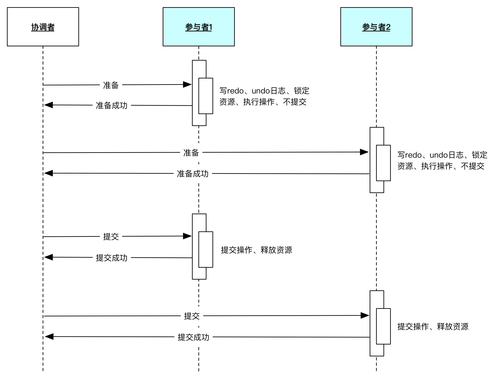
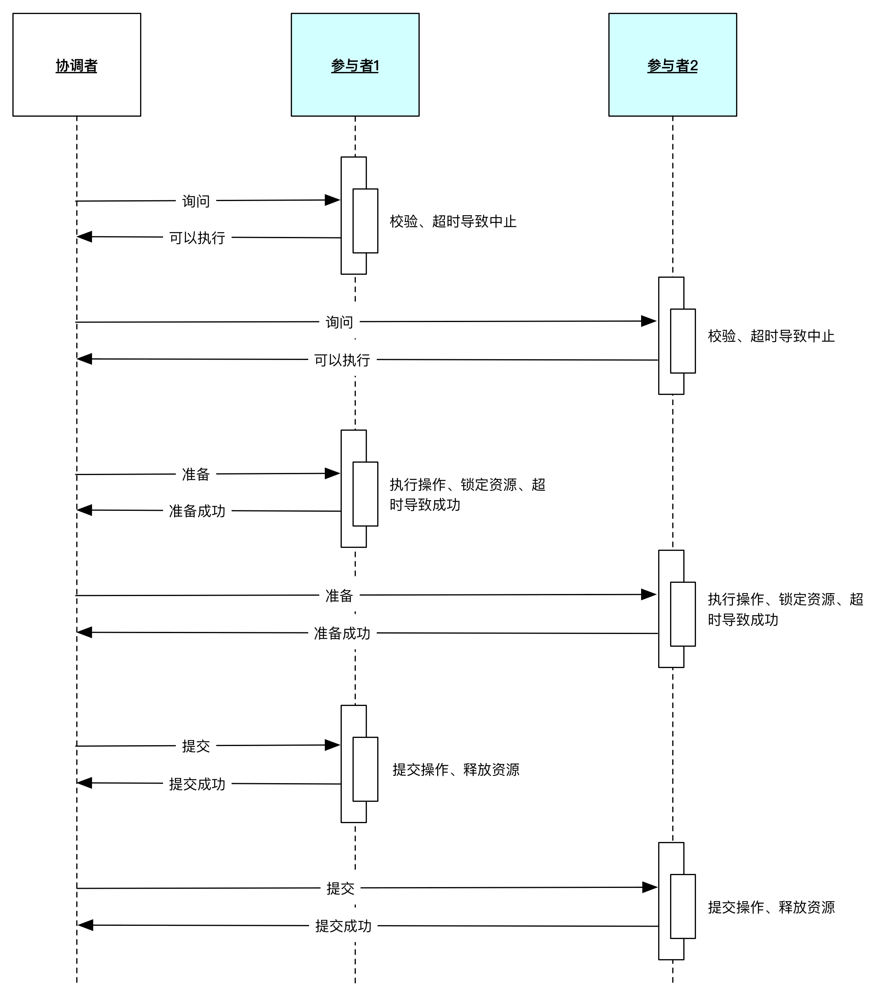
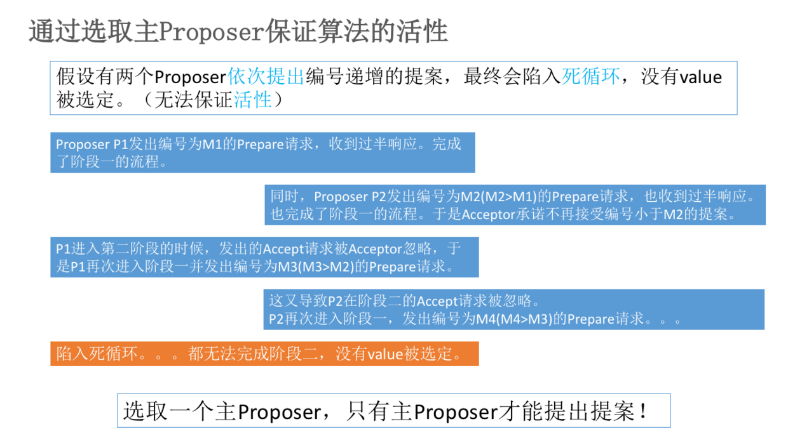

zookeeper 进阶
====================
# 1 一致性原理

## 1.1 一致性协议概述

## 1.2 两阶段提交协议 (2PC)
两阶段提交协议（two-phase commit，简称 2PC），2PC 把分布式事务分成两个过程：准备阶段和提交阶段，这两个阶段都是事务管理器发起的。

  
 
如上图，我们把事务管理器称为协调者，把资源管理器称为参与者，进行说明：

- 准备阶段：协调者向参与者发起指令，参与者评估自己的状态，如果参与者评估指令可以完成，参与者会写 redo 或者 undo 日志，然后锁定资源，执行操作，但是并不提交；

- 提交阶段：如果每个参与者明确返回准备成功，也就是预留资源和执行操作成功，协调者向参与者发起提交指令，参与者提交资源变更的事务，释放锁定的资源；如果任何一个参与者明确返回准备失败，也就是预留资源或者执行操作失败，协调者向参与者发起中止指令，参与者取消已经变更的事务，执行undo 日志，释放锁定的资源。

2PC 在准备阶段锁定资源，是一个重量级的操作，并能保证强一致性，但是实现起来复杂、成本较高，不够灵活，更重要的是它有如下致命的问题：

- 阻塞：对于任何一次指令必须收到明确的响应，才会继续做下一步，否则处于阻塞状态，占用的资源被一直锁定，不会被释放；

- 单点故障：如果协调者宕机，参与者没有了协调者指挥，会一直阻塞，尽管可以通过选举新的协调者替代原有协调者，但是如果之前协调者在发送一个提交指令后宕机，而提交指令仅仅被一个参与者接受，并且参与者接收后也宕机，新上任的协调者无法处理这种情况；

- 脑裂：协调者发送提交指令，有的参与者接收到执行了事务，有的参与者没有接收到事务，就没有执行事务，多个参与者之间是不一致的。

上面所有的这些问题，都是需要人工干预处理，没有自动化的解决方案，因此两阶段提交协议在正常情况下能保证系统的强一致性，但是在出现异常情况下，当前处理的操作处于错误状态，需要管理员人工干预解决，因此可用性不够好，这也符合 CAP 协议的一致性和可用性不能兼得的原理。

## 1.3 三阶段提交协议 (3PC)
三阶段提交协议（three-phase commit，简称 3PC），3PC 是 2PC 的改进版本，它通过超时机制解决了同步阻塞的问题。

  
 

- 询问阶段：协调者询问参与者是否可以完成指令，协调者只需要回答是或不是，而不需要做真正的操作，这个阶段超时会导致中止；

- 准备阶段：如果在询问阶段所有的参与者都返回可以执行操作，协调者向参与者发送预执行请求，然后参与者写 redo 和 undo 日志，执行操作，但是不提交操作；如果在询问阶段任何参与者返回不能执行操作的结果，则协调者向参与者发送中止请求，逻辑与 2PC 的准备阶段相似，这个阶段超时导致成功；

- 提交阶段：如果每个参与者在准备阶段返回准备成功，也就是预留资源和执行操作成功，协调者向参与者发起提交指令，参与者提交资源变更的事务，释放锁定的资源；如果任何一个参与者返回准备失败，也就是预留资源或者执行操作失败，协调者向参与者发起中止指令，参与者取消已经变更的事务，执行undo 日志，释放锁定的资源，逻辑与 2PC 的提交阶段一致。

3PC 与 2PC 的两个不同点：

- 增加了询问阶段，询问阶段可以确保尽可能早的发现无法执行操作而需要中止的行为，但是它并不能发现所有的这种行为，只会减少这种情况的发生；

- 在准备阶段以后，协调者和参与者执行的任务中都增加了超时，一旦超时，协调者和参与者都继续提交事务，默认为成功，这是根据概率统计上超时后默认成功的正确性最大。

## 1.4 TCC 协议
2PC、3PC 中都包含多个参与者、多个阶段实现一个事务，实现复杂，性能也是一个很大的问题，因此，在互联网高并发系统中，鲜有使用 2PC 和 3PC 的场景。

阿里巴巴提出的 TCC 协议，将一个任务拆分成 Try、Confirm、Cancel，正常的流程会先执行 Try；如果执行没有问题，再执行 Confirm；如果执行过程中出了问题，则执行操作的逆操 Cancel。

  
 

- 从正常的流程上讲，这仍然是一个两阶段的提交协议，但在执行出现问题的时候，有一定的自我修复能力，如果任何一个参与者出现了问题，协调者通过执行操作的逆操作来取消之前的操作，达到最终的一致状态。

- 从逻辑上看，可以说 TCC 是简化版的 3PC，解决了 2PC 的阻塞问题，但是没有解决极端情况下会出现不一致和脑裂的问题。然而，TCC 通过自动化补偿手段，会把需要人工处理的不一致情况降到到最少，也是一种非常有用的解决方案，根据线人，阿里在内部的一些中间件上实现了 TCC 模式。

- 从时序上，如果遇到极端情况下 TCC 会有很多问题的，如:若在 Cancel 的时候一些参与者收到指令，而一些参与者没有收到指令，整个系统仍然是不一致的，这种复杂的情况，系统首先会通过补偿的方式，尝试自动修复的，如果系统无法修复，必须由人工参与解决。

2PC、3PC、TCC协议 都能保证分布式事务的一致性，他们保证的分布式系统的一致性从强到弱，TCC 达到的目标是最终一致性。

## 1.4 Paxos 算法

  
 

Paxos 算法分为两个阶段：

- 第一阶段：
  - (a) Proposer 选择一个**提案编号 N**，然后向**半数以上**的 Acceptor 发送编号为 N 的 **Prepare 请求**。
  - (b) 如果一个 Acceptor 收到一个编号为 N 的 Prepare 请求，且 N **大于**该 Acceptor 已经响应过的所有 Prepare 请求的编号，那么它就会将它已经接受过的**编号最大的提案**（如果有的话）作为响应反馈给 Proposer，同时该 Acceptor **承诺不再接受任何编号小于 N 的提案**。

- 第二阶段：
  - (a) 如果 Proposer 收到**半数以上 Acceptor** 对其发出的编号为 N 的 Prepare 请求的**响应**，那么它就会发送一个针对[N,V]提案的**Accept 请求**给半数以上的 Acceptor。（注：V 就是收到的响应中编号最大的提案的 value，如果响应中不包含任何提案，那么 V 就由 Proposer 自己决定。）
  - (b) 如果 Acceptor 收到一个针对编号为 N 的提案的 Accept 请求，只要该 Acceptor 没有对编号大于 N 的 Prepare 请求做出过响应，它就接受该提案。

### Learner 学习被选定的 value
Learner学习（获取）被选定的value有如下三种方案：

  
 

### 如何保证 Paxos 算法的活性

  
 

## 1.5 ZAB 算法

# 2 zk 集群解析

# 3 典型应用场景

# 4 zk 使用注意事项

# 参考
- [分布式系列文章——Paxos算法原理与推导](https://www.cnblogs.com/linbingdong/p/6253479.html)
- [Paxos、Raft分布式一致性最佳实践](https://zhuanlan.zhihu.com/p/31780743)
- [redo和undo的区别](https://www.cnblogs.com/alicesunBlog/archive/2013/01/30/2882524.html)
- [分布式系统协议Paxos、Raft和ZAB](https://zhuanlan.zhihu.com/p/147691282)
- [分布式服务化系统一致性的“最佳实干”](https://www.jianshu.com/p/1156151e20c8)
